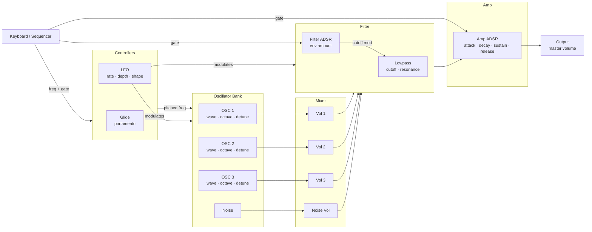
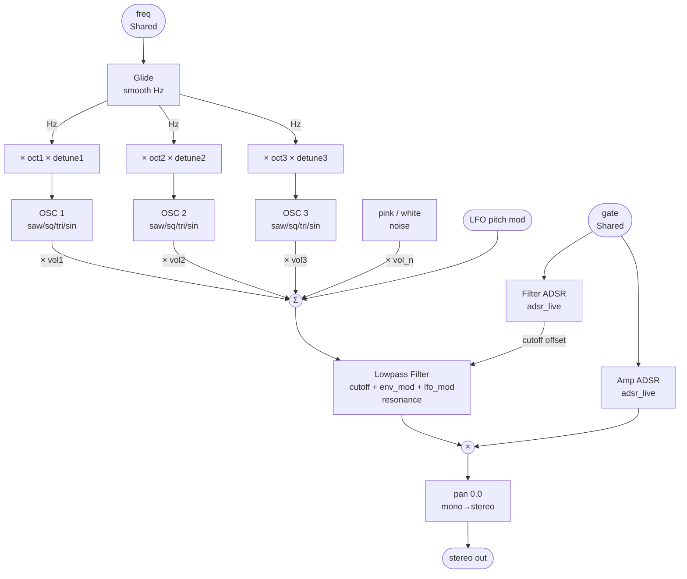
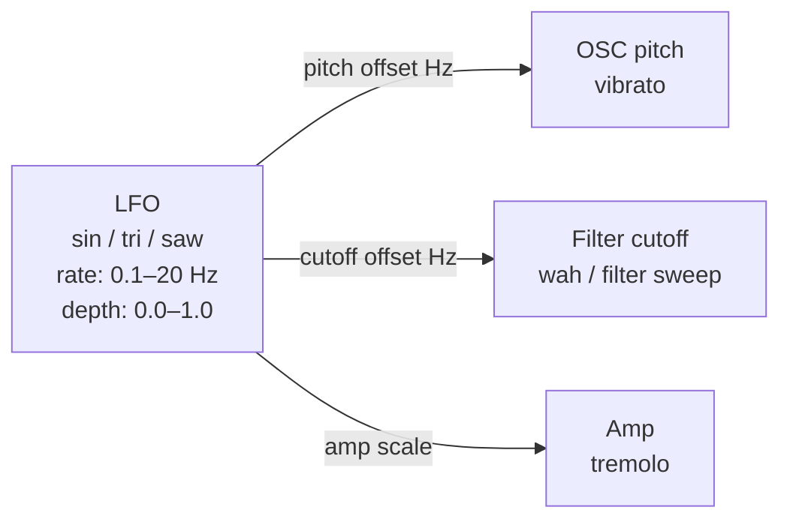
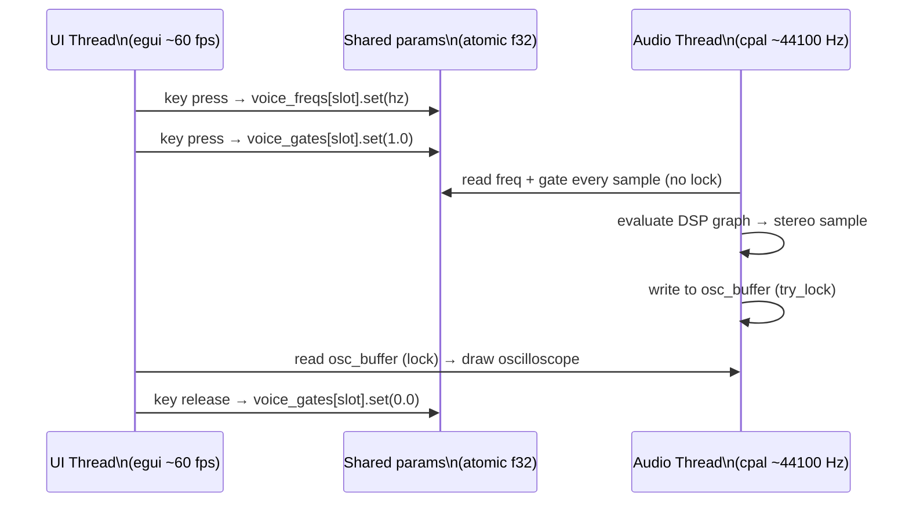
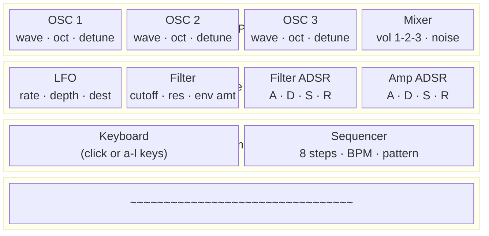
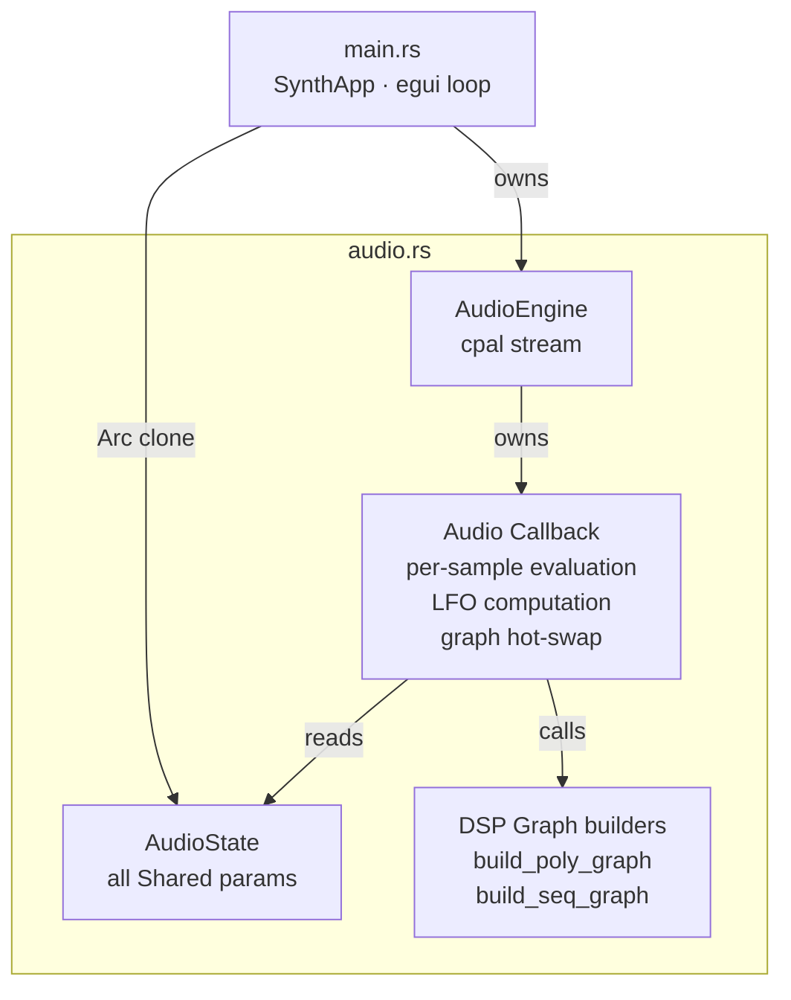

# The Synth — Architecture

A MiniMoog-inspired subtractive synthesizer built in Rust with [fundsp](https://github.com/SamiPerttu/fundsp) (DSP) + [cpal](https://github.com/RustAudio/cpal) (audio I/O) + [egui](https://github.com/emilk/egui) (UI).

---

## Signal Flow Overview

---

## Detailed Per-Voice DSP Graph

Each polyphonic voice runs this graph independently. Up to 6 voices play simultaneously.

---

## LFO Modulation Routing

The LFO is a single low-frequency oscillator that can be routed to one or more destinations.

---

## Thread Model

Two threads communicate via lock-free `Shared` atomics (fundsp) and a single `Mutex` for the oscilloscope buffer.

---

## UI Layout

---

## Module Structure

---

## Parameter Reference

### Oscillators (×3)

| Parameter | Range | Notes |
|-----------|-------|-------|
| Waveform  | sine / saw / square / triangle | Per OSC |
| Octave    | -2 … +2 oct | Relative to played note |
| Detune    | -100 … +100 cents | Fine pitch offset |
| Mix level | 0.0 … 1.0 | In the mixer |

### Noise

| Parameter | Range | Notes |
|-----------|-------|-------|
| Type      | white / pink | |
| Mix level | 0.0 … 1.0 | |

### LFO

| Parameter | Range | Notes |
|-----------|-------|-------|
| Rate      | 0.1 … 20 Hz | |
| Depth     | 0.0 … 1.0 | Scales modulation amount |
| Shape     | sin / tri / saw | |
| Destination | pitch / filter / amp | |

### Filter

| Parameter | Range | Notes |
|-----------|-------|-------|
| Cutoff    | 80 … 18000 Hz | Logarithmic |
| Resonance | 0.5 … 20 Q | |
| Env Amount | 0.0 … 1.0 | How much filter ADSR opens filter |
| Type      | lowpass (Moog-style) | Fixed for now |

### Amp ADSR

| Parameter | Range |
|-----------|-------|
| Attack    | 1 ms … 2 s |
| Decay     | 1 ms … 2 s |
| Sustain   | 0.0 … 1.0 |
| Release   | 1 ms … 4 s |

### Glide

| Parameter | Range | Notes |
|-----------|-------|-------|
| Time      | 0 … 500 ms | 0 = instant (off) |

---

## What Changes from v0.1

| Area | Before | After |
|------|--------|-------|
| Oscillators | 1 per voice, 1 waveform | 3 per voice, each configurable |
| Mixer | None | Per-OSC + noise volume |
| Filter | Separate tab, no chain | Integrated in signal chain |
| LFO | None | Rate / depth / destination |
| Glide | None | Portamento between notes |
| UI | 4 tabs (educational) | 1 unified synth panel |
| Sequencer + Keyboard | Drive separate graphs | Both drive same full chain |
