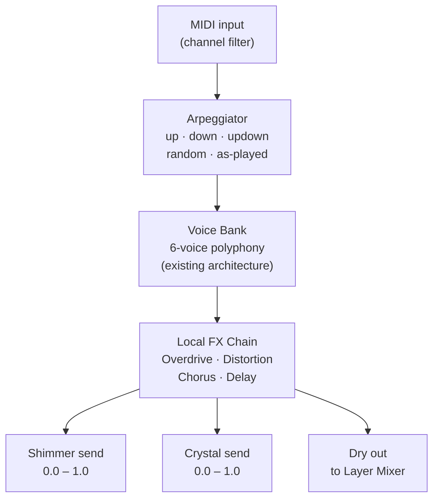
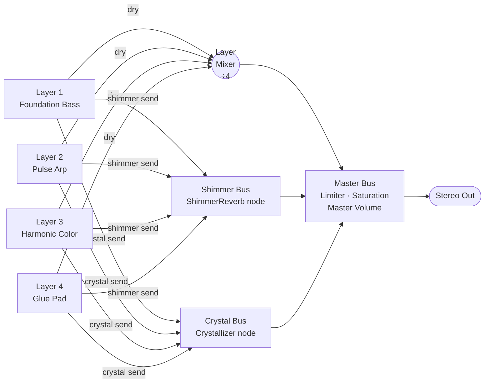
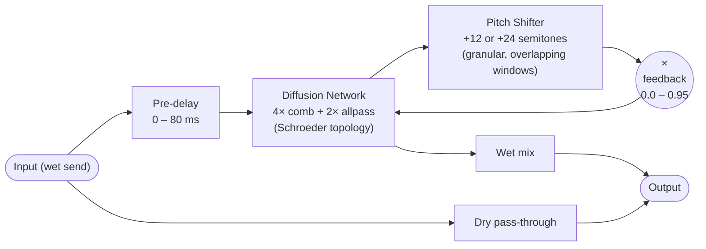
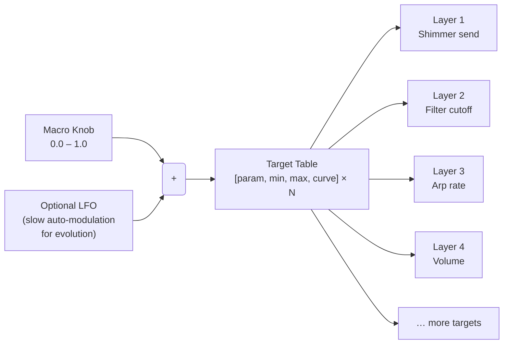
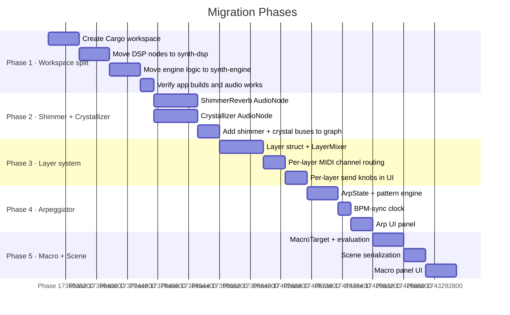

# Ambient Synth — Architecture Proposal

This document proposes the architectural evolution of `the_synth` from a single mono-timbral
synthesizer into a modular, multi-layer ambient music engine. It is a design document — no code
changes are implied yet.

---

## 1. Vision

The target experience is a **self-modulating ambient rig** that a musician can control with a
small set of expressive macros. The reference setup (Volca Bass + Zebra-style arp + Legend bass
+ Omnisphere strings + Valhalla Shimmer + SoundToys Crystallizer) demonstrates the key idea:
**four simultaneous instruments with different textural roles, glued by two signature spatial
effects, controlled by a few meaningful knobs**.

The synth should be able to reproduce this archetype without requiring the user to manage four
separate applications or manual routing.

### Textural roles in the reference setup

| Layer role | Character | Rhythmic density | Frequency range |
|---|---|---|---|
| **Foundation** (Legend bass) | Deep, slow, sustained | Near-static | Sub / low |
| **Pulse** (Volca arp) | Analog, melodic, looping | 1/8–1/16 notes | Low-mid |
| **Harmonic color** (Zebra arp) | Dark, metallic, complex | Variable | Mid-high |
| **Glue pad** (Omnisphere strings) | Lush, slow attack, sustain | Slow chord changes | Full range |

These four roles map directly to a **four-layer architecture**, each layer carrying its own
synthesis voice, arpeggiator, and local effects, feeding into shared spatial buses.

---

## 2. Design Principles

### Library-first
The synthesis engine must be usable as a Rust library (`synth-engine`) independently of the
egui UI or the cpal audio backend. This enables embedding in other applications, headless
testing, and future integration with DAW plugin formats (VST3/CLAP via `nih-plug`).

### Real-time safe on the audio thread
No heap allocation, no mutex lock, no blocking I/O on the audio thread. All cross-thread
communication uses `fundsp::Shared` (lock-free atomic f32) or `Arc<AtomicU*>`. This is already
the pattern in the current codebase and must be preserved and extended.

### Static graph with dynamic parameters
DSP graphs are built once at initialisation. Runtime changes (mute a layer, change a patch,
adjust reverb size) are expressed through parameter writes to `Shared` values, never through
graph restructuring. Inactive paths are silenced by setting their volume `Shared` to 0.0.

### Composable, independently testable modules
Each module (oscillator bank, arpeggiator, effects node, macro engine) must compile and be
testable in isolation. No module should import from the UI crate.

### Predictable gain staging
Every summing point must have a defined worst-case amplitude and a corresponding normalization
factor. Layers are mixed before the global buses. The master bus is the last and only safety
net. See `dsp-guidelines.md` for the full rules.

---

## 3. Proposed Crate Structure

The project should evolve from a single crate into a **Cargo workspace** with three crates.

```mermaid
graph TD
    subgraph Workspace["Cargo Workspace — the_synth"]
        DSP["synth-dsp  ·  lib\n───────────────\nDSP primitives\nMultiWaveOsc · LiveAdsr\nMoog filter · FxNodes\nShimmer · Crystallizer\nAll fundsp AudioNodes"]
        ENGINE["synth-engine  ·  lib\n───────────────\nLayer system\nArpeggiator\nMacro engine\nScene management\nMIDI routing\nPatch serialization"]
        APP["synth-app  ·  bin\n───────────────\negui UI panels\ncpal audio stream\nMIDI device mgmt\nFile dialogs"]
    end

    DSP -->|"DSP nodes + Shared params"| ENGINE
    ENGINE -->|"AudioState + event bus"| APP

    style DSP fill:#1a2a3a,stroke:#4a7fa5
    style ENGINE fill:#1a3a2a,stroke:#4aa57f
    style APP fill:#3a2a1a,stroke:#a57f4a
```



### `synth-dsp` (library crate)
Pure signal processing. No I/O, no UI, no serialization. Depends only on `fundsp` and `std`.
This crate contains every `AudioNode` implementation:
- `MultiWaveOsc` — band-limited oscillator (already exists, move here)
- `LiveAdsr` — fully parametric ADSR (already exists, move here)
- `FxChain` — series effects chain (already exists, move here)
- `ShimmerReverb` — new: pitch-shifted feedback reverb
- `Crystallizer` — new: granular pitch-shift delay

### `synth-engine` (library crate)
Assembles DSP nodes into a complete instrument. Manages the layer system, arpeggiator, macro
engine, and scene state. Exposes a clean API: `Engine::new()`, `Engine::process_block()`,
`Engine::set_macro()`, `Engine::load_scene()`. Depends on `synth-dsp`, `serde`, `midir`.

### `synth-app` (binary crate)
The egui application. Creates an `Engine`, opens a cpal stream, drives the MIDI engine, and
renders the UI. Contains no DSP logic — it only translates user actions into `Engine` API calls.
Depends on `synth-engine`, `cpal`, `egui/eframe`, `rfd`.

---

## 4. Layer System

### Concept

A **Layer** is one complete instrument voice running simultaneously with up to three other
layers. Layers are independent: each has its own patch, arpeggiator, MIDI channel, and local
effects. They are mixed together before the global send buses.

Up to **four layers** are supported, matching the four textural roles of the reference setup.
Layers can be muted, soloed, and have independent volume and pan.

### Layer internal signal flow



### Layer Mixer and Global Buses



### Layer data model

```
Layer {
    id:           u8,                 // 0–3
    name:         String,
    enabled:      Shared,             // 0.0 = muted
    volume:       Shared,             // layer fader
    pan:          Shared,             // -1.0 left … +1.0 right
    midi_channel: Arc<AtomicU8>,      // 0 = omni
    patch:        Patch,              // existing Patch struct
    arpeggiator:  ArpState,           // new (see §6)
    shimmer_send: Shared,             // pre-fader send to Shimmer Bus
    crystal_send: Shared,             // pre-fader send to Crystal Bus
    local_fx:     LocalFxParams,      // chorus, delay, overdrive, distortion
}
```

---

## 5. New Effects: Shimmer Reverb

### What it is

Shimmer reverb is an algorithmic reverb with a **pitch shifter inserted in the feedback loop**.
On each reverb recirculation, the signal is transposed up (typically +1 or +2 octaves) before
being fed back into the reverb diffusion network. The result: sustained sounds grow upward into
a halo of pitch-shifted harmonics above themselves. A single bass note becomes a chord. This is
the defining sound of ambient music (Eno, Stars of the Lid, Jonsi).

### Signal flow



### Parameters

| Parameter | Range | Role |
|---|---|---|
| `size` | 0.0 – 1.0 | Reverb tail length (scales comb delay times) |
| `damp` | 0.0 – 1.0 | High-frequency absorption in the diffusion network |
| `shimmer` | 0.0 – 1.0 | Amount of pitch-shifted signal in the feedback path |
| `pitch` | 0, +12, +24 st | Pitch shift interval (unison, octave, two octaves) |
| `feedback` | 0.0 – 0.95 | Overall recirculation amount (controls tail decay) |
| `mix` | 0.0 – 1.0 | Wet/dry blend (applied at the bus, not per-note) |

### Pitch shifter approach

The pitch shifter in the feedback path uses an **overlapping-window granular approach** (also
known as a pitch-shift via two read heads on a circular buffer). This avoids FFT complexity
while producing acceptable quality at the moderate rates used in a reverb tail:

```
Circular buffer (e.g. 4096 samples)
  Write head: advances at sample rate
  Read head A: advances at (1.0 / pitch_ratio) × sample rate
  Read head B: offset by buffer_size/2, same rate
  Crossfade A ↔ B with a Hann window when either head wraps
  Output = crossfaded mix of head A and head B
```

At +1 octave, `pitch_ratio = 2.0`, so the read heads advance at half speed — playback speed
halves, pitch doubles. The crossfade eliminates the click at the wrap point.

This implementation belongs in `synth-dsp::shimmer`.

---

## 6. New Effects: Crystallizer

### What it is

The Crystallizer (inspired by SoundToys Crystallizer) is a **granular pitch-shift delay**. It
slices incoming audio into short grains, pitch-shifts each grain by a fixed interval, and
re-emits the grains with a configurable delay and feedback. The result is a cascading, glassy
texture where each sound spawns a pitch-shifted echo of itself.

### Signal flow


### Parameters

| Parameter | Range | Role |
|---|---|---|
| `pitch` | −24 … +24 st | Semitone shift applied to each grain |
| `grain_size` | 20 – 200 ms | Duration of each grain (affects smoothness vs. texture) |
| `scatter` | 0.0 – 1.0 | Time randomisation of grain playback positions |
| `feedback` | 0.0 – 0.85 | Crystallizer tail decay |
| `mix` | 0.0 – 1.0 | Wet/dry blend |

### Key difference from shimmer

Shimmer expands sounds **spatially** (into a reverberant halo of harmonics).
Crystallizer expands sounds **temporally** (into a cascade of pitch-shifted echoes spread
over time). Applied together, they place a sound in a large, shimmering space while also
scattering its echo-image forward in time. The combination is more than the sum of its parts.

---

## 7. Arpeggiator

### Current state

The existing **step sequencer** requires manually programming each note. This is powerful but
requires effort. A **chord-responsive arpeggiator** is a different tool: hold a chord and the
arpeggiator automatically plays its notes in a configurable pattern. This is the source of the
"noodle lead" character in the reference setup.

### Design


### ArpState data model

```
ArpState {
    enabled:      bool,
    mode:         ArpMode,      // Up, Down, UpDown, Random, AsPlayed
    division:     ClockDiv,     // Quarter, Eighth, Sixteenth, Thirtysecond, + Triplet variants
    octave_range: u8,           // 1–4: how many octave repetitions per cycle
    gate:         f32,          // 0.1–1.0: fraction of step duration note is held
    hold:         bool,         // latch: keep last chord when keys released
    sync_to_bpm:  bool,
    bpm:          f32,          // used if not synced to global BPM
}
```

### Relationship to existing sequencer

The step sequencer and arpeggiator are **complementary**, not competing:
- Step sequencer: precise, programmed, repeating patterns (bassline, melody)
- Arpeggiator: reactive to held chords, expressive, improvisational

Both remain available per layer. A layer can use either, both, or neither.

---

## 8. Macro System

### Concept

A **Macro** is a single named control (0.0 – 1.0) that simultaneously drives multiple
synthesizer parameters, each scaled and offset independently. The musician sees "Atmosphere"
or "Motion" — not "shimmer feedback" and "layer 3 filter cutoff" and "layer 2 arp rate".

This is what makes the "few knobs" UX possible for complex ambient textures.

### Macro definition

```
Macro {
    name:    String,               // e.g. "Atmosphere"
    targets: Vec<MacroTarget>,     // list of parameter bindings
}

MacroTarget {
    param:  ParamAddress,          // layer · parameter path
    min:    f32,                   // output value when macro = 0.0
    max:    f32,                   // output value when macro = 1.0
    curve:  MacroCurve,            // Linear, Exponential, SCurve
}
```

### Signal flow



### Example: "Atmosphere" macro

| Value | Shimmer mix | Crystal feedback | Layer 4 (pad) volume | Layer 1 filter cutoff |
|---|---|---|---|---|
| 0.0 (dry) | 0.05 | 0.0 | 0.4 | 800 Hz |
| 0.5 | 0.4 | 0.3 | 0.7 | 3 kHz |
| 1.0 (full ambient) | 0.85 | 0.6 | 1.0 | 8 kHz |

A single knob turn morphs from a fairly dry, rhythmic texture to a fully dissolved ambient wash.

### Scene

A **Scene** is a named snapshot of: all four layer patches, arpeggiator states, all macro
definitions and their current values. Scenes replace the current flat patch system for
multi-layer use.

```
Scene {
    name:    String,
    layers:  [Layer; 4],
    macros:  Vec<Macro>,       // 4–8 macros per scene
    bpm:     f32,
    key:     Note,             // root note for arp scale quantization
    scale:   Scale,            // diatonic scale for arp quantization
}
```

---

## 9. Full System Signal Flow

The complete picture, from MIDI input to stereo output:


---

## 10. UI/UX Implications

The "few knobs" UX maps naturally to this architecture:

| UI element | Maps to |
|---|---|
| **Scene selector** | Load a `Scene` (all 4 layers + macros) |
| **Layer tabs** | Per-layer patch editor (existing synth UI, one tab per layer) |
| **Macro panel** | 4–8 large knobs, one per macro, labelled by scene |
| **Shimmer send** | Per-layer knob in the layer strip |
| **Crystal send** | Per-layer knob in the layer strip |
| **Arp controls** | Per-layer: mode, division, octave range, gate, hold |
| **Global BPM** | Drives all arp clocks and delay BPM-sync |

The macro panel is the primary performance surface. The layer/patch editor is for sound design
and remains accessible but not required during performance.

---

## 11. Migration Path

The existing codebase is a sound foundation. The migration should be incremental:



### Phase 1 is non-breaking
Moving to a workspace and reorganizing modules does not change any DSP behaviour. It is purely
structural. The audio output should be bit-identical before and after Phase 1.

### Phases 2–5 are additive
Each phase adds new capability without removing existing functionality. The existing single-layer
mono-timbral mode remains operational throughout — it becomes "one layer with shimmer/crystal
sends" after Phase 3.

---

## 12. Open Questions

These decisions should be made before implementation begins:

1. **Pitch shifter quality vs. complexity trade-off.** The granular overlap-add approach is
   simpler but has artefacts on transients. A phase-vocoder (FFT-based) approach is cleaner
   but adds latency and complexity. For a reverb feedback path, the granular approach is
   likely sufficient — the artefacts are buried in the reverb tail.

2. **Four fixed layers or dynamic N layers?** Four fixed layers matches the reference setup and
   simplifies the static graph approach. Dynamic N layers would require graph rebuilds or a
   larger pre-allocated graph. Recommend starting with four.

3. **Macro LFO depth.** Should macros support audio-rate LFO modulation (for tremolo-like
   effects at the scene level), or only UI-rate slow modulation? Audio-rate macro modulation
   requires the callback-side computation pattern from `dsp-guidelines.md §BlockRateAdapter`.

4. **Scene format compatibility with existing patches.** The existing 94 embedded patches are
   single-layer. A Scene wraps four of them. A migration utility that wraps a single patch
   into a Scene (layer 1 = the patch, layers 2–4 silent) would preserve backwards
   compatibility.
