# Ambient Synth — Architecture Proposal

This document proposes the architectural evolution of `the_synth` from a single mono-timbral
synthesizer into a modular, multi-layer ambient music engine. It is a design document — no code
changes are implied yet.

---

## 1. Vision

The target experience is a **self-modulating ambient rig** that a musician can control with a
small set of expressive macros. The reference setup (Volca Bass + Zebra-style arp + Legend bass
+ Omnisphere strings + Valhalla Shimmer + SoundToys Crystallizer) demonstrates the key idea:
**four simultaneous instruments with different textural roles, glued by two signature spatial
effects, controlled by a few meaningful knobs**.

The synth should be able to reproduce this archetype without requiring the user to manage four
separate applications or manual routing.

### Textural roles in the reference setup

| Layer role | Character | Rhythmic density | Frequency range |
|---|---|---|---|
| **Foundation** (Legend bass) | Deep, slow, sustained | Near-static | Sub / low |
| **Pulse** (Volca arp) | Analog, melodic, looping | 1/8–1/16 notes | Low-mid |
| **Harmonic color** (Zebra arp) | Dark, metallic, complex | Variable | Mid-high |
| **Glue pad** (Omnisphere strings) | Lush, slow attack, sustain | Slow chord changes | Full range |

These four roles map directly to a **four-layer architecture**, each layer carrying its own
synthesis voice, arpeggiator, and local effects, feeding into shared spatial buses.

---

## 2. Design Principles

### Library-first
The synthesis engine must be usable as a Rust library (`synth-engine`) independently of the
egui UI or the cpal audio backend. This enables embedding in other applications, headless
testing, and future integration with DAW plugin formats (VST3/CLAP via `nih-plug`).

### Real-time safe on the audio thread
No heap allocation, no mutex lock, no blocking I/O on the audio thread. All cross-thread
communication uses `fundsp::Shared` (lock-free atomic f32) or `Arc<AtomicU*>`. This is already
the pattern in the current codebase and must be preserved and extended.

### Static graph with dynamic parameters
DSP graphs are built once at initialisation. Runtime changes (mute a layer, change a patch,
adjust reverb size) are expressed through parameter writes to `Shared` values, never through
graph restructuring. Inactive paths are silenced by setting their volume `Shared` to 0.0.

### Composable, independently testable modules
Each module (oscillator bank, arpeggiator, effects node, macro engine) must compile and be
testable in isolation. No module should import from the UI crate.

### Predictable gain staging
Every summing point must have a defined worst-case amplitude and a corresponding normalization
factor. Layers are mixed before the global buses. The master bus is the last and only safety
net. See `dsp-guidelines.md` for the full rules.

---

## 3. Platform Architecture

The workspace is organized as a **platform** — a set of reusable library crates that any
number of applications can assemble independently. Each app picks what it needs and builds its
own experience on top. No app logic leaks into the platform.

### The platform rule

> Platform crates never depend on app crates or on each other upward.
> Engine crates depend only on platform crates.
> Apps depend on one or more engine crates plus platform crates.

This makes every platform crate independently usable: a future drum machine, a VST plugin, a
Bevy game, or a CLI generative tool can each pull in exactly what they need.

### Full workspace layout

```mermaid
graph TD
    subgraph PLATFORM["Platform crates  ·  no app logic"]
        DSP["synth-dsp  ·  lib\n──────────────────\nDSP primitives\nMultiWaveOsc · LiveAdsr\nMoog filter · FxChain\nShimmer · Crystallizer"]
        CTRL["synth-control  ·  lib\n──────────────────\nControlEvent bus\nControlSource trait\nMidiEngine\nCC → param mapping"]
        UI["synth-ui  ·  lib\n──────────────────\nShared egui widgets\nADSR visualizer\nOscilloscope\nKeyboard widget\nPatch browser\nPeak meter · Knobs"]
    end

    subgraph ENGINES["Engine crates  ·  instrument assembly"]
        SE["synth-engine  ·  lib\n──────────────────\nSingle-voice engine\nAudioState\nbuild_synth_graph\nFxChain\nprocess_block API"]
        AE["ambient-engine  ·  lib\n──────────────────\nMulti-track engine\n4 × Track\nGlobal buses\nArpeggiator\nMacro · Scene system\nGenerative patterns\nAutomation"]
    end

    subgraph APPS["Application binaries"]
        TS["the_synth  ·  bin\n──────────────────\nMono-timbral synth\ncpal + egui\nExisting UX, unchanged"]
        AB["ambient-box  ·  bin\n──────────────────\nMulti-track ambient\nelectronic music maker\ncpal + egui\nLayer mixer · Macros\nScene browser"]
        FUT["[future apps]\n──────────────────\nBevy game\nVST3/CLAP plugin\nDrum machine\nGenerative installation"]
    end

    DSP --> SE & AE
    CTRL --> SE & AE & TS & AB
    UI --> TS & AB
    SE --> TS
    AE --> AB
    DSP & CTRL & UI & AE --> FUT

    style DSP  fill:#1a2a3a,stroke:#4a7fa5
    style CTRL fill:#2a1a3a,stroke:#7f4aa5
    style UI   fill:#1a3a3a,stroke:#4aa5a5
    style SE   fill:#1a3a2a,stroke:#4aa57f
    style AE   fill:#1a3a2a,stroke:#4aa57f
    style TS   fill:#3a2a1a,stroke:#a57f4a
    style AB   fill:#3a1a2a,stroke:#a54a7f
    style FUT  fill:#2a2a2a,stroke:#888888
```

### Platform crates

**`synth-dsp`** (exists) — Pure signal processing. No I/O, no UI, no serialization.
Depends only on `fundsp` and `std`. Contains every `AudioNode` implementation:
`MultiWaveOsc`, `LiveAdsr`, `FxChain`, and future `ShimmerReverb`, `Crystallizer`.

**`synth-control`** (exists) — Event bus and input abstraction. `ControlEvent` enum,
`ControlSender`/`ControlReceiver` (lock-free channel), `ControlSource` trait, `MidiEngine`.
Depends on `crossbeam-channel`, `midir`, `anyhow`.

**`synth-ui`** (planned) — Shared egui widgets. No audio dependencies — pure UI.
ADSR visualizer, oscilloscope, on-screen keyboard, patch browser panel, VU meter, knobs.
Both `the_synth` and `ambient-box` use this crate for their common UI components.

### Engine crates

**`synth-engine`** (exists) — Single-voice engine powering `the_synth`. `AudioState`,
`build_synth_graph`, `FxChain`. Exposes `process_block()` and `AudioState` parameter Shareds.

**`ambient-engine`** (planned) — Multi-track engine powering `ambient-box`. Four independent
`Track` instances each with their own voice bank, arpeggiator, and effect sends. Global shimmer
and crystal buses. Macro and scene system. Generative pattern engine. Automation.

### Application binaries

**`the_synth`** (exists) — The original mono-timbral synthesizer. Stays exactly as it is.
No changes forced by platform evolution.

**`ambient-box`** (planned) — The multi-track ambient/electronic music maker. Layer mixer,
macro performance surface, scene browser, BPM-sync. Built entirely on `ambient-engine` and
`synth-ui`.

**Future apps** depend on the same platform crates. A Bevy game adds `synth-bevy` as a shell
over `ambient-engine`. A VST plugin wraps any engine with a `nih-plug` shell.

---

## 4. Layer System

### Concept

A **Layer** is one complete instrument voice running simultaneously with up to three other
layers. Layers are independent: each has its own patch, arpeggiator, MIDI channel, and local
effects. They are mixed together before the global send buses.

Up to **four layers** are supported, matching the four textural roles of the reference setup.
Layers can be muted, soloed, and have independent volume and pan.

### Layer internal signal flow

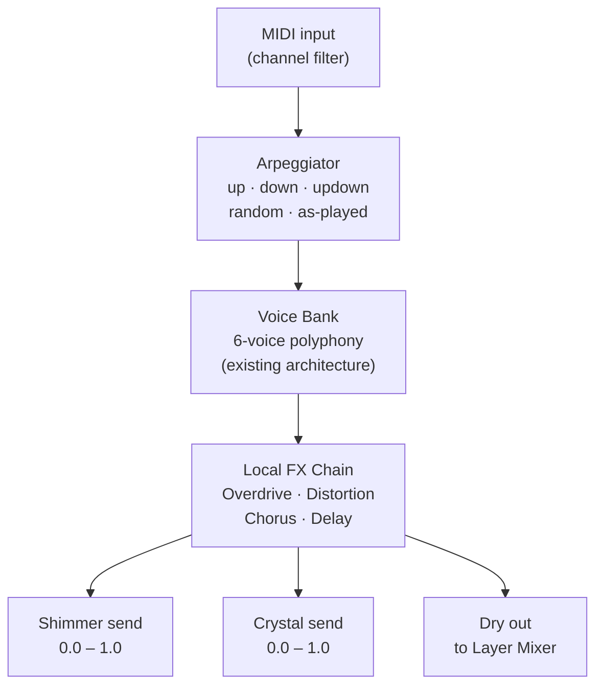

### Layer Mixer and Global Buses


### Layer data model

```
Layer {
    id:           u8,                 // 0–3
    name:         String,
    enabled:      Shared,             // 0.0 = muted
    volume:       Shared,             // layer fader
    pan:          Shared,             // -1.0 left … +1.0 right
    midi_channel: Arc<AtomicU8>,      // 0 = omni
    patch:        Patch,              // existing Patch struct
    arpeggiator:  ArpState,           // new (see §6)
    shimmer_send: Shared,             // pre-fader send to Shimmer Bus
    crystal_send: Shared,             // pre-fader send to Crystal Bus
    local_fx:     LocalFxParams,      // chorus, delay, overdrive, distortion
}
```

---

## 5. New Effects: Shimmer Reverb

### What it is

Shimmer reverb is an algorithmic reverb with a **pitch shifter inserted in the feedback loop**.
On each reverb recirculation, the signal is transposed up (typically +1 or +2 octaves) before
being fed back into the reverb diffusion network. The result: sustained sounds grow upward into
a halo of pitch-shifted harmonics above themselves. A single bass note becomes a chord. This is
the defining sound of ambient music (Eno, Stars of the Lid, Jonsi).

### Signal flow


### Parameters

| Parameter | Range | Role |
|---|---|---|
| `size` | 0.0 – 1.0 | Reverb tail length (scales comb delay times) |
| `damp` | 0.0 – 1.0 | High-frequency absorption in the diffusion network |
| `shimmer` | 0.0 – 1.0 | Amount of pitch-shifted signal in the feedback path |
| `pitch` | 0, +12, +24 st | Pitch shift interval (unison, octave, two octaves) |
| `feedback` | 0.0 – 0.95 | Overall recirculation amount (controls tail decay) |
| `mix` | 0.0 – 1.0 | Wet/dry blend (applied at the bus, not per-note) |

### Pitch shifter approach

The pitch shifter in the feedback path uses an **overlapping-window granular approach** (also
known as a pitch-shift via two read heads on a circular buffer). This avoids FFT complexity
while producing acceptable quality at the moderate rates used in a reverb tail:

```
Circular buffer (e.g. 4096 samples)
  Write head: advances at sample rate
  Read head A: advances at (1.0 / pitch_ratio) × sample rate
  Read head B: offset by buffer_size/2, same rate
  Crossfade A ↔ B with a Hann window when either head wraps
  Output = crossfaded mix of head A and head B
```

At +1 octave, `pitch_ratio = 2.0`, so the read heads advance at half speed — playback speed
halves, pitch doubles. The crossfade eliminates the click at the wrap point.

This implementation belongs in `synth-dsp::shimmer`.

---

## 6. New Effects: Crystallizer

### What it is

The Crystallizer (inspired by SoundToys Crystallizer) is a **granular pitch-shift delay**. It
slices incoming audio into short grains, pitch-shifts each grain by a fixed interval, and
re-emits the grains with a configurable delay and feedback. The result is a cascading, glassy
texture where each sound spawns a pitch-shifted echo of itself.

### Signal flow

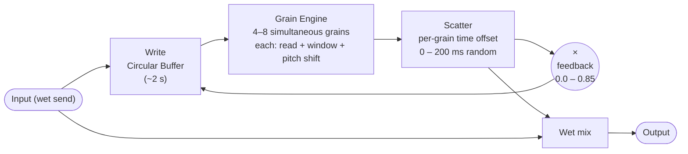

### Parameters

| Parameter | Range | Role |
|---|---|---|
| `pitch` | −24 … +24 st | Semitone shift applied to each grain |
| `grain_size` | 20 – 200 ms | Duration of each grain (affects smoothness vs. texture) |
| `scatter` | 0.0 – 1.0 | Time randomisation of grain playback positions |
| `feedback` | 0.0 – 0.85 | Crystallizer tail decay |
| `mix` | 0.0 – 1.0 | Wet/dry blend |

### Key difference from shimmer

Shimmer expands sounds **spatially** (into a reverberant halo of harmonics).
Crystallizer expands sounds **temporally** (into a cascade of pitch-shifted echoes spread
over time). Applied together, they place a sound in a large, shimmering space while also
scattering its echo-image forward in time. The combination is more than the sum of its parts.

---

## 7. Arpeggiator

### Current state

The existing **step sequencer** requires manually programming each note. This is powerful but
requires effort. A **chord-responsive arpeggiator** is a different tool: hold a chord and the
arpeggiator automatically plays its notes in a configurable pattern. This is the source of the
"noodle lead" character in the reference setup.

### Design

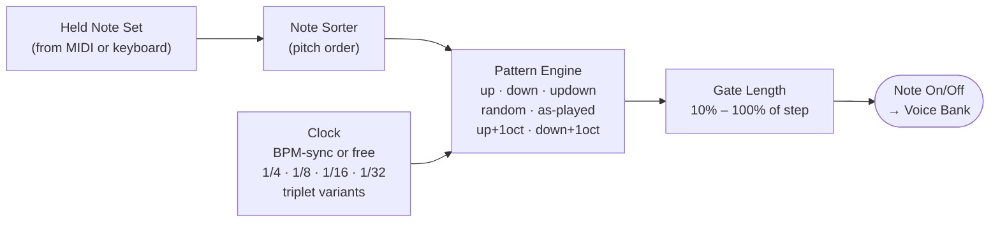

### ArpState data model

```
ArpState {
    enabled:      bool,
    mode:         ArpMode,      // Up, Down, UpDown, Random, AsPlayed
    division:     ClockDiv,     // Quarter, Eighth, Sixteenth, Thirtysecond, + Triplet variants
    octave_range: u8,           // 1–4: how many octave repetitions per cycle
    gate:         f32,          // 0.1–1.0: fraction of step duration note is held
    hold:         bool,         // latch: keep last chord when keys released
    sync_to_bpm:  bool,
    bpm:          f32,          // used if not synced to global BPM
}
```

### Relationship to existing sequencer

The step sequencer and arpeggiator are **complementary**, not competing:
- Step sequencer: precise, programmed, repeating patterns (bassline, melody)
- Arpeggiator: reactive to held chords, expressive, improvisational

Both remain available per layer. A layer can use either, both, or neither.

---

## 8. Macro System

### Concept

A **Macro** is a single named control (0.0 – 1.0) that simultaneously drives multiple
synthesizer parameters, each scaled and offset independently. The musician sees "Atmosphere"
or "Motion" — not "shimmer feedback" and "layer 3 filter cutoff" and "layer 2 arp rate".

This is what makes the "few knobs" UX possible for complex ambient textures.

### Macro definition

```
Macro {
    name:    String,               // e.g. "Atmosphere"
    targets: Vec<MacroTarget>,     // list of parameter bindings
}

MacroTarget {
    param:  ParamAddress,          // layer · parameter path
    min:    f32,                   // output value when macro = 0.0
    max:    f32,                   // output value when macro = 1.0
    curve:  MacroCurve,            // Linear, Exponential, SCurve
}
```

### Signal flow

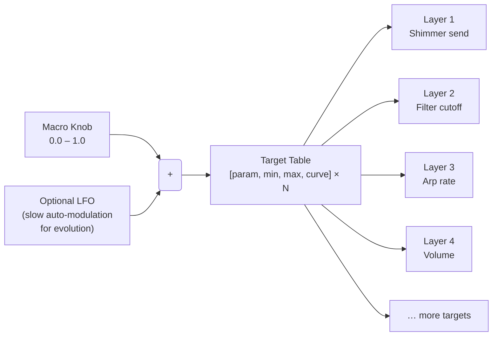

### Example: "Atmosphere" macro

| Value | Shimmer mix | Crystal feedback | Layer 4 (pad) volume | Layer 1 filter cutoff |
|---|---|---|---|---|
| 0.0 (dry) | 0.05 | 0.0 | 0.4 | 800 Hz |
| 0.5 | 0.4 | 0.3 | 0.7 | 3 kHz |
| 1.0 (full ambient) | 0.85 | 0.6 | 1.0 | 8 kHz |

A single knob turn morphs from a fairly dry, rhythmic texture to a fully dissolved ambient wash.

### Scene

A **Scene** is a named snapshot of: all four layer patches, arpeggiator states, all macro
definitions and their current values. Scenes replace the current flat patch system for
multi-layer use.

```
Scene {
    name:    String,
    layers:  [Layer; 4],
    macros:  Vec<Macro>,       // 4–8 macros per scene
    bpm:     f32,
    key:     Note,             // root note for arp scale quantization
    scale:   Scale,            // diatonic scale for arp quantization
}
```

---

## 9. Full System Signal Flow

The complete picture, from MIDI input to stereo output:

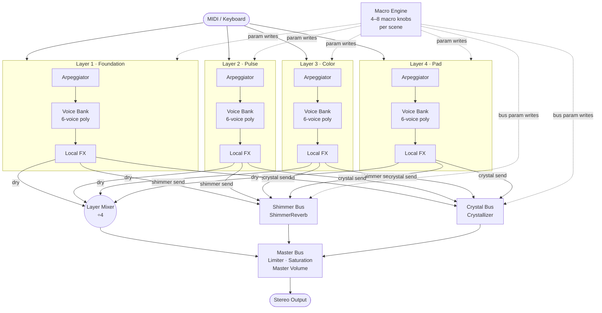

---

## 10. UI/UX Implications

The "few knobs" UX maps naturally to this architecture:

| UI element | Maps to |
|---|---|
| **Scene selector** | Load a `Scene` (all 4 layers + macros) |
| **Layer tabs** | Per-layer patch editor (existing synth UI, one tab per layer) |
| **Macro panel** | 4–8 large knobs, one per macro, labelled by scene |
| **Shimmer send** | Per-layer knob in the layer strip |
| **Crystal send** | Per-layer knob in the layer strip |
| **Arp controls** | Per-layer: mode, division, octave range, gate, hold |
| **Global BPM** | Drives all arp clocks and delay BPM-sync |

The macro panel is the primary performance surface. The layer/patch editor is for sound design
and remains accessible but not required during performance.

---

## 11. Migration Path

The existing codebase is a sound foundation. The migration should be incremental:

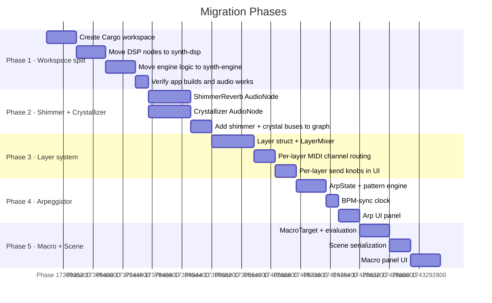

### Phase 1 is non-breaking
Moving to a workspace and reorganizing modules does not change any DSP behaviour. It is purely
structural. The audio output should be bit-identical before and after Phase 1.

### Phases 2–5 are additive
Each phase adds new capability without removing existing functionality. The existing single-layer
mono-timbral mode remains operational throughout — it becomes "one layer with shimmer/crystal
sends" after Phase 3.

---

## 12. Open Questions

These decisions should be made before implementation begins:

1. **Pitch shifter quality vs. complexity trade-off.** The granular overlap-add approach is
   simpler but has artefacts on transients. A phase-vocoder (FFT-based) approach is cleaner
   but adds latency and complexity. For a reverb feedback path, the granular approach is
   likely sufficient — the artefacts are buried in the reverb tail.

2. **Four fixed layers or dynamic N layers?** Four fixed layers matches the reference setup and
   simplifies the static graph approach. Dynamic N layers would require graph rebuilds or a
   larger pre-allocated graph. Recommend starting with four.

3. **Macro LFO depth.** Should macros support audio-rate LFO modulation (for tremolo-like
   effects at the scene level), or only UI-rate slow modulation? Audio-rate macro modulation
   requires the callback-side computation pattern from `dsp-guidelines.md §BlockRateAdapter`.

4. **Scene format compatibility with existing patches.** The existing 94 embedded patches are
   single-layer. A Scene wraps four of them. A migration utility that wraps a single patch
   into a Scene (layer 1 = the patch, layers 2–4 silent) would preserve backwards
   compatibility.

---

## 13. Platform Architecture — Detailed Design

This section provides the detailed design for the platform described in §3. It supersedes
earlier single-engine proposals. The key shift is from "one engine, one app" to a **platform
of reusable crates** that multiple independent applications can assemble.

### 13.1 Use Cases and Hosts

Each use case is an independent application (or library shell) that assembles platform crates:

| Use case | Binary / crate | Engine | Audio thread owner | Control source |
|---|---|---|---|---|
| **Mono-timbral synth** | `the_synth` | `synth-engine` | cpal | MIDI + keyboard + mouse + UI |
| **Ambient / electronic maker** | `ambient-box` | `ambient-engine` | cpal | MIDI + keyboard + macro knobs + UI |
| **Bevy game** | `synth-bevy` plugin | `ambient-engine` | Bevy audio | Bevy ECS events + game state |
| **DAW plugin** (future) | `synth-vst` | any engine | DAW host | MIDI + automation |

No engine crate knows which application is hosting it. The host is always a thin shell that
owns the audio thread and calls `process_block()`.

### 13.2 Platform Crate Dependency Rules

```mermaid
graph TD
    subgraph PLATFORM["Platform crates  (no app logic, no engine assembly)"]
        DSP["synth-dsp\nDSP nodes · AudioNode impls"]
        CTRL["synth-control\nControlEvent · MidiEngine\nControlSource trait"]
        UI["synth-ui\nShared egui widgets"]
    end

    subgraph ENGINES["Engine crates  (instrument assembly, no I/O)"]
        SE["synth-engine\nSingle-voice · AudioState\nbuild_synth_graph"]
        AE["ambient-engine\n4-track · buses · arp\nmacros · scenes · generative"]
    end

    subgraph APPS["Applications  (I/O shells)"]
        TS["the_synth  bin"]
        AB["ambient-box  bin"]
        BEVY["synth-bevy  lib"]
        VST["synth-vst  lib  (future)"]
    end

    DSP --> SE & AE
    CTRL --> SE & AE & TS & AB & BEVY
    UI  --> TS & AB
    SE  --> TS
    AE  --> AB & BEVY & VST

    style DSP  fill:#1a2a3a,stroke:#4a7fa5
    style CTRL fill:#2a1a3a,stroke:#7f4aa5
    style UI   fill:#1a3a3a,stroke:#4aa5a5
    style SE   fill:#1a3a2a,stroke:#4aa57f
    style AE   fill:#1a3a2a,stroke:#4aa57f
    style TS   fill:#3a2a1a,stroke:#a57f4a
    style AB   fill:#3a1a2a,stroke:#a54a7f
    style BEVY fill:#3a1a2a,stroke:#a54a7f
    style VST  fill:#2a2a2a,stroke:#888888
```

**Hard rules:**
- Platform crates (`synth-dsp`, `synth-control`, `synth-ui`) never depend on each other upward
  and never depend on engine or app crates
- Engine crates depend only on platform crates — never on cpal, egui, or bevy
- Apps are the only crates that may import I/O libraries (cpal, egui, bevy)
- `synth-ui` depends on egui only — no audio, no engine dependency

### 13.3 The Four Architectural Layers

The full system is organized in four horizontal layers. Each layer has a single clear
responsibility and a defined interface to the layers above and below it.

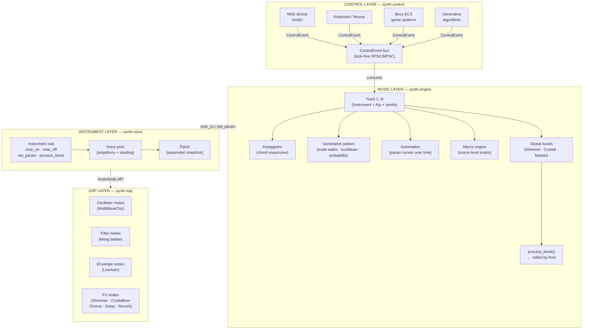

**The critical boundary** is between the Music layer and the Control layer. The audio thread
only knows about `ControlEvent` — it never sees MIDI bytes, Bevy ECS, or UI widget values.
Everything above that boundary is application code. Everything below is real-time safe.

### 13.4 The Control Layer in Detail

A `ControlEvent` is the universal language between any input source and the engine.

```
enum ControlEvent {
    NoteOn  { track: u8, pitch: u8, velocity: u8 },
    NoteOff { track: u8, pitch: u8 },
    SetParam { address: ParamAddress, value: f32 },
    SetMacro { index: u8, value: f32 },
    SceneLoad { name: String },
    Tempo    { bpm: f32 },
    ChordHold { track: u8, notes: Vec<u8> },   // for arpeggiator
    SceneTransition { from: u8, to: u8, frames: u32 },
}
```

A `ControlSource` is a trait with one method: `poll() -> Option<ControlEvent>`. Every source
implements this trait. The engine's audio callback drains the queue each buffer:

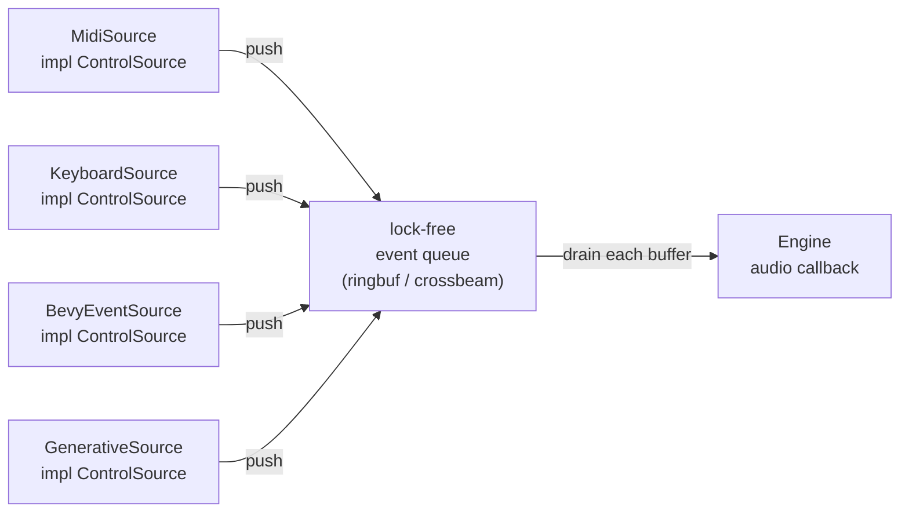

The queue is the **only** thread boundary in the real-time path. It must be wait-free on the
consumer side (audio thread). The producer side (UI thread, Bevy system thread) may use a
try-push that drops on overflow — the audio thread must never block.

### 13.5 Bevy Integration Design

The Bevy integration is a thin shell over `synth-engine`. It has three responsibilities:

**1. Audio source registration.**
`SynthPlugin` registers the engine as a Bevy `AudioSource`. Bevy's audio system calls
`process_block()` from its own audio thread, identical to how cpal does in the standalone app.
The engine does not know the difference.

**2. ECS → ControlEvent bridge.**
Game systems post `SynthEvent` Bevy events (regular Bevy events, not real-time). A dedicated
Bevy system reads `SynthEvent`s each frame and translates them into `ControlEvent`s pushed into
the engine's lock-free queue:

```
// Bevy game system example:
fn tension_system(
    tension: Res<GameTension>,
    mut synth: EventWriter<SynthEvent>,
) {
    synth.send(SynthEvent::SetMacro { index: 0, value: tension.0 });
}
```

The musician pre-designs what Macro 0 does (shimmer level, arp rate, pad volume) — the game
just moves the dial. This is the adaptive audio model: game changes the macro, musician defines
the consequence.

**3. Dev inspector panel.**
In development mode, `SynthPlugin` adds a `bevy-egui` panel that exposes the same parameter
controls as the standalone app. This allows a musician/composer to tweak the engine live inside
the game window. The panel is stripped from release builds by a Cargo feature flag.

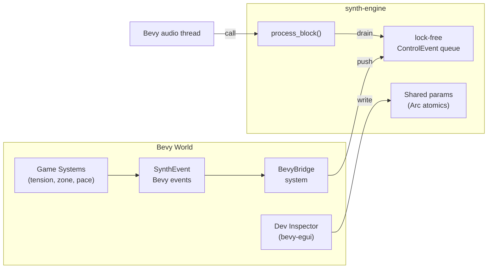

### 13.6 Generative Music Engine

For ambient and game use, the engine needs to generate music autonomously, without a human
pressing keys. The generative engine sits inside `synth-engine` as a `ControlSource` that
produces note events from rules rather than from human input.

Three generative primitives cover the ambient / synthwave / game audio range:

**Scale walker** — plays a random walk within a chosen scale and key. Step size, direction
probability, and note range are parameters. At low tempo and wide steps this produces the
"noodle" behavior of a Volca Bass lead. This is the simplest generative layer.

**Euclidean rhythm** — distributes N hits across M steps using Bjorklund's algorithm. Standard
in electronic music for organic-feeling rhythmic patterns that are not 4-on-the-floor.
Configurable per-track; drives the arpeggiator's clock gate.

**Probability table** — a list of (note, probability) pairs evaluated each step. Enables
tension-responsive melody: when `tension` is high, high-probability notes shift toward
dissonant intervals; when low, they return to tonic resolution. The game writes `tension`,
the musician defines the table per scene.

All three primitives are driven by the same global BPM clock that drives the arpeggiators.
They produce `ControlEvent::NoteOn / NoteOff` events into the main queue — indistinguishable
from human MIDI input.

### 13.7 Automation Engine

Automation allows parameters to change over time along pre-defined curves without real-time
human input. It is essential for the slow, continuous evolution of ambient textures.

```
AutomationClip {
    param:    ParamAddress,
    points:   Vec<(beat: f32, value: f32)>,   // sorted by beat
    curve:    InterpolationCurve,              // Linear, Cosine, Hold
    looping:  bool,
}
```

The automation engine runs in the audio callback alongside the arpeggiator. It reads the
current playhead position (in beats, derived from the sample counter and BPM), interpolates
between the nearest two points, and writes the result to the target `Shared`. It is fully
real-time safe: no allocation, no branching on the hot path.

Automation is the "set and forget" modulation layer — it handles the long-period evolution
(e.g., filter cutoff opening over 32 bars) that would be tedious to perform manually and too
slow for an LFO.

### 13.8 Process Block API Contract

The engine's single public audio API must satisfy these constraints across all three host types:

```rust
impl Engine {
    /// Called by the host audio thread — must be real-time safe.
    /// Advances the internal timeline by `frames` samples.
    /// `output` is interleaved stereo: [L0, R0, L1, R1, ...]
    pub fn process_block(&mut self, output: &mut [f32], frames: usize);

    /// Called from any thread. Non-blocking, fails silently on queue full.
    pub fn push_event(&self, event: ControlEvent);

    /// Called from any thread. Writes directly to a lock-free Shared.
    pub fn set_param(&self, address: ParamAddress, value: f32);
}
```

**The host owns the audio clock.** The engine has no internal threads, no `std::thread::sleep`,
no `Instant::now` on the hot path. All timing is derived from the cumulative sample count
passed through `frames`. This is the invariant that makes the engine portable across cpal,
Bevy, and any future DAW host.

---

## 14. Engineering Plan

This section defines the concrete implementation phases. Each phase builds on the previous,
is independently releasable, and does not break existing functionality. The plan reflects
the **platform + two-app architecture** described in §3 and §13.

### Current state (as of Phase 3 complete)

| Area | Status |
|---|---|
| Oscillator bank (3 OSC + unison + FM + ring) | ✅ Complete |
| Amp ADSR, Filter ADSR, LFO DSP, Moog ladder, Noise | ✅ Complete |
| FX chain (overdrive, distortion, chorus, delay, reverb) | ✅ Complete |
| Step sequencer + chord keyboard | ✅ Complete |
| MIDI input (`MidiEngine`) | ✅ Complete |
| Workspace split (`synth-dsp`, `synth-engine`, root app) | ✅ Phase 1 done |
| `synth-control` crate, `ControlEvent` bus | ✅ Phase 2 done |
| Voice allocation on audio thread | ✅ Phase 2 done |
| `the_synth` standalone app | ✅ Working, frozen going forward |
| `synth-ui` shared widget library | ✅ Phase 3 done (skeleton) |
| `ambient-engine` multi-track engine | ✅ Phase 3 done (skeleton) |
| `ambient-box` app binary | ✅ Phase 3 done (skeleton — minimal UX, intentional) |
| Arpeggiator + Scale walker | ✅ Phase 4 done |
| Shimmer reverb + Crystallizer | 🔲 Phase 5 |
| `ambient-box` UX refinement | 🔲 Evolves naturally through Phases 4–6 |
| Macro + Scene system | 🔲 Phase 6 |
| Generative patterns + Automation | 🔲 Phase 8 |
| `synth-bevy` Bevy integration | 🔲 Phase 7 |

---

### ✅ Phase 4 — Arpeggiator + Scale walker (done)

**Goal:** Each track in `ambient-box` and `the_synth` has a chord-responsive arpeggiator and a
scale walker. All logic lives in `synth-engine::arp`; apps provide callback wiring only.

| Task | Status | Notes |
|---|---|---|
| 4.1 `ArpState` | ✅ | Fixed-size arrays, zero heap on audio thread |
| 4.2 Pattern modes | ✅ | Up · Down · UpDown · Random · AsPlayed |
| 4.3 BPM-sync clock | ✅ | Per-arp BPM + ClockDiv; phase-based gate model |
| 4.4 `ChordHold` event | ✅ | `ControlEvent::ChordHold`; allocation on sender thread only |
| 4.5 Octave range + gate length | ✅ | Per-arp `ArpShared` atomics |
| 4.6 Arp UI panel | ✅ | In both `the_synth` and `ambient-box` |
| 4.7 Scale walker | ✅ | `ScaleWalker` + `ScaleWalkerShared`; 11 scales, random walk ±1/±2 steps |

---

### ✅ Phase 3 — `ambient-box` skeleton + `ambient-engine` foundation (done)

**Goal:** Create the two new crates (`ambient-engine`, `ambient-box`) and the shared widget
library (`synth-ui`). The `ambient-box` app launches, produces audio from four independent
tracks, and the keyboard/MIDI can play each track. The existing `the_synth` is untouched.

| Task | Status | Notes |
|---|---|---|
| 3.1 Create `synth-ui` | ✅ | `knob()` widget; boundary established |
| 3.2 Update `the_synth` to use `synth-ui` | 🔲 deferred | Not blocking; `the_synth` is frozen |
| 3.3 Create `ambient-engine` | ✅ | `TrackState` × 4, per-track DSP graph, `AmbientEngine` |
| 3.4 Per-track volume + `TrackMixer` | ✅ | `track_vol` Shared, normalized sum |
| 3.5 Placeholder global buses | ✅ | `shimmer_send` / `crystal_send` Shared per track |
| 3.6 Create `ambient-box` binary | ✅ | cpal stream, egui window, MIDI |
| 3.7 Track selector UI | ✅ | 4-button row, active track routes input |
| 3.8 Per-track send knobs | ✅ | Volume, cutoff, resonance, shimmer, crystal |

**Run:** `cargo run -p ambient-box`

The UX is intentionally minimal at this stage. The full layer mixer, patch editor, and
performance surface will emerge naturally as Phases 4–6 add the features that define what
the controls need to do. Designing it in full before Shimmer and the Macro system exist
would mean designing blind.

---

### Phase 5 — Shimmer reverb and Crystallizer (in `synth-dsp`)

**Goal:** Both signature spatial effects implemented as `AudioNode`s in `synth-dsp`, wired
into `ambient-engine`'s global buses. Testable in isolation without any app.

| Task | Description |
|---|---|
| 5.1 `ShimmerReverb` AudioNode | Schroeder reverb + granular pitch-shifter in feedback loop |
| 5.2 Granular pitch shifter | Circular buffer + moving read head + overlap-add smoothing |
| 5.3 `Crystallizer` AudioNode | Granular pitch-shift delay: grain size, scatter, pitch ratio, feedback |
| 5.4 Wire into `ambient-engine` global buses | Replace dry placeholders with the new nodes |
| 5.5 Shimmer + Crystal UI in `ambient-box` | Global bus controls: room size, pitch interval, grain size, scatter, wet/dry |

---

### Phase 6 — Macro and Scene system (in `ambient-engine`)

**Goal:** The musician can define named macro knobs per scene that simultaneously modulate
multiple parameters. Scenes are serializable and load/save from disk.

| Task | Description |
|---|---|
| 6.1 `Macro` + `MacroTarget` structs | As defined in §8 |
| 6.2 Macro evaluation in audio callback | Read macro `Shared`; iterate targets; write param `Shared`s |
| 6.3 `Scene` struct | 4 track patches + macro definitions + BPM + key + scale |
| 6.4 Scene serialization | `serde` + JSON; migration utility wraps a single `Patch` into a Scene |
| 6.5 Macro panel UI in `ambient-box` | 4–8 large labelled knobs — the primary performance surface |
| 6.6 Scene browser UI | Load / save / name scenes; preview patch names per slot |

---

### Phase 7 — Bevy integration (`synth-bevy`)

**Goal:** A Bevy game can embed `ambient-engine` and drive it through ECS events. See §15
for the full integration design.

| Task | Description |
|---|---|
| 7.1 Create `synth-bevy` crate | Bevy plugin skeleton; feature-gated `bevy` dependency |
| 7.2 `AmbientPlugin` | Registers `ambient-engine` as Bevy `AudioSource`; initializes event channel |
| 7.3 `SynthEvent` Bevy event | Mirror of `ControlEvent` as a regular Bevy event (heap-ok) |
| 7.4 `BevyBridge` system | Reads `SynthEvent`s; translates; pushes into engine lock-free queue |
| 7.5 `SynthParam` Resource | `Arc<AtomicF32>` handles; game systems write macros directly |
| 7.6 Dev inspector | `bevy-egui` panel behind `inspector` Cargo feature |
| 7.7 Example Bevy app | Moving entity → Macro 0; demonstrates adaptive audio |

---

### Phase 8 — Generative patterns and Automation (in `ambient-engine`)

**Goal:** `ambient-box` and Bevy games can generate music autonomously from rules.

| Task | Description |
|---|---|
| 8.1 Euclidean rhythm generator | Bjorklund algorithm; N hits / M steps per track |
| 8.2 Probability table generator | (note, probability) table; tension parameter |
| 8.3 `AutomationClip` | Breakpoint curve; evaluated in callback from beat position |
| 8.4 Automation engine | Manages active clips; interpolates and writes `Shared` params |
| 8.5 Generative + automation UI | Controls in `ambient-box`; no full DAW timeline |

---

### Phase summary and dependencies

```mermaid
graph LR
    P0["✅ Phase 0\nSingle-voice\ncomplete"]
    P1["✅ Phase 1\nWorkspace\nsplit"]
    P2["✅ Phase 2\nControl layer"]
    P3["✅ Phase 3\nambient-box\nskeleton"]
    P4["✅ Phase 4\nArpeggiator"]
    P5["Phase 5\nShimmer +\nCrystallizer"]
    P6["Phase 6\nMacro +\nScene"]
    P7["Phase 7\nBevy"]
    P8["Phase 8\nGenerative +\nautomation"]

    P0 --> P1 --> P2 --> P3
    P3 --> P4 & P5
    P4 & P5 --> P6
    P2 --> P7
    P6 --> P8
    P4 --> P8

    style P0 fill:#1a3a1a,stroke:#4aa54a
    style P1 fill:#1a3a1a,stroke:#4aa54a
    style P2 fill:#1a3a1a,stroke:#4aa54a
    style P3 fill:#1a3a1a,stroke:#4aa54a
    style P4 fill:#1a3a1a,stroke:#4aa54a
    style P5 fill:#2a1a3a,stroke:#7f4aa5
    style P6 fill:#3a2a1a,stroke:#a57f4a
    style P7 fill:#3a1a2a,stroke:#a54a7f
    style P8 fill:#3a2a1a,stroke:#a57f4a
```

Phase 7 (Bevy) only requires Phase 2 and can proceed in parallel with ambient music work.
`the_synth` is never modified after Phase 2.

### Non-goals

- **iOS / iPadOS** — AUv3 requires a full Swift project shell; out of scope.
- **VST3 / CLAP** — `nih-plug` wrapping any engine crate is possible after Phase 3; tracked separately.
- **DAW-style piano roll** — automation UI in Phase 8 is minimal; a full timeline editor is a separate product.

---

## 15. Bevy Integration — Developer Guide

This section describes the integration from the perspective of a game developer embedding
`synth-bevy` into a Bevy project. It covers the full picture: plugin setup, the pieces of
architecture involved, how game systems talk to the audio engine, and the thread model.

### 15.1 What the game developer gets

After adding `synth-bevy` as a dependency, a game developer can:

- Play musical notes from any Bevy system with a single event
- Drive continuous audio parameters (filter cutoff, macro levels, layer volumes) directly from
  game state — no audio code required
- Load and switch musical scenes (a full multi-layer patch with macro definitions) at runtime
- In development mode, open an inspector panel to tweak sounds live inside the game window
- Do all of the above without knowing anything about DSP, fundsp, or audio callbacks

### 15.2 Plugin setup

The integration entry point is `SynthPlugin`. A game adds it to the Bevy `App` once:

```rust
// main.rs (game)
use synth_bevy::SynthPlugin;

App::new()
    .add_plugins(DefaultPlugins)
    .add_plugins(SynthPlugin::default())
    .run();
```

`SynthPlugin` performs the following at startup, in order:

1. Creates a `synth-engine` `Engine` instance (allocates DSP graph, voice pools)
2. Wraps the engine in a Bevy `Resource` so any system can borrow it
3. Registers the engine as a Bevy `AudioSource` — Bevy's audio backend calls `process_block()`
   from its audio thread automatically, forever, for the lifetime of the app
4. Registers `SynthEvent` as a Bevy event type
5. Adds the `BevyBridge` system to the `PostUpdate` schedule — translates `SynthEvent`s into
   lock-free `ControlEvent`s each frame
6. If the `inspector` Cargo feature is enabled, adds the `SynthInspector` plugin (bevy-egui panel)

After plugin setup the audio engine is running. It produces silence until notes or parameter
changes arrive.

### 15.3 Pieces of architecture

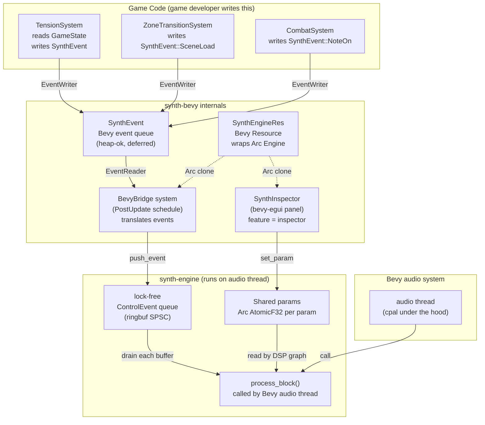

There are exactly **two cross-thread boundaries**:

| Boundary | Mechanism | Thread safety |
|---|---|---|
| Game thread → audio thread (discrete events) | `ringbuf` lock-free SPSC queue | Wait-free on consumer (audio thread) |
| Game thread → audio thread (continuous params) | `Arc<AtomicF32>` (`fundsp::Shared`) | Atomic store/load, no lock |

The game thread never blocks on the audio thread. The audio thread never blocks on anything.

### 15.4 SynthEvent — the game developer's API

`SynthEvent` is a regular Bevy event. Game systems write it with `EventWriter<SynthEvent>`;
the `BevyBridge` system reads it with `EventReader<SynthEvent>` and converts it to the
engine's internal `ControlEvent`.

```rust
pub enum SynthEvent {
    /// Trigger a note on a specific track (0-indexed).
    NoteOn  { track: u8, pitch: u8, velocity: u8 },
    NoteOff { track: u8, pitch: u8 },

    /// Latch a chord for the track's arpeggiator.
    /// The arp iterates these notes until a new ChordHold arrives.
    ChordHold { track: u8, notes: Vec<u8> },

    /// Set a named macro knob (0.0–1.0).
    /// The current scene defines what parameters this macro controls.
    SetMacro { index: u8, value: f32 },

    /// Write directly to a specific parameter on a specific track.
    SetParam { track: u8, param: ParamId, value: f32 },

    /// Load a named scene (replaces all four track patches + macro definitions).
    SceneLoad { name: String },

    /// Crossfade from the current scene to a new one over N frames.
    SceneTransition { name: String, frames: u32 },

    /// Change global BPM.
    Tempo { bpm: f32 },
}
```

The game developer never calls audio functions directly. They write `SynthEvent`s; the bridge
handles translation.

### 15.5 Driving the engine from game state — patterns

#### Pattern A: Continuous mapping (game value → macro)

The most common pattern for adaptive audio. A game system reads a game-world value and maps
it to a macro knob each frame. The musician has pre-designed what Macro 0 does — the game
only knows it ranges 0–1.

```rust
fn tension_audio_system(
    tension: Res<GameTension>,           // f32, 0.0 = calm, 1.0 = max danger
    mut events: EventWriter<SynthEvent>,
) {
    events.write(SynthEvent::SetMacro {
        index: 0,          // "Atmosphere" macro — defined in the scene
        value: tension.0,
    });
}
```

This system runs every frame. The macro smoothly drives shimmer level, filter cutoff, pad
volume, or whatever the musician mapped to it — without any additional code.

#### Pattern B: Scene transition on zone change

```rust
fn zone_transition_system(
    zone: Res<CurrentZone>,
    mut last_zone: Local<Option<Zone>>,
    mut events: EventWriter<SynthEvent>,
) {
    if Some(zone.0) != *last_zone {
        *last_zone = Some(zone.0);
        events.write(SynthEvent::SceneTransition {
            name: zone.0.scene_name().to_string(),
            frames: 44100 * 4,   // 4-second crossfade at 44.1 kHz
        });
    }
}
```

Each zone has a named scene. When the player crosses a zone boundary the engine crossfades to
the new scene without a hard cut.

#### Pattern C: Rhythmic triggers from game events

```rust
fn combat_hit_system(
    mut hit_events: EventReader<EnemyHitEvent>,
    mut synth: EventWriter<SynthEvent>,
) {
    for hit in hit_events.read() {
        // Track 1 = percussion layer; pitch encodes hit severity
        let pitch = if hit.damage > 50 { 60 } else { 48 };
        synth.write(SynthEvent::NoteOn  { track: 1, pitch, velocity: hit.damage.min(127) });
        synth.write(SynthEvent::NoteOff { track: 1, pitch });
    }
}
```

#### Pattern D: Letting the arpeggiator handle harmony

For ambient zones where the music should follow a harmonic center without individual note
triggers:

```rust
fn ambient_chord_system(
    harmony: Res<HarmonyState>,          // current root + scale
    mut synth: EventWriter<SynthEvent>,
    mut last_chord: Local<Vec<u8>>,
) {
    let chord = harmony.current_chord_midi_notes();
    if chord != *last_chord {
        *last_chord = chord.clone();
        synth.write(SynthEvent::ChordHold { track: 0, notes: chord });
    }
}
```

The arpeggiator on Track 0 iterates the held chord automatically. The game never sends
individual `NoteOn/Off` for the ambient layer — it just tells the arp what chord to play.

### 15.6 The dev inspector

During development the musician / composer can open the inspector panel inside the game
window to design sounds and map macros without leaving Bevy. Enable it with a Cargo feature:

```toml
# Cargo.toml (game)
[dependencies]
synth-bevy = { path = "../synth-bevy", features = ["inspector"] }
```

The panel is a `bevy-egui` window. It exposes:
- All four track tabs with the full patch editor (same UI as the standalone app)
- Macro editor: drag-connect parameters to macro knobs; set min/max/curve per target
- Scene save/load from disk
- Live oscilloscope and peak meter

In a release build the `inspector` feature is not enabled. The panel code is compiled out
entirely — zero overhead.

### 15.7 Thread model summary

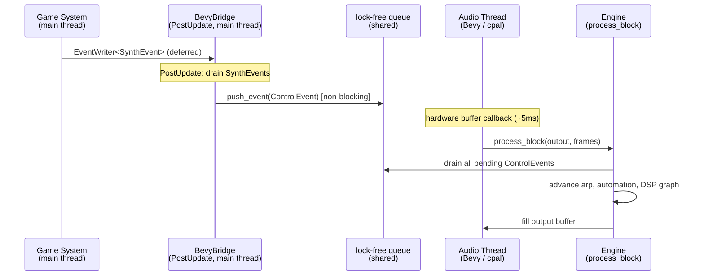

Key properties:
- `SynthEvent` is a normal Bevy event — it can carry heap data (`Vec`, `String`) safely because
  it lives on the game thread until `BevyBridge` converts it to a `ControlEvent`
- `ControlEvent` pushed into the lock-free queue is stack-sized (no heap). The queue is
  pre-allocated; if it is full, the push is dropped silently — the audio thread never blocks
- `process_block()` drains the queue before advancing DSP — events written in frame N take
  effect at the start of the next audio buffer, typically within 5–10 ms

### 15.8 Minimal working example

A complete Bevy app that plays a generative ambient loop, driven by a single tension value:

```rust
use bevy::prelude::*;
use synth_bevy::{SynthPlugin, SynthEvent};

#[derive(Resource)]
struct GameTension(f32);

fn main() {
    App::new()
        .add_plugins(DefaultPlugins)
        .add_plugins(SynthPlugin::default())
        .insert_resource(GameTension(0.0))
        .add_systems(Startup, load_scene)
        .add_systems(Update, (oscillate_tension, map_tension_to_audio))
        .run();
}

fn load_scene(mut events: EventWriter<SynthEvent>) {
    events.write(SynthEvent::SceneLoad { name: "ambient_forest".to_string() });
}

fn oscillate_tension(time: Res<Time>, mut tension: ResMut<GameTension>) {
    // Slowly oscillate tension 0→1→0 over 20 seconds (placeholder for real game logic)
    tension.0 = (time.elapsed_secs() * std::f32::consts::TAU / 20.0).sin() * 0.5 + 0.5;
}

fn map_tension_to_audio(
    tension: Res<GameTension>,
    mut events: EventWriter<SynthEvent>,
) {
    events.write(SynthEvent::SetMacro { index: 0, value: tension.0 });
}
```

The `ambient_forest` scene (designed in the standalone app or inspector, saved to disk)
contains four layers — pad, bass, arp, texture — with Macro 0 wired to shimmer level, filter
cutoff, and texture volume. The game code above is the entirety of the audio integration.
