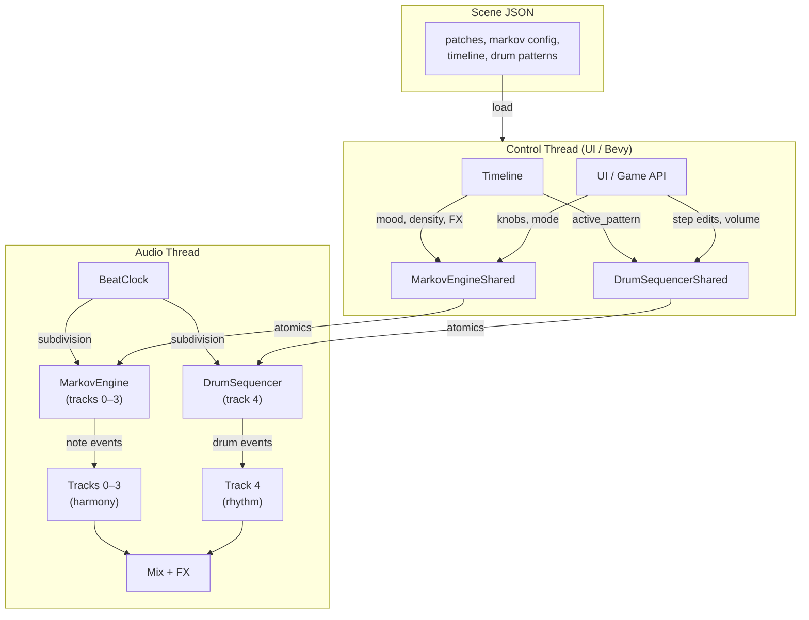
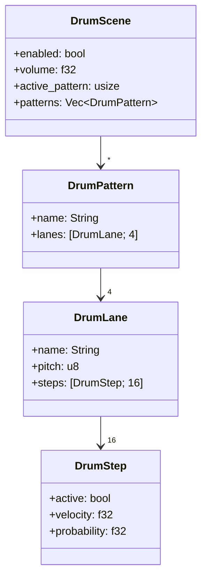
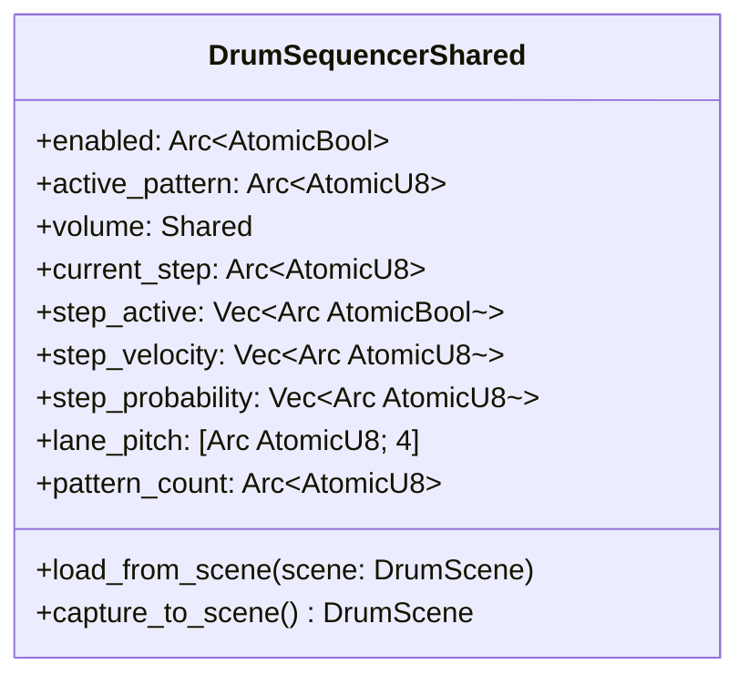
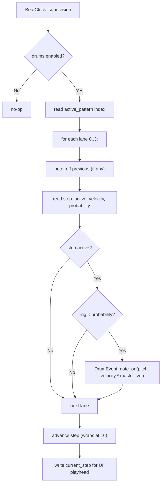
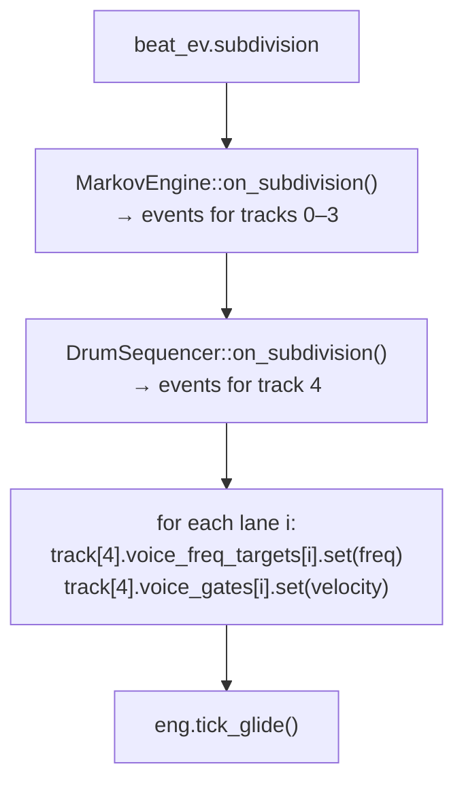

# Drum Step Sequencer — Design Document

**Status:** Design phase (pre-implementation)
**Target crates:** `synth-engine` (track count), `ambient-engine` (sequencer core + API), `ambient-box` (UI)
**Depends on:** Phase 8.3 Markov engine, Phase 8.7 Timeline

---

## 1. Motivation

The Markov generative engine excels at evolving harmony, mood, and texture — but rhythm
needs to be **composed, not generated**. A groove that randomly changes every bar doesn't
lock the listener in. Real electronic music (techno, ambient techno, soundtrack) layers
authored rhythmic patterns under generative harmony.

The drum sequencer provides:
- **Authored grooves** — 16-step patterns with per-step control
- **Humanization** — per-step probability and velocity
- **Timeline integration** — pattern variants that switch with scene sections
- **Genre expansion** — enables techno, soundtrack, and electronic styles alongside ambient

---

## 2. Core Design Principles

1. **Dedicated 5th track.** The drum machine gets its own synth track (track index 4)
   with its own patch, filter, envelope, and 6 voice slots. This means drum sounds are
   sonically independent from the 4 harmonic Markov tracks — a kick can use a sine with
   fast decay while pads use long-sustain saw waves. No voice slot sharing, no timbral
   compromise.

2. **Library-first architecture.** The drum sequencer lives in `ambient-engine`, not in
   `ambient-box`. It exposes a clean API that any host (ambient-box, Bevy game, headless
   renderer) can drive. The sequencer produces events; the host routes them to the audio
   engine. No UI coupling in the core logic.

3. **Parallel with Markov.** The drum sequencer runs alongside the Markov engine on the
   same BeatClock. Both fire on subdivision events. Markov drives tracks 0–3 (harmony),
   the drum sequencer drives track 4 (rhythm). They don't interact — the Timeline
   orchestrates both.

4. **Composed patterns, not generative.** Each step is authored (on/off, velocity,
   probability). The Markov engine provides the evolving harmonic landscape; the drum
   sequencer provides the repeating groove. This is the standard hybrid approach used in
   professional electronic music production.

5. **Scene-serializable.** Drum patterns are stored in the scene JSON alongside Markov
   config. Loading a scene restores the complete musical state — harmony + rhythm +
   timeline. This works identically whether loaded from ambient-box UI or via the
   Bevy `SynthEvent` API.

---

## 3. Architecture Overview



### Track layout (5 tracks)

| Track | Role | Driven by | Typical patch |
|---|---|---|---|
| 0 | Bass | Markov | Ambient Bass, Felt Bass, Sub Throb |
| 1 | Pad | Markov | Endurance Pad, Oblique Pad |
| 2 | Melody / Pad | Markov | Gilmour Lead, Warm Rhodes, Keys Tail |
| 3 | Texture / Pulse | Markov | Wormhole Texture, Saw Stab |
| 4 | **Drums** | **DrumSequencer** | Percussive patch (short ADSR, noise, FM) |

Tracks 0–3 are unchanged from the current system. Track 4 is new and only active
when the scene has a `"drums"` config. Ambient scenes leave track 4 silent.

---

## 4. TRACK_COUNT Change

`TRACK_COUNT` in `synth-engine/src/multi.rs` changes from 4 to 5.

### Impact

All `[T; TRACK_COUNT]` arrays grow by one element automatically. Key locations:

- `MultiTrackEngine` — track graph array, shimmer/crystal sends
- `AmbientEngine` — per-track configs (euclidean, prob_table, generative_mode, arp, walker)
- `Scene` — `tracks: [SceneTrack; TRACK_COUNT]`
- `ambient-box` — UI state arrays, voice_notes, steal_idx, lfo_phases

### Backwards compatibility (scene JSON)

Existing scenes have `"tracks": [4 elements]`. With `TRACK_COUNT = 5`, the fixed-size
array deserializer expects 5. Solution: change `Scene.tracks` from `[SceneTrack; TRACK_COUNT]`
to `Vec<SceneTrack>` and clamp/pad during load:

```
if tracks.len() < TRACK_COUNT:
    pad with default silent track (no patch loaded, volume 0)
if tracks.len() > TRACK_COUNT:
    truncate
```

This keeps all existing scene files valid.

---

## 5. Data Model

### Step



### Constants

| Constant | Value | Rationale |
|---|---|---|
| `DRUM_STEPS` | 16 | Matches BeatClock's 16 subdivisions per bar (4/4 time) |
| `DRUM_LANES` | 4 | Kick, Snare, Hat, Perc — fits 4 voice slots (lanes 0–3 → voice slots 0–3 on track 4) |
| `DRUM_MAX_PATTERNS` | 8 | Enough for Timeline section variants |

### DrumStep

| Field | Type | Default | Description |
|---|---|---|---|
| `active` | bool | false | Whether this step fires |
| `velocity` | f32 | 0.8 | Hit strength 0.0–1.0 |
| `probability` | f32 | 1.0 | Chance of firing when active (humanization) |

### DrumLane

| Field | Type | Description |
|---|---|---|
| `name` | String | Display label ("Kick", "Snare", "Hat", "Perc") |
| `pitch` | u8 | MIDI pitch for this instrument (different pitches = different timbres through same patch) |
| `steps` | [DrumStep; 16] | The pattern |

### DrumPattern

A complete drum pattern — 4 lanes × 16 steps. Scenes can store multiple patterns
and the Timeline switches between them.

### DrumScene

Serializable config stored in `Scene.drums: Option<DrumScene>`. When `None`, the drum
machine is disabled and track 4 is silent. Fully optional — ambient scenes omit this field.

---

## 6. Thread-Safe Shared State



Step data is stored as flat atomic arrays indexed by:
`pattern_idx * DRUM_LANES * DRUM_STEPS + lane_idx * DRUM_STEPS + step_idx`

Velocity stored as u8 (0–255 → 0.0–1.0). Probability stored as u8 (0–100 → 0.0–1.0).

`current_step` is written by the audio thread on each step advance — the UI reads it
to display the playhead position.

---

## 7. Audio-Thread Sequencer

```rust
pub struct DrumSequencer {
    step: usize,                        // 0..15
    current_notes: [Option<u8>; DRUM_LANES], // for note-off tracking
    rng: Lcg,                           // RT-safe RNG for probability
}
```

### on_subdivision



Returns `[DrumEvent; DRUM_LANES]` — one event per lane.

### DrumEvent

```rust
pub struct DrumEvent {
    pub note_on: Option<u8>,   // MIDI pitch
    pub note_off: Option<u8>,  // MIDI pitch
    pub velocity: f32,         // 0.0–1.0, already scaled by step velocity * master volume
}
```

### reset

Called on bar boundary. Resets step counter to 0 for bar-aligned playback.

---

## 8. Audio Callback Integration

The drum sequencer fires **after** the Markov block, on the same `beat_ev.subdivision`
event. It writes directly to track 4's voice slots.



Each drum lane maps directly to a voice slot on track 4:
- Lane 0 (Kick) → voice slot 0
- Lane 1 (Snare) → voice slot 1
- Lane 2 (Hat) → voice slot 2
- Lane 3 (Perc) → voice slot 3

No voice stealing needed — each lane has a dedicated slot.

---

## 9. Scene JSON Format

```json
{
  "name": "Black Box",
  "bpm": 126,
  "tracks": [
    { "patch_path": "...", "patch": {...}, ... },
    { "patch_path": "...", "patch": {...}, ... },
    { "patch_path": "...", "patch": {...}, ... },
    { "patch_path": "...", "patch": {...}, ... },
    { "patch_path": "assets/patches/Pulse/Noise Click.json", "patch": {...}, ... }
  ],
  "markov": { ... },
  "drums": {
    "enabled": true,
    "volume": 0.7,
    "active_pattern": 0,
    "patterns": [
      {
        "name": "Four on Floor",
        "lanes": [
          {
            "name": "Kick",
            "pitch": 36,
            "steps": [
              {"active": true, "velocity": 1.0, "probability": 1.0},
              {"active": false},
              {"active": false},
              {"active": false},
              {"active": true, "velocity": 0.9},
              {"active": false},
              {"active": false},
              {"active": false},
              {"active": true, "velocity": 1.0},
              {"active": false},
              {"active": false},
              {"active": false},
              {"active": true, "velocity": 0.9},
              {"active": false},
              {"active": false},
              {"active": false}
            ]
          },
          {
            "name": "Snare",
            "pitch": 38,
            "steps": [
              {"active": false}, {"active": false}, {"active": false}, {"active": false},
              {"active": true, "velocity": 1.0},
              {"active": false}, {"active": false}, {"active": false},
              {"active": false}, {"active": false}, {"active": false}, {"active": false},
              {"active": true, "velocity": 1.0},
              {"active": false}, {"active": false}, {"active": false}
            ]
          },
          {
            "name": "Hat",
            "pitch": 42,
            "steps": [
              {"active": true, "velocity": 0.7}, {"active": false},
              {"active": true, "velocity": 0.5}, {"active": false},
              {"active": true, "velocity": 0.7}, {"active": false},
              {"active": true, "velocity": 0.5}, {"active": false},
              {"active": true, "velocity": 0.7}, {"active": false},
              {"active": true, "velocity": 0.5}, {"active": false},
              {"active": true, "velocity": 0.7}, {"active": false},
              {"active": true, "velocity": 0.5}, {"active": false}
            ]
          },
          {
            "name": "Perc",
            "pitch": 46,
            "steps": [
              {"active": false}, {"active": false}, {"active": false}, {"active": false},
              {"active": false}, {"active": false},
              {"active": true, "velocity": 0.6, "probability": 0.7},
              {"active": false},
              {"active": false}, {"active": false}, {"active": false}, {"active": false},
              {"active": false}, {"active": false},
              {"active": true, "velocity": 0.6, "probability": 0.7},
              {"active": false}
            ]
          }
        ]
      },
      {
        "name": "Sparse",
        "lanes": [ "..." ]
      }
    ]
  }
}
```

Existing scenes without `"drums"` deserialize to `None` — fully backwards compatible.

---

## 10. Timeline Integration

`TimelineSection` gains an optional `drum_pattern` field:

```json
{
  "name": "Eruption",
  "phrases": 4,
  "transition_phrases": 1,
  "mood": [0.0, 0.15, 0.0, 0.60, 0.0, 0.25],
  "density": 0.75,
  "drum_pattern": 1
}
```

When the Timeline advances to a section with `drum_pattern: Some(idx)`, it writes the
index to `DrumSequencerShared.active_pattern`. The pattern switches at the next bar
boundary (the sequencer resets its step counter on bar, so the new pattern starts
cleanly from step 0).

Sections without `drum_pattern` keep the current pattern — useful for changing mood/density
without disrupting the groove.

---

## 11. Library API (for Bevy integration)

The drum sequencer is fully usable from `ambient-engine` without ambient-box:

```rust
use ambient_engine::{
    DrumSequencer, DrumSequencerShared, DrumScene,
    Scene, AmbientEngine, load_scene_json,
};

// Load a scene (includes drum patterns if present)
let scene = load_scene_json("scenes/Black Box.json")?;
let mut engine = AmbientEngine::new();
engine.apply_scene(&scene);

// Access drum shared state for runtime control
let drums = &engine.drum_shared;
drums.enabled.store(true, Ordering::Relaxed);
drums.volume.set_value(0.8);
drums.active_pattern.store(1, Ordering::Relaxed); // switch to pattern "Sparse"

// Edit a step at runtime
drums.set_step(/*pattern*/0, /*lane*/2, /*step*/5, true, 0.7, 1.0);

// The audio callback (in Bevy or ambient-box) calls:
// drum_sequencer.on_subdivision(&engine.drum_shared)
// and routes DrumEvents to track 4
```

### Bevy SynthEvent extensions

```rust
enum SynthEvent {
    // ... existing events ...
    SetDrumEnabled(bool),
    SetDrumVolume(f32),
    SetDrumPattern(u8),
    SetDrumStep { pattern: u8, lane: u8, step: u8, active: bool, velocity: f32, probability: f32 },
}
```

These events write to `DrumSequencerShared` atomics — the same mechanism used for
Markov parameters.

---

## 12. UI Design

### Step sequencer grid (ambient-box)

```
[Drums ON/OFF] [Vol: ====] [Pattern: Four on Floor ▼]

      1  2  3  4  5  6  7  8  9 10 11 12 13 14 15 16
Kick [■][ ][ ][ ][■][ ][ ][ ][■][ ][ ][ ][■][ ][ ][ ]
Snr  [ ][ ][ ][ ][■][ ][ ][ ][ ][ ][ ][ ][■][ ][ ][ ]
Hat  [■][ ][▪][ ][■][ ][▪][ ][■][ ][▪][ ][■][ ][▪][ ]
Perc [ ][ ][ ][ ][ ][ ][○][ ][ ][ ][ ][ ][ ][ ][○][ ]
                                 ▲ playhead

[■] = active, full velocity    [▪] = active, reduced velocity
[○] = active, has probability  [ ] = inactive
```

- **Left-click**: toggle step on/off
- **Right-click or shift-click**: open velocity/probability popup
- **Playhead**: column highlighted in real-time (reads `current_step` atomic)
- **Cell brightness**: proportional to velocity
- **Dotted border**: probability < 1.0 (step sometimes skips)
- **Pattern dropdown**: select from loaded patterns
- Shown only when scene has `drums` config. Hidden for pure ambient scenes.

---

## 13. File Structure

| File | Change | Description |
|---|---|---|
| `crates/synth-engine/src/multi.rs` | **Modify** | `TRACK_COUNT = 5` |
| `crates/ambient-engine/src/drums.rs` | **New** | All drum types, DrumSequencerShared, DrumSequencer |
| `crates/ambient-engine/src/lib.rs` | **Modify** | `pub mod drums;` + re-exports |
| `crates/ambient-engine/src/engine.rs` | **Modify** | `drum_shared` in AmbientEngine, `drums: Option<DrumScene>` in Scene, `tracks` to Vec for compat, capture/apply |
| `crates/ambient-engine/src/markov.rs` | **Modify** | `drum_pattern: Option<u8>` in TimelineSection |
| `crates/ambient-box/src/main.rs` | **Modify** | Audio callback drum handler, drum UI grid, app state |
| `assets/patches/Pulse/*.json` | Existing | Percussive patches for the drum track |
| `scenes/*.json` | **Modify** | Add `drums` config to techno scenes |

---

## 14. Implementation Phases

### Phase 1: Track count expansion
- Change `TRACK_COUNT` to 5 in `synth-engine`
- Change `Scene.tracks` from fixed array to `Vec<SceneTrack>` with pad/truncate on load
- Fix all compilation errors from the array size change
- Verify existing scenes still load

### Phase 2: Drum data structures
- Create `drums.rs` with all types (DrumStep, DrumLane, DrumPattern, DrumScene, DrumEvent)
- Create `DrumSequencerShared` with atomic arrays + `load_from_scene`/`capture_to_scene`
- Create `DrumSequencer` with `on_subdivision` + `reset`
- Unit tests for stepping, probability, velocity, pattern switching, wrapping

### Phase 3: Engine integration
- Add `drum_shared: DrumSequencerShared` to `AmbientEngine`
- Add `drums: Option<DrumScene>` to `Scene`
- Update `capture_scene()`/`apply_scene()` for drum serialization
- Add `drum_pattern: Option<u8>` to `TimelineSection` + wire into Timeline

### Phase 4: Audio callback
- Add `DrumSequencer` state + `DrumSequencerShared` clone in audio callback
- Add drum subdivision handler after Markov block
- Add drum bar reset alongside existing resets
- Route DrumEvents to track 4 voice slots

### Phase 5: UI
- Add drum UI state to App struct
- Build step sequencer grid panel (egui)
- Wire click → toggle step, playhead display, pattern selector
- Wire scene load/save for drum data

### Phase 6: Content
- Add drum patterns to techno scenes (Black Box, Solar Flare, Ghost Machine, Midnight Drive, Says)
- Create preset drum patterns (Four on Floor, Minimal, Breakbeat, Ambient Pulse)
- Test full pipeline: load scene → play → Timeline switches patterns → save

---

## 15. Design Decisions Log

| Decision | Rationale |
|---|---|
| Dedicated 5th track, not shared voice slots | Each drum lane needs its own timbre. Sharing a track with Markov forces all drums to sound like the harmonic patch. |
| TRACK_COUNT 4→5 | Clean separation. One-time migration cost, permanent architectural benefit. |
| Vec<SceneTrack> instead of [SceneTrack; N] | Backwards compatible with 4-track scene files. Pad with defaults on load. |
| 16 steps | Matches BeatClock's 16 subdivisions per bar in 4/4 time. |
| 4 lanes | Kick/Snare/Hat/Perc covers most electronic genres. More lanes would need more voice slots. |
| Per-step probability | Humanization without sacrificing groove structure. Standard in Elektron/Ableton. |
| Pattern variants in Timeline | Sections can have different grooves (sparse intro, dense peak) without per-step automation. |
| DrumSequencer in ambient-engine | Library-friendly. Bevy users get the same drum machine via API. |
| DrumEvent separate from GenEvent | Self-contained module. GenEvent has no velocity field; adding one would touch Euclidean/ProbTable. |
| Pattern switch on bar boundary | Clean transitions. The sequencer resets on bar, so new patterns always start from step 0. |
