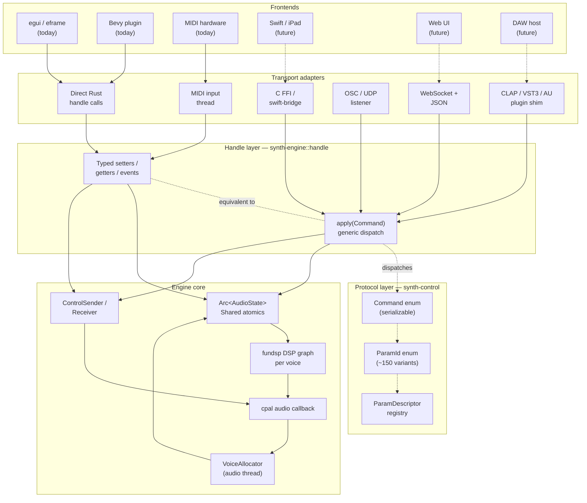
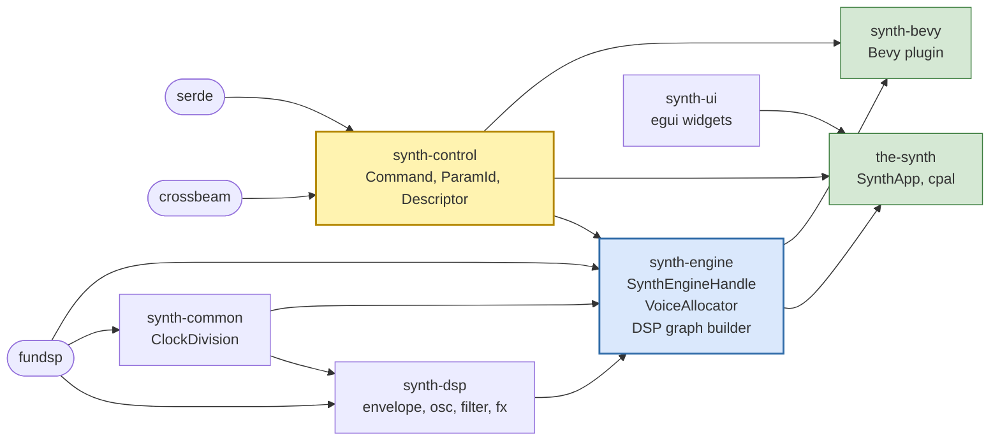
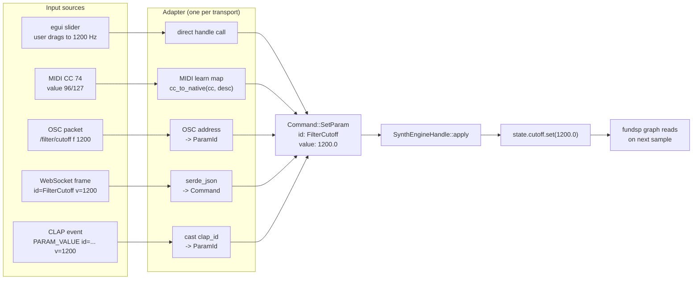
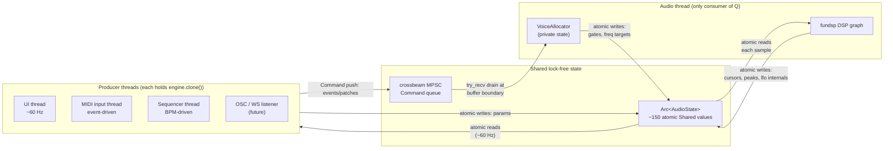
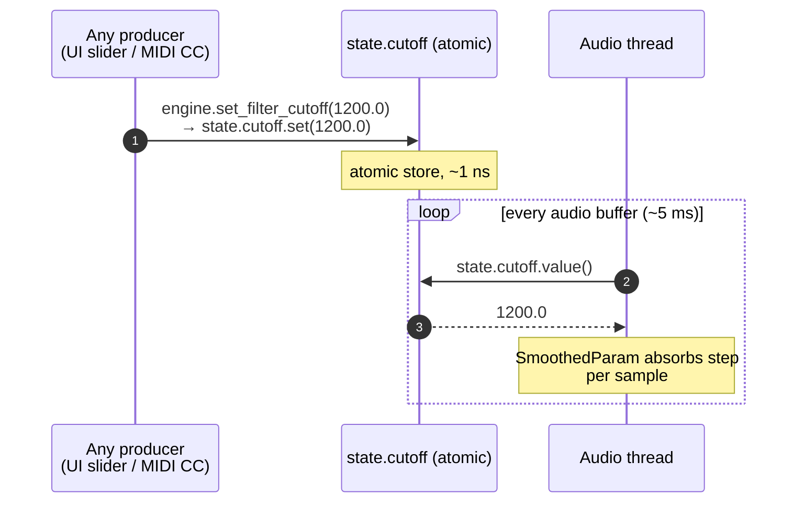
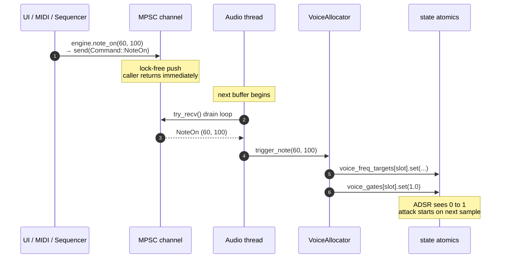
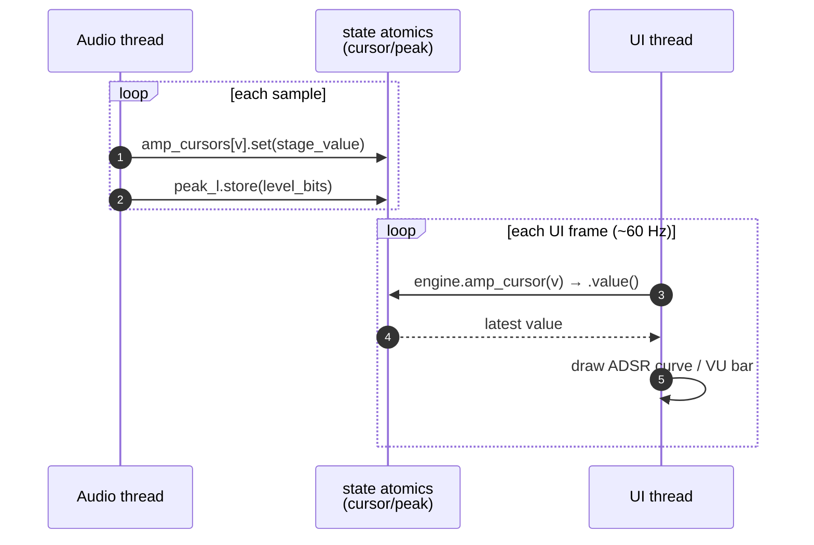
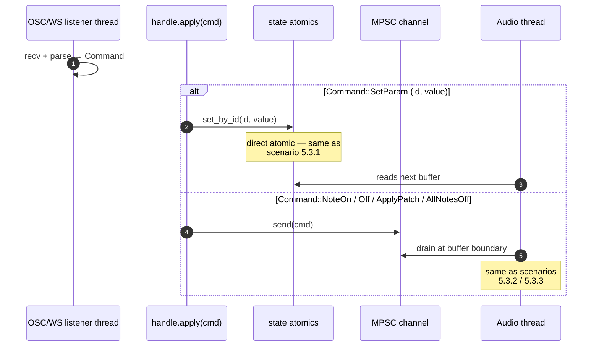

# `SynthEngineHandle` + Typed `Params` — Implementation Plan [DONE]

> Status: design decisions locked (§5). Protocol layer folded in (§3, §11).
> Ready to execute Stage 1 on request.

Follow-up to [`headless-engine-review.md`](headless-engine-review.md). Primary
target: same-device, same-process (egui today). But the **protocol layer**
introduced here (`Command` + `ParamId` + `ParamDescriptor`) is explicitly
designed so that cross-process and cross-device transports (Swift/iPad over
network, web UI, DAW plugin shells) become thin adapters later without
engine changes.

No code has been written yet. This document is the pre-work plan.

---

## 1. Goal

Replace the two parallel APIs (the incomplete `ControlEvent` channel + the
pervasive `Arc<AudioState>.field.set(...)` sprawl) with **one typed handle**
that the UI owns.

After this refactor:

- The UI (any UI) depends only on `SynthEngineHandle`, not on `Arc<AudioState>`,
  not on fundsp, not on the DSP graph shape.
- Voice allocation lives in `synth-engine`, not in the cpal callback closure.
- `Patch` round-trips through the handle, not through UI mirror fields.
- A headless integration test can instantiate the engine without eframe/cpal
  and drive it via the handle only.

---

## 2. Grounding numbers (from the fidelity audit)

| Item | Count |
|---|---|
| `SynthApp` fields total | 132 |
| `SynthApp` fields that mirror engine parameters | ~59 |
| `SynthApp` UI-only fields (panels, theme, drag state, …) | ~60 |
| Direct `state.*.set(...)` / `.store(...)` from UI | ~80 |
| Live engine parameters on `AudioState` | ~150 |
| `ControlEvent::SetParam` routable parameters today | 5 |
| `Patch` struct fields | 79 |
| Voice-allocation lines inside the cpal callback closure | ~150–200 |
| Readback surfaces the UI reads from the engine | 8 types |
| Callback-only `Shared` writes that must stay direct | 5 fields |

The ~59 mirror fields and ~80 direct writes are the coupling we're unwinding.

---

## 3. Shape of the engine surface

Three layers, each building on the one below:

```
┌───────────────────────────────────────────────────────────┐
│ (1) Typed sugar   — SynthEngineHandle::set_filter_cutoff() │  ← same-process UIs
├───────────────────────────────────────────────────────────┤
│ (2) Protocol      — Command + ParamId + ParamDescriptor    │  ← wire-ready
├───────────────────────────────────────────────────────────┤
│ (3) State         — Arc<AudioState> + ControlSender        │  ← engine internals
└───────────────────────────────────────────────────────────┘
```

Layer (2) is the **portable contract**. Typed sugar is a Rust-only
convenience on top of it. Any non-Rust frontend (Swift, web, DAW plugin
shell) targets layer (2) via a transport adapter — never layer (3).

### 3.1 Layer 2 — the protocol

Lives in `synth-control`. Serializable, transport-neutral.

```rust
/// Stable identifier for every live engine parameter.
/// ~150 variants covering oscillators, filter, envelopes, LFOs, FX,
/// arp, walker, master.
#[derive(Clone, Copy, Debug, PartialEq, Eq, Hash,
         serde::Serialize, serde::Deserialize)]
#[non_exhaustive]
pub enum ParamId {
    OscVol(u8), OscWave(u8), OscFreqMult(u8), OscPulseWidth(u8),
    OscUnisonDetune(u8, u8), OscUnisonVol(u8, u8),
    FilterCutoff, FilterResonance, FilterEnvAmount,
    FenvAttack, FenvDecay, FenvSustain, FenvRelease,
    AmpAttack, AmpDecay, AmpSustain, AmpRelease,
    LfoRate, LfoDepth, LfoShape, LfoDest, /* … */
    // ~150 variants total
}

/// Static metadata for a parameter — the thing a decoupled UI renders from.
pub struct ParamDescriptor {
    pub id:      ParamId,
    pub name:    &'static str,        // "Filter Cutoff"
    pub path:    &'static str,        // "filter/cutoff" — CLAP-style module path
    pub min:     f32,
    pub max:     f32,
    pub default: f32,
    pub unit:    &'static str,        // "Hz", "s", "dB", ""
    pub kind:    ParamKind,           // Linear | Log | Discrete(n) | Bool
    pub format:  fn(f32) -> String,   // 1200.0 → "1.2 kHz"
}

pub fn all_params() -> &'static [ParamDescriptor] { /* table literal */ }

/// Every operation the engine can perform. Fully serializable.
#[derive(Clone, Debug, serde::Serialize, serde::Deserialize)]
#[non_exhaustive]
pub enum Command {
    SetParam { id: ParamId, value: f32 },
    NoteOn   { pitch: u8, velocity: u8 },
    NoteOff  { pitch: u8 },
    AllNotesOff,
    ChordHold(Vec<u8>),
    ArpRestart,
    WalkerRestart,
    ApplyPatch(Patch),
}
```

Notes on choices:
- `#[non_exhaustive]` on both enums — adding variants later is non-breaking.
- **Native units** (like CLAP / AU), not VST3-style normalized `[0.0, 1.0]`.
  Simpler for our case; a normalized projection can be added later if we
  wrap for a DAW host.
- `format: fn(f32) -> String` in each descriptor is small but hugely useful:
  same-process UIs render units correctly for free, and a future remote UI
  can request the format function's output over the wire per-param.
- `ParamKind::Discrete(n)` covers wave selectors, LFO shapes, LFO
  destinations, reverb types — anywhere an `AtomicU8` lives today.

This layer is the single place a new transport needs to understand. OSC,
WebSocket, MIDI CC mapping, Swift FFI — all parse inputs into `Command` and
call `handle.apply(cmd)`.

### 3.2 Layer 1 — the typed handle

Lives in `synth-engine::handle`. Wraps internals, offers two equivalent
projections:

```rust
#[derive(Clone)]
pub struct SynthEngineHandle {
    state:   Arc<AudioState>,   // internal, never exposed
    control: ControlSender,     // internal, never exposed
}

impl SynthEngineHandle {
    // --- Typed sugar: same-process fast path (~90 setter/getter pairs) ---
    pub fn set_filter_cutoff(&self, hz: f32) { self.state.cutoff.set(hz); }
    pub fn filter_cutoff(&self) -> f32       { self.state.cutoff.value() }

    // --- Events: channel-routed (voice allocator lives on audio thread) ---
    pub fn note_on(&self, pitch: u8, vel: u8) {
        self.send(Command::NoteOn { pitch, velocity: vel });
    }
    pub fn note_off(&self, pitch: u8) { self.send(Command::NoteOff { pitch }); }

    // --- Readback ---
    pub fn amp_cursor(&self, voice: usize) -> f32 {
        self.state.amp_cursors[voice].value()
    }
    pub fn peak_l(&self) -> f32 {
        f32::from_bits(self.state.peak_l.load(Ordering::Relaxed))
    }

    // --- Generic dispatch: THE bridging point for all transports ---
    pub fn apply(&self, cmd: Command) { /* big match → typed setter or channel send */ }
}
```

**Equivalence invariant:**

```
handle.set_filter_cutoff(1200.0)
  ≡  handle.apply(Command::SetParam {
         id: ParamId::FilterCutoff,
         value: 1200.0,
     })
```

Both paths bottom out on the same `Shared::set` call. Typed sugar is there
for ergonomics and (slight) call-site speed; `apply` is there so transports
don't need to know about ~90 specialized methods.

### 3.3 Layer 3 — state (unchanged)

`Arc<AudioState>` and `ControlSender` stay as they are today — they become
implementation detail, not public API.

**Stays out of both public layers** (audio callback writes these directly,
by design — sample-accurate internal state, not UI params):
- `voice_gain_scale`, `voice_freqs`, `lfo_pitch_mult`, `effective_cutoff`
- per-sample retrigger flip on `voice_gates`

### 3.4 Size estimate

| Layer | File(s) | LoC |
|---|---|---|
| Layer 2 — `ParamId`, `ParamKind`, `ParamDescriptor`, `all_params()`, `Command` | `synth-control/src/protocol.rs` | ~300 |
| Layer 1 — typed sugar + `apply(Command)` | `synth-engine/src/handle.rs` | ~500 |
| Glue / re-exports | `synth-control/src/lib.rs`, `synth-engine/src/lib.rs` | ~20 |
| Smoke test (headless, no cpal/eframe) | `synth-engine/tests/handle_smoke.rs` | ~60 |

**Stage 1 total:** ~880 lines, almost entirely mechanical. The `all_params()`
descriptor table is the largest single chunk (~150 entries × ~1 line each).

---

## 4. Architecture diagrams

Five views of the same system. Read 4.1 first; the others zoom into specific
slices.

### 4.1 Layered architecture — the decoupling story

Solid arrows exist today. Dashed arrows are the future transports that will
plug into the same `apply(Command)` entry point without any engine change.



**Reading guide:**
- The **Protocol layer** is the portable contract. Everything above it is
  per-frontend; everything below is the engine.
- **Typed sugar** and `apply(Command)` are two equivalent entry points into
  the same handle — same-process code prefers typed sugar for ergonomics;
  transports use `apply(Command)` because they've already deserialized a
  `Command`.
- Adding a new frontend = adding one adapter. **Nothing below the handle
  changes.**

### 4.2 Crate topology

Where each piece lives. The handle and protocol are in separate crates so
they can be depended on independently — e.g., a CLAP shim only needs
`synth-control` + `synth-engine`, never `the-synth`.



Yellow = protocol. Blue = handle. Green = frontend (binary / integration
crate). Frontends depend on the handle + protocol, not on each other.

### 4.3 Transport convergence — N inputs, one `Command`

Five unrelated input sources, all producing the same `Command::SetParam`,
all causing the same atomic write. Adding a sixth transport = adding one
adapter; the core doesn't notice.



**Key property:** the `Command` is the single convergence point. MIDI learn,
state snapshotting, automation recording, and networked control all become
"emit a `Command`" / "consume a `Command`" problems.

### 4.4 Parameter change — data flow (same-process)

Hot-path write. No channel, no buffer wait. The UI sets an atomic; the DSP
graph reads it on the next sample. `SmoothedParam` absorbs any step.

```mermaid
sequenceDiagram
    autonumber
    actor UI as UI thread (egui)
    participant H as SynthEngineHandle
    participant S as Arc&lt;AudioState&gt;
    participant G as fundsp graph
    participant CB as cpal callback (audio thread)

    UI->>H: set_filter_cutoff(1200.0)
    H->>S: state.cutoff.set(1200.0)
    Note over S: lockless atomic store<br/>sub-ns, no contention

    loop Every audio buffer (~5 ms)
        CB->>S: state.cutoff.value()
        S-->>CB: 1200.0
        CB->>G: tick samples
        G->>G: SmoothedParam absorbs step
        G-->>CB: filtered samples
    end
```

For cross-transport writes (OSC, WebSocket, CLAP), steps 1–2 become:
`adapter → apply(Command::SetParam) → state.cutoff.set(...)`. Everything
from step 3 on is identical.

### 4.5 Note event — data flow (channel-routed)

Events need to interact with voice allocation, which lives on the audio
thread. So they go through a lock-free channel, drained at the top of each
audio buffer.

```mermaid
sequenceDiagram
    autonumber
    actor UI as UI / MIDI / any source
    participant H as SynthEngineHandle
    participant CS as crossbeam channel<br/>(ControlSender)
    participant CB as cpal callback
    participant VA as VoiceAllocator
    participant S as Arc&lt;AudioState&gt;

    UI->>H: note_on(60, 100)
    H->>CS: send(Command::NoteOn pitch=60 vel=100)
    Note right of CS: lock-free MPSC<br/>never blocks caller

    rect rgba(240,240,255,0.6)
    Note over CB: next buffer begins
    CB->>CS: try_recv() drain loop
    CS-->>CB: NoteOn pitch=60 vel=100
    CB->>VA: trigger_note(60, 100)
    VA->>S: voice_freq_targets[slot].set(midi_hz(60))
    VA->>S: voice_gates[slot].set(1.0)
    Note over S: ADSR sees 0 to 1 edge<br/>attack starts on next sample
    end
```

Why the channel? `voice_notes`, `pitch_hold_count`, `retrigger_countdown`,
`arp`, `walker` all live on the audio thread and are mutated per-event. A
direct-call path would require cross-thread locking on those. The channel
is the audio-safe way to hand events off.

---

## 5. Threading model

Two communication primitives, both lock-free: **atomics** (for parameter
values) and **one MPSC channel** (for events). Every non-audio thread holds
its own `SynthEngineHandle` clone; the audio thread owns the receiver and
private voice-allocator state. That's the entire concurrency model.

### 5.1 Threads and ownership

| Thread | Rate | Owns | Role |
|---|---|---|---|
| **UI thread** (egui/eframe main) | ~60 Hz | `SynthEngineHandle` clone | sliders, note clicks, draws meters & ADSR cursors |
| **Audio thread** (cpal callback) | ~200 Hz (per buffer) | `VoiceAllocator`, DSP graph, channel receiver | voice allocation, sample generation, writes meters/cursors |
| **Sequencer thread** | BPM-driven | handle clone + sequence state | emits `Command::NoteOn/Off` each step |
| **MIDI input thread** (midir) | event-driven | handle clone | MIDI CC → direct atomic; MIDI note → `Command` |
| **Recorder I/O thread** | buffer-driven | ring buffer reader | writes WAV |
| **OSC / WebSocket listener** (future) | event-driven | handle clone | parses wire bytes → `handle.apply(Command)` |

Each thread is independent. They communicate only through atomics and the
one channel.

### 5.2 Communication overview



### 5.3 Scenarios

Five concurrency patterns cover every interaction in the system.

#### 5.3.1 Direct-atomic path — slider / MIDI CC

Source doesn't matter. Sub-nanosecond write. No channel.



#### 5.3.2 Channel-routed event — UI key, MIDI note, sequencer step

Identical path for all three event sources.



The `VoiceAllocator` is only touched by the audio thread; producers never
contend for it — they just push Commands.

#### 5.3.3 Patch load — one Command, batch of writes on audio thread

Wrapping the whole preset in a single `Command::ApplyPatch` keeps the batch
coherent relative to the audio buffer boundary — no half-applied patch ever
audible.

```mermaid
sequenceDiagram
    autonumber
    participant U as UI thread
    participant Q as MPSC channel
    participant A as Audio thread
    participant VA as VoiceAllocator
    participant S as state atomics

    U->>Q: engine.apply_patch(p)<br/>→ send(Command::ApplyPatch(p))
    Note over Q: patch passed as Arc&lt;Patch&gt;<br/>no copy, no alloc on audio thread

    Note over A: buffer boundary
    A->>Q: try_recv()
    Q-->>A: ApplyPatch(p)
    A->>VA: all_notes_off()
    loop for each (id, value) in patch.params()
        A->>S: set_by_id(id, value)
        Note over S: atomic writes, ~1 ns each
    end
    Note over A,S: whole patch lands within<br/>a single buffer drain<br/>(sub-millisecond)
```

#### 5.3.4 Readback — cursors, meters, peaks

No synchronization. Producer and consumer each touch the atomic at their
own rate; last-value-wins is correct for visualization.



UI may miss intermediate audio-rate values — intentional. Visual smoothness
comes from egui's 60 Hz redraw, not from catching every sample.

#### 5.3.5 Future OSC / WebSocket listener

Remote transport. Listener thread parses wire bytes into `Command`, then
branches into the same paths as the local scenarios.



Adding a new transport = one listener thread. The audio thread never
learns it exists.

### 5.4 Concurrency invariants

Complement the refactor-wide invariants in §8. These are specifically
about threading.

1. **Audio thread never blocks.** No `Mutex::lock()`, no `recv()` (only
   `try_recv`), no heap allocation, no syscall. Holds only atomics and its
   private `VoiceAllocator`.
2. **Voice allocator state is audio-thread-exclusive.** Other threads see
   its effects only via the atomics it writes (`voice_gates`,
   `voice_freq_targets`, `amp_cursors`).
3. **Params are last-write-wins.** Multiple producers may race on
   `state.cutoff.set(...)`; the last value wins. Correct semantics for
   slider-style params (two UIs dragging the same knob → last drag wins).
4. **Per-sender event ordering.** The crossbeam MPSC preserves order per
   sender. If the sequencer sends NoteOff then NoteOn for the same pitch,
   they arrive at the audio thread in that order.
5. **Handles clone freely.** `engine.clone()` = 2 Arc refcount bumps, ~1 ns.
   Each thread holds its own.
6. **Channel is bounded + non-blocking.** `make_control_channel(1024)` with
   `try_send` — producers never block. A full queue would indicate audio
   thread stall, not a functional limit.

### 5.5 What changes from today's threading

- **MIDI CC handling moves off the UI thread.** Today it happens inline in
  the egui main loop ([`main.rs:566–597`](../crates/the-synth/src/main.rs#L566-L597)).
  Post-refactor it lives on the MIDI input thread that already exists for
  note handling, calling `engine.set_*()`. Pure decoupling; no regression.
- **Sequencer thread upgrades from `ControlSender` to `SynthEngineHandle`
  clone.** It gains the ability to *read* engine state (for future
  transport-aware behavior) without adding a second plumbing mechanism.
- **Arp and walker stay on the audio thread.** They tick once per buffer
  and feed the same `VoiceAllocator` as external events. Moving them off
  would introduce an extra channel hop with no gain.

---

## 6. Staged plan

Each stage is independently shippable. After Stage 1 the app behaves
identically; after Stage 2 the handle is the only write path from UI code.

| # | Stage | Breakage risk | Net LoC |
|---|---|---|---|
| 1 | **Facade + protocol.** Add `Command` / `ParamId` / `ParamDescriptor` in `synth-control`. Add `SynthEngineHandle` (typed sugar + `apply(Command)`) in `synth-engine`. Expose from `AudioEngine::new()`. UI still has direct `Arc<AudioState>` access. Nothing else changes. Headless smoke test lands with it. | zero — purely additive | +880 |
| 2 | **Panel migration.** Convert each UI panel's direct `state.*.set(...)` to `handle.set_*(...)`. Per-panel counts: oscillators 22, modulation 26, fx_chain 40+, arp_walker 14, sequencer_ui 9, main.rs MIDI CC 3. | per-panel, contained | ±120 |
| 3 | **Patch migration.** `Patch::apply(&handle)` and `Patch::from_handle(&handle)`. Route the 79 patch fields through the handle. Consider moving `Patch` into `synth-engine` so it's not UI-scoped. | medium — `patch.rs` rewrite | ±300 |
| 4 | **`VoiceAllocator` extraction.** Move `trigger_note`, `release_note`, `voice_notes`, `pitch_hold_count`, `retrigger_countdown`, `arp`, `walker` out of the cpal closure into `synth-engine::voice::VoiceAllocator`. Callback shrinks to ~40 lines of orchestration. | medium — audio thread logic moves | ±250 |
| 5 | **Drop `Arc<AudioState>` from `SynthApp`.** Mechanical: make `state` private to `AudioEngine`. Compile-driven cleanup catches the stragglers. | low | –50 |
| 6 | **Delete the mirror.** Remove ~59 `SynthApp` parameter-mirror fields. Sliders use the standard egui pattern: read from handle, pass `&mut local` to the widget, write back on `.changed()`. | low but touches every panel once | –200 |

Order matters: 1 → 2 → 3 in that order. 4 can run in parallel with 2/3. 5–6
come last (they depend on the mirror being unused).

---

## 7. Design choices — decisions locked

### 5.1 Handle ownership: bare struct with `Clone` ✅

```rust
#[derive(Clone)]
pub struct SynthEngineHandle {
    state: Arc<AudioState>,
    control: ControlSender,
}
```

Consequences:
- `handle.clone()` = 2 atomic refcount bumps (sub-ns). Clone freely.
- All clones point to the same underlying state; writes from any thread are
  visible to all.
- `Send + Sync` comes for free — clones move into the sequencer thread, MIDI
  thread, future OSC listener, etc. Each holds its own clone; all hit the
  same engine.
- No `handle.lock()`. Call sites read cleanly.
- Chosen over `Arc<Handle>` (redundant — the struct already holds `Arc`s)
  and over non-`Clone` refs (blocks moving handles into threads).

### 5.2 Setters: hybrid (direct for params, channel for transport) ✅

- **Params → direct `Shared::set`** inside handle methods. Lockless, atomic,
  audio-safe.
- **Notes / transport / patch load → `ControlEvent`**. Needs to interact with
  voice allocation on the audio thread.

**MIDI implications (important — this must stay modular):**

- MIDI notes go through `handle.note_on(pitch, vel)` → `ControlEvent::NoteOn`
  → audio thread voice allocator. Same path as UI clicks.
- MIDI CC → param: the MIDI thread calls `handle.set_lfo_depth(v)` etc.
  Same lockless atomic underneath, just via typed setter. Replaces the
  current direct `state.lfo_depth.set(...)` calls at
  [`main.rs:566-597`](../crates/the-synth/src/main.rs#L566-L597).
- **MIDI learn falls out for free:** a learn table maps
  `(channel, cc) → Box<dyn Fn(&SynthEngineHandle, f32)>`. Engine doesn't know
  MIDI exists; MIDI doesn't know the param graph. Pure decoupling.
- **Any future transport** (OSC, Swift FFI, AU, WebSocket) layers in the same
  way: translate input → call handle setters.

### 5.3 Getters: read live ✅

Read the live atomic every call. No cache, no invalidation. egui at 60 Hz
× ~150 atomic loads/frame = sub-microsecond. Cost is not measurable.

### 5.4 `Patch` moves into `synth-engine` ✅

Currently in `the-synth`, which re-couples the UI to the parameter graph.
After Stage 3 it lives next to `SynthEngineHandle` so any future UI can
round-trip patches without re-implementing them. Patch load goes through
`handle.apply_patch(&patch)` / `handle.snapshot() -> Patch`.

### 5.5 Naming: `SynthEngineHandle` ✅

Self-describing, no collision with the `the-synth` binary or any `Synth`
module name. Verbose at call sites but unambiguous. Aliasing (e.g.
`type Engine = SynthEngineHandle;`) can be added later if it becomes tedious.

---

## 8. Invariants the refactor must preserve

These are non-negotiable; any change that breaks them is wrong.

1. **Audio thread never blocks.** No `Mutex::lock()` on the audio thread. The
   current `try_lock` / atomic discipline must be preserved in the new
   `VoiceAllocator`.
2. **No allocation in the audio callback.** The existing code already
   satisfies this; regressions are easy to miss.
3. **Sample-accurate `Shared` semantics.** fundsp graphs read these mid-graph;
   the handle cannot intercept the reads, only the writes. The 5
   callback-internal Shareds (§3) stay direct.
4. **Voice retrigger hygiene.** The `trigger_note` fix from the previous
   session (audible detection → countdown path) stays in place. Moving the
   logic into `VoiceAllocator` must not regress it.
5. **Patch load silences voices before applying.** Current `Patch::apply`
   calls `all_notes_off()` first. Must survive stage 3.

---

## 9. Stage 1 — concrete deliverables

Minimum viable facade + protocol. Nothing else in the app changes.

### Files touched

- **New:** `crates/synth-control/src/protocol.rs` — `ParamId`, `ParamKind`,
  `ParamDescriptor`, `all_params()`, `Command`. serde derives behind a
  feature flag (`serde`) so `synth-control` stays lean for consumers that
  don't need the wire format.
- **Edit:** `crates/synth-control/src/lib.rs` — `pub mod protocol;` plus
  re-exports.
- **Edit:** `crates/synth-control/Cargo.toml` — add `serde` (optional) +
  `serde_derive`.
- **New:** `crates/synth-engine/src/handle.rs` — `SynthEngineHandle` struct:
  typed sugar (setters/getters/readback/events) + `apply(Command)`.
- **Edit:** `crates/synth-engine/src/lib.rs` — `pub mod handle;` plus
  re-export of `synth_control::protocol` items.
- **Edit:** `crates/the-synth/src/audio.rs` — `AudioEngine` gains
  `pub handle: SynthEngineHandle` (cloned and returned alongside `state`).
- **Edit:** `crates/the-synth/src/main.rs` — `SynthApp` gains
  `engine: SynthEngineHandle` alongside the existing `state: Arc<AudioState>`.
  Old state is **not** removed.
- **New:** `crates/synth-engine/tests/handle_smoke.rs` — headless test,
  no cpal/eframe. Exercises: param set/get roundtrip, `Command` dispatch,
  `apply(SetParam) ≡ typed setter` equivalence check, serde round-trip for
  `Command`, `ParamDescriptor` table invariants (min ≤ default ≤ max, no
  duplicate `ParamId`s).

### Acceptance

1. `cargo build -p synth-control`, `-p synth-engine`, `-p the-synth`
   all succeed.
2. `cargo test --workspace` stays green.
3. `the-synth` runs; UI behaves identically (direct `state.*.set(...)`
   writes still work — migration is Stage 2).
4. Headless smoke test passes.
5. `all_params()` covers every field of `AudioState` that is reachable from
   the UI (~150 entries). Enforced by a test that iterates descriptors and
   round-trips each through `Command::SetParam`.

### Explicit non-goals for Stage 1

- No UI migration.
- No patch refactor.
- No `VoiceAllocator` extraction.
- No removal of the `SynthApp` mirror or `Arc<AudioState>` field.
- No transport adapter implementations (no OSC, no WebSocket, no FFI).
  Just the protocol types they'd target.

---

## 10. Compatibility with MIDI / VST3 / AU / CLAP

The protocol layer (§3.1) isn't a novel invention — it's a minimalist
variant of the same abstractions every plugin API and modern MIDI spec has
converged on. This section spells out the mapping so future work (plugin
shells, MIDI learn, MIDI 2.0 Property Exchange, DAW hosting) is a
matter of adapter code, not engine rewrites.

### 8.1 The shared abstractions

All of these ship basically the same four concepts:

| Concept | Our design | MIDI 1.0 | MIDI 2.0 | VST3 | AU v3 | CLAP |
|---|---|---|---|---|---|---|
| Param identifier | `ParamId` enum | 7-bit CC (0–127), no names | Property Exchange ID | `ParamID: u32` | `AUParameterAddress: u64` | `clap_id: u32` |
| Param metadata | `ParamDescriptor` | conventional only | PE JSON schema | `Parameter` struct | `AUParameter` | `clap_param_info` |
| Value encoding | native units | 7-bit | 32-bit | normalized `[0,1]` | native units | native units |
| Param change message | `Command::SetParam` | CC message | CC + high-res | `IParameterChanges` queue | render-block event | `CLAP_EVENT_PARAM_VALUE` |
| Note on/off | `Command::NoteOn/Off` | status bytes | UMP note packet | `Event::kNoteOnEvent` | MIDI event | `CLAP_EVENT_NOTE_ON/OFF` |
| State save | `Patch` + `apply/snapshot` | SysEx (by convention) | PE | `IBStream` | `fullState` dict | `clap_istream/ostream` |
| Events + params unified | single `Command` stream | separate | separate | two parallel lists | unified list | **unified sorted event list** |

**CLAP** is the closest match to our design — small, modern, open, unified
event stream, native units, module path naming, `#[non_exhaustive]`-style
flexibility. We are effectively building a Rust-native subset of CLAP.

### 8.2 What we're missing vs. plugin APIs (and whether it matters)

1. **Sample-accurate parameter offsets.** VST3/AU/CLAP tag every param
   change with `sample_offset: u32` so DAW automation is dead-on. We don't
   need this for in-process UI — block sizes are small (~256 samples) and
   the engine's `SmoothedParam` absorbs jitter. Would become necessary only
   if we ship as a DAW plugin.

2. **Value-to-text converters.** All three plugin APIs provide formatters
   (`"1.2 kHz"` from `1200.0`). Our `ParamDescriptor.format: fn(f32) -> String`
   satisfies this natively — same-process UIs get correct unit rendering
   and a future remote UI can receive formatted strings in descriptors.

3. **Transport info (tempo, bar, play state).** Plugin hosts pipe these in
   so internal LFOs/sequencers can sync. Irrelevant for us — **we own the
   clock**. Only needed if we host inside a DAW.

4. **Change subscriptions / observers.** Plugins notify hosts when internal
   state changes (e.g., MIDI-driven param move). We defer this — polling at
   60 Hz is fine same-process. Cheap to add later:
   `handle.subscribe(ParamId, callback)` or a push `Event` stream.

5. **Parameter modulation** (`CLAP_EVENT_PARAM_MOD`). Separate from value
   changes — lets a host apply time-varying offsets (macros, LFOs) without
   overwriting the "user value." Our LFO lives inside the engine and our
   users aren't hosts, so we don't need this layer yet.

### 8.3 Concrete mappings for each external standard

#### MIDI 1.0 (legacy devices, OS-level MIDI input)

- **Note on/off** → `handle.note_on(pitch, velocity)` /
  `handle.note_off(pitch)`. Already implemented via `ControlEvent`.
- **CC → parameter** → user-configurable MIDI learn: a
  `HashMap<(channel, cc), ParamId>` stored as user preferences. When a CC
  arrives: `handle.apply(Command::SetParam { id, value: cc_to_native(cc_val, &desc) })`.
  The `cc_to_native` uses `desc.min/max` and `desc.kind` to scale.
- **Program Change** → map to `Patch` index → `handle.apply(Command::ApplyPatch(p))`.
- **Pitch Bend** → `Command::SetParam { id: PitchBend, value }` once we add
  a `PitchBend` variant to the param graph.
- **Sustain (CC 64)** → already handled via `ArpShared.hold`; becomes a
  `ParamId::Sustain` or a dedicated `Command::SustainOn/Off` variant.

#### MIDI 2.0 Property Exchange

- PE asks a device: "give me your param list." We reply with a JSON
  document built from `all_params()`. The `ParamDescriptor` fields map
  directly to PE's JSON schema: `name`, `min`, `max`, `default`, `unit`.
- This is literally the intended use case — PE was designed for this.

#### CLAP plugin shell (likely easiest first port)

- `clap_plugin_params::count()` = `all_params().len()`.
- `clap_plugin_params::get_info(index, &info)` = copy from
  `all_params()[index]`.
- `CLAP_EVENT_PARAM_VALUE` → `handle.apply(Command::SetParam { id, value })`.
- `CLAP_EVENT_NOTE_ON/OFF` → `handle.apply(Command::NoteOn/Off { ... })`.
- `clap_plugin_state::save/load` → `handle.snapshot()` / `handle.apply_patch(p)`.
- Estimated effort: a weekend project once Stage 6 lands.

#### VST3 plugin shell

- `IEditController::getParameterCount/Info` maps to `all_params()`.
- `IParameterChanges` maps to a stream of `Command::SetParam`. **Must
  normalize** since VST3 uses `[0.0, 1.0]` — a 10-line helper on
  `ParamDescriptor` (`fn normalize(&self, native: f32) -> f32`,
  `fn denormalize(&self, norm: f32) -> f32`).
- `IEventList::Event` maps to `Command::NoteOn/Off`.
- `IBStream` save/load maps to bincode-serialized `Patch`.
- More plumbing than CLAP but no engine changes.

#### AU v3 plugin shell (Apple native path)

- `AUParameterTree` built from `all_params()` grouped by `desc.path` for
  the hierarchy (`filter/cutoff` → tree node "filter" with child "cutoff").
- `AUParameterAddress: u64` derived from `ParamId` discriminant.
- `AURenderEvent` unified list maps 1-to-1 with `Command` stream (same
  philosophy as CLAP).
- `fullState` NSDictionary built from `Patch`.

#### OSC

- Address = `desc.path`: `/filter/cutoff f 1200.0` →
  `Command::SetParam { id: FilterCutoff, value: 1200.0 }`.
- `/note/on ii 60 100`, `/note/off i 60`, etc.
- `/query/params` → reply with descriptor list as OSC bundle.

#### WebSocket / JSON

- `serde_json::from_slice::<Command>(msg)?` → `handle.apply(cmd)`.
- `/state/dump` request → `handle.snapshot()` → `serde_json::to_vec`.
- ~20 lines of adapter total.

### 8.4 Takeaway

Our `Command` + `ParamId` + `ParamDescriptor` is deliberately a subset of
CLAP's event/param model. It costs ~300 lines to build and saves ~10× that
in adapter work across the five transports above. Every non-Rust UI the
user might want — iPad Swift, browser, hardware controller, DAW plugin —
targets this layer and inherits its stability guarantees
(`#[non_exhaustive]`, serde-compatible, unit metadata).

---

## 11. Open questions (to decide later, not blocking Stage 1)

- Should `SynthEngineHandle` expose a **batch API** (`handle.apply_all(&[Command])`
  with internal batching) vs just looping per-command? Loop is simpler;
  batching matters for automation recording / lock-free cross-thread bursts.
- Should the sequencer thread own its own `SynthEngineHandle` clone instead
  of a raw `ControlSender`? Probably yes, once Stage 4 lands — then the
  sequencer can also read engine state (e.g., for timing-aware behavior).
- Normalize param values to `0.0..1.0` internally (VST3 style)? Not needed
  for same-process use. If we ship a VST3 shell, add a normalization helper
  on `ParamDescriptor` instead of changing internal representation.
- **Subscription / push API** for remote UIs: `handle.subscribe(ParamId,
  callback)` or a push `Event` stream (value-changed, step-advanced,
  meter-update). Deferred until a cross-network transport lands.
- **Sample-accurate `Command` scheduling** (`Command` carries an optional
  `at: Option<u64>` frame offset). Needed for DAW hosting; not for
  same-process or networked UIs where smoothing absorbs jitter.

---

## 12. Definition of done (whole refactor)

Same as §7 of the review, repeated here for convenience:

1. `the-synth` builds and runs using only `SynthEngineHandle` — no
   `state.<field>.set(...)` anywhere under `the-synth/src/ui/` or
   `the-synth/src/patch.rs`.
2. A minimal non-egui host (e.g., CLI test harness) can drive the engine via
   the same handle and produce identical audio.
3. Loading a patch is observable via engine getters.
4. Headless integration test exists: no eframe, no cpal, drives the engine
   through the handle only, asserts DSP output.
