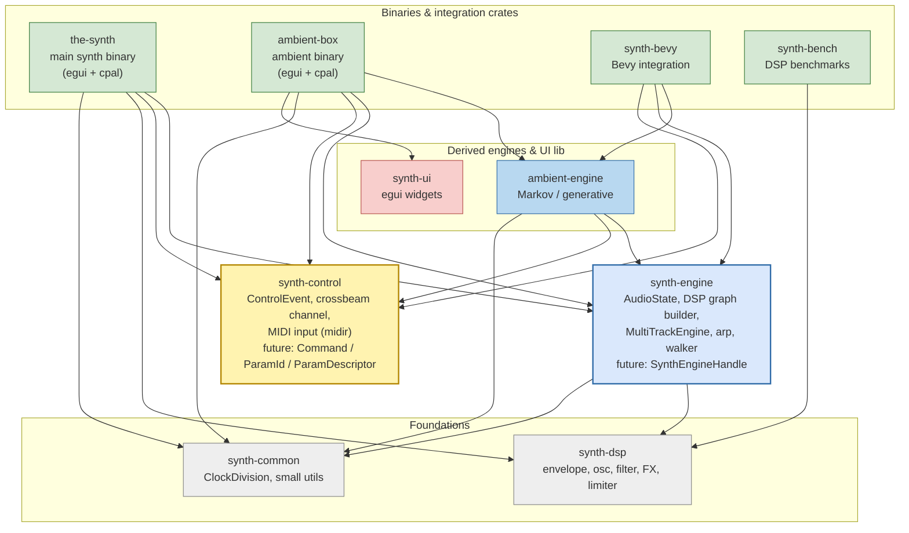

# Headless Engine — Architecture Review

Goal: make the audio engine fully headless so the UI layer can be swapped
(egui today, something else tomorrow) without touching DSP code.

This document captures the **current reality** of the UI ↔ engine boundary and
proposes directions for a future refactor. No code changes yet.

---

## 1. Crate graph — the good part

All ten workspace crates and how they depend on each other:



**Color legend.** Gray = foundations (pure, `fundsp` only). Yellow = protocol
(the future contract layer). Solid blue = core engine; tinted blue = derived
engine. Green = binaries / integration targets. Pink = utility crates.

**Observations that matter for the refactor:**

1. **`synth-control` is already a workspace leaf** (no internal Rust deps).
   Exactly what you want in a protocol crate — anyone can depend on it
   cheaply. Ready to grow into `Command` / `ParamId` / `ParamDescriptor`
   without rippling changes.

2. **`synth-engine` does *not* depend on `synth-control` today.** Control-event
   handling lives in the consumers (the-synth, ambient-engine). Post-refactor
   Stage 1, this edge gets added (`SynthEngineHandle` needs a `ControlSender`).
   Low-risk.

3. **`synth-ui` is used only by `ambient-box`**, not by `the-synth`. The
   widget crate exists but the main binary isn't actually drawing from it.
   Worth a look when touching UI code.

4. **`the-synth` ↔ `ambient-engine` are cleanly separated.** Neither depends
   on the other.

5. **`synth-bevy` is the non-egui-host proof.** It skips `synth-ui`, skips
   `the-synth` entirely, and uses only `ambient-engine + synth-engine +
   synth-control`. Exactly the pattern we want to generalize with the handle.

6. **`ambient-engine` is a derived engine** that wraps `synth-engine` with
   generative logic. When we add `SynthEngineHandle`, ambient-engine is one
   of its first consumers — a useful stress test for the API.

7. **`synth-bench` is isolated** (only `synth-dsp`). Easy to forget during
   refactors that change DSP internals.

`synth-engine`, `synth-dsp`, `synth-common`, `synth-control` have **no UI
dependencies**. The crate layout already enforces the boundary we want.
The problem is not the crate graph — it's what the UI actually *does* with
the engine crates it depends on.

---

## 2. Where decoupling leaks today

### 2.1 `ControlEvent` is a stub, not a contract

[`synth-control/src/event.rs`](../crates/synth-control/src/event.rs) defines
`ControlEvent::SetParam` with a `ParamId` enum of **5 values**:

- `FilterCutoff`
- `FilterResonance`
- `LfoDepth`
- `MasterVolume`
- `LfoPitchMult`

`AudioState` exposes **~150 live parameters** (oscillators, unison, FM/ring,
filter, amp ADSR, filter ADSR, LFO1/LFO2, glide, master, arp, walker, FX
chain, shimmer, crystal, stereo, limiter, …).

**Gap: ~145 parameters have no `ControlEvent` route.** `SetParam` is used for
note-related MIDI mapping; everything else bypasses the channel.

### 2.2 UI owns `Arc<AudioState>` and writes directly

[`the-synth/src/main.rs`](../crates/the-synth/src/main.rs) `SynthApp` holds
`state: Arc<AudioState>` and `control: ControlSender`, and hands `state` to
every panel.

UI panels perform direct mutations via `state.<field>.set(...)` and
`.store(...)`. Approximate counts by file:

| File | Direct writes |
|---|---|
| `ui/oscillators.rs` | ~21 |
| `ui/modulation.rs` | ~31 |
| `ui/arp_walker.rs` | ~16 |
| `ui/sequencer_ui.rs` | ~9 |
| `ui/fx_chain.rs` | ~3 |

**~80 direct `Shared` / atomic writes from the UI into engine internals.** No
facade between egui widgets and fundsp atomics.

### 2.3 `SynthApp` mirrors every parameter

`SynthApp` carries a UI-side copy of each parameter in addition to holding
`Arc<AudioState>`. When a slider moves, both the `SynthApp` field *and* the
`Shared` atomic are written independently. Source-of-truth is ambiguous (UI
snapshot vs. live atomic).

This mirror is what the patch system serializes.

### 2.4 The patch system is UI-coupled

[`the-synth/src/patch.rs`](../crates/the-synth/src/patch.rs):

- `Patch::from_app(app)` captures `SynthApp` fields (the UI mirror).
- `patch.apply(app)` writes back to `SynthApp` fields *and* pokes `Shared`
  atomics directly.
- **No `ControlEvent::SetParam` calls anywhere in the patch pipeline.**

Consequences: loading a patch is invisible to the control channel. A MIDI
recorder, OSC bridge, or automation layer wouldn't see patch changes in the
event stream.

### 2.5 `AudioEngine` is not a reusable handle

[`the-synth/src/audio.rs`](../crates/the-synth/src/audio.rs) stuffs voice
allocation into the cpal callback closure:

- `voice_notes: [Option<u8>; 6]`
- `steal_idx`
- `pitch_hold_count: [u8; 128]`
- `retrigger_countdown: [u8; 6]`
- `arp: ArpState`, `walker: ScaleWalker`

A headless host can't call `engine.tick()`. The `AudioEngine` struct is a
struct by name only — it owns the `cpal::Stream` and nothing else. The real
logic is captured in the callback closure and can't be reused.

Note: `synth-engine::multi::MultiTrackEngine` *does* expose a clean
`tick_glide` / `tick_lfo_sample` / `get_stereo` surface. The single-track path
in `the-synth` hasn't been lifted to the same level.

### 2.6 Sequencer is the cleanest component

[`the-synth/src/sequencer.rs`](../crates/the-synth/src/sequencer.rs)
`SequencerHandle` exposes only atomics + pattern state, and the thread
produces `ControlEvent`s. That's the model to generalize to the rest of the
app.

### 2.7 `synth-bevy` confirms the leak is host-agnostic

[`synth-bevy/src/plugin.rs`](../crates/synth-bevy/src/plugin.rs) uses
`ControlEvent::SetParam` where it can (5 params) and falls back to `Shared`
writes for everything else. Same leak, different host.

---

## 3. The real picture

The app has **two parallel APIs**:

1. **Event channel** — complete for note lifecycle (`NoteOn`, `NoteOff`,
   `ChordHold`, `ArpRestart`, `WalkerRestart`), skeletal for params (5/150).
2. **`Arc<AudioState>` + fundsp `Shared`** — the de facto API; used for every
   knob, every patch apply, every sequencer control change.

A UI swap today means re-implementing against both. The headless boundary
exists on paper (crate layout) but not in practice (every widget reaches
through `Arc<AudioState>`).

---

## 4. Directions for a headless refactor

Three plausible end states. These are not mutually exclusive — most realistic
plans are a blend.

### Option A — Channel-as-API (strict)

Extend `ParamId` to cover every live parameter. All UI writes go through
`ControlEvent::SetParam`. The audio callback becomes the only writer of
`Shared`.

- **Pros:** every change is auditable, recordable, MIDI-mappable for free; one
  API surface.
- **Cons:** ~150 enum variants; big routing `match` in the callback; typing
  `f32` everywhere loses per-field context (e.g., `AtomicU8` for wave
  selection doesn't fit cleanly).

### Option B — Typed `EngineHandle` (pragmatic)

Keep `Arc<AudioState>` internally, but move it behind an `EngineHandle` /
`Params` struct with typed setters:

```rust
handle.set_osc_vol(osc_idx, v);
handle.set_filter_cutoff(hz);
handle.note_on(pitch, velocity);
handle.load_patch(&patch);
```

UI and patch system go through the handle; never through `Shared` directly.
Internally the handle can still write atomics.

- **Pros:** ends the ~80-site `Shared::set` sprawl; gives a second UI something
  to compile against without reading the DSP crate; easy to stub in tests.
- **Cons:** another layer to maintain; doesn't gain auditability unless
  handle setters also emit events.

### Option C — Hybrid

- Direct `Shared` writes for audio-rate slider feedback (cheap, lockless).
- All *state-changing* actions (note on/off, sequencer transport, patch load,
  preset change, pattern edits) go through `ControlEvent`.

Patches become event streams; new UIs only need to emit events, not know the
internal parameter graph.

### Recommendation

**Option B with partial Option C.** The typed handle kills the sprawl and
gives a second UI a real target. Events stay for transport-like concerns
(notes, sequencer, patch load) so external automation and recording become
possible later without another rewrite.

`ParamId` stays small on this path because it's no longer the only chokepoint.

---

## 5. Concrete cleanup items (worth doing under any direction)

1. **Extract a `VoiceAllocator` struct** in `synth-engine` from the cpal
   callback closure in
   [`the-synth/src/audio.rs`](../crates/the-synth/src/audio.rs). Move
   `voice_notes`, `pitch_hold_count`, `retrigger_countdown`, `arp`, `walker`,
   `trigger_note`, `release_note` into it. Any host can then drive the engine
   via one method call per buffer.

2. **Decide on a single source of truth for parameters.** Either:
   - Delete the `SynthApp` mirror fields and read live values off the engine
     handle, or
   - Promote `SynthApp`'s mirror into a `Params` struct whose setters write
     through to the engine (never the other way around).

3. **Route patch apply through the engine handle** instead of touching
   `Shared` and `SynthApp` fields in two places.

4. **Add a headless integration test.** Spawn the engine without eframe /
   without cpal; drive it with events; assert DSP output. This test is what
   guards the decoupling from regressing once achieved.

5. **Lift `MultiTrackEngine`'s tick surface to be the canonical engine
   API.** The single-track path in `the-synth` should use the same pattern
   (or be deleted in favour of a 1-track configuration of
   `MultiTrackEngine`).

---

## 6. What stays untouched

- `synth-dsp`: already pure DSP, no UI, good as-is.
- `synth-common`: already pure.
- `synth-ui`: egui widgets, scoped correctly.
- `synth-control`: the types are fine; the `ParamId` enum may or may not grow
  depending on chosen direction.
- Sequencer thread model: the handle + channel pattern should be the
  template for other subsystems.

---

## 7. Definition of "done"

Headless is achieved when **all four** of these hold:

1. `the-synth` builds and runs using only an `EngineHandle` / event channel —
   no `state.<field>.set(...)` calls anywhere under `the-synth/src/ui/` or
   `the-synth/src/patch.rs`.
2. A second, minimal non-egui host (CLI or TUI) can drive the engine using
   the same handle, producing identical audio.
3. Loading a patch is observable on the event stream.
4. An integration test exists that runs the engine in-process, drives it
   with events only, and validates output — no eframe, no cpal.
