# Markov Music System — Design Document

**Status:** Phase 8.3 implemented, Phase 8.7 (Timeline) in design
**Target crates:** `ambient-engine` (core), `forma-bevy` (integration), `forma-ambient` (UI)

---

## 1. Motivation

Euclidean and probability-table generators are rhythmically mechanical and harmonically naive.
Each step is independent — there is no memory, no phrase shape, no relationship between voices.
The result sounds like a random arpeggiator, not music.

Markov chains model music as a sequence of **state transitions** where history shapes the
next state. A note follows from the previous note. A rest follows from a dense passage.
A chord resolves because the transition matrix encodes resolution probability.
The result has temporal coherence, phrasing, and style — without requiring authored sequences.

However, Markov chains alone are **memoryless at large time scales**. A single chain produces
statistically plausible output moment-to-moment, but has no concept of a *piece* — no build,
no climax, no resolution over minutes. Without a higher-level temporal structure, every
30 seconds of output is interchangeable with any other 30 seconds. The result sounds
*generative* rather than *composed*.

The **Timeline** layer (Phase 8.7) addresses this by introducing a song-level structure
that modulates the engine's parameters over time — giving each scene an arc, a narrative
shape, and a sense of going somewhere.

---

## 2. Core Design Principles

1. **Tonality-agnostic matrices.** All chains operate on relative quantities: scale degrees
   (1–7), rhythmic states (Rest/Hold/Single/Double/Accent), harmonic function (I/IV/V/etc.).
   Absolute pitch is resolved at output time from `(root, scale, degree)`. The same matrices
   work in any key; modulation is an external input, not a matrix property.

2. **External control of tonality and mood.** The game engine or user sets the root note,
   scale, mood blend, and density. The chains respond to these inputs but do not encode them.
   This separation means a single set of matrices can express any key and any mood through
   interpolation and parameter injection.

3. **Voice roles enforce harmonic coherence (Strategy 1+2).** A global harmonic chain sets
   the current chord function for all voices. Each voice has a fixed role (Bass, Pad, Melody,
   Texture) that constrains its register and scale-degree preference. Within those constraints
   the melodic chain provides organic variety. Structural clashes are prevented by role design,
   not by real-time conflict detection.

4. **Phrase boundaries prevent stasis.** A global phrase counter advances every N bars.
   At phrase boundaries the harmonic chain is permitted wider transitions (e.g. relative major
   modulation). This gives the music a sense of going somewhere rather than hovering.

5. **Trainable matrices.** Every probability matrix is a plain `[[f32; N]; N]` array and can
   be updated from analysis of existing music. A training pass reads MIDI or note-event logs,
   counts observed state transitions, and normalizes to produce new matrices. The runtime and
   the learner share the same data format.

6. **Launchpad visualization.** The UI shows N voice rows × M step columns. Cells light up
   in real time as the chains produce output. No steps are pre-programmed — the grid is a
   live display of generative output. This is the primary feedback loop for musicians and
   game developers alike.

7. **Timeline-driven song arcs.** A scene can define an ordered sequence of Sections, each
   specifying target values for mood, density, tonality, voice enables, and effects. The
   Timeline advances through sections over phrases, interpolating between them smoothly.
   This gives each scene a unique temporal shape — a build, a peak, a resolution — without
   changing the Markov engine internals. The engine stays dumb and reactive; the intelligence
   about *how a piece evolves* lives in the Timeline, which is pure data.

---

## 3. Architecture Overview

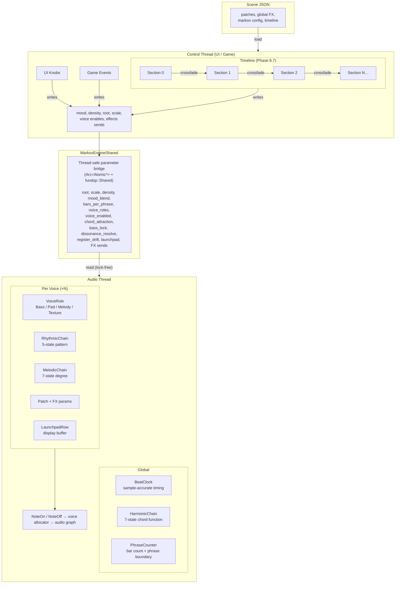

### Thread communication model

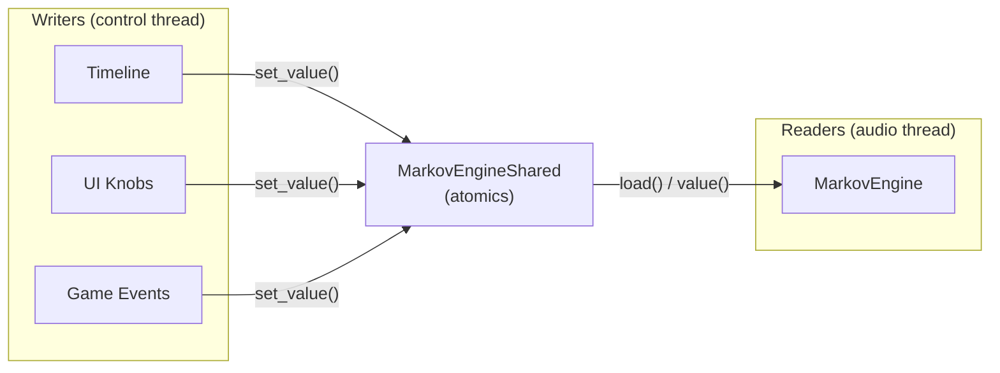

### Time scale hierarchy

The system operates at four nested time scales:

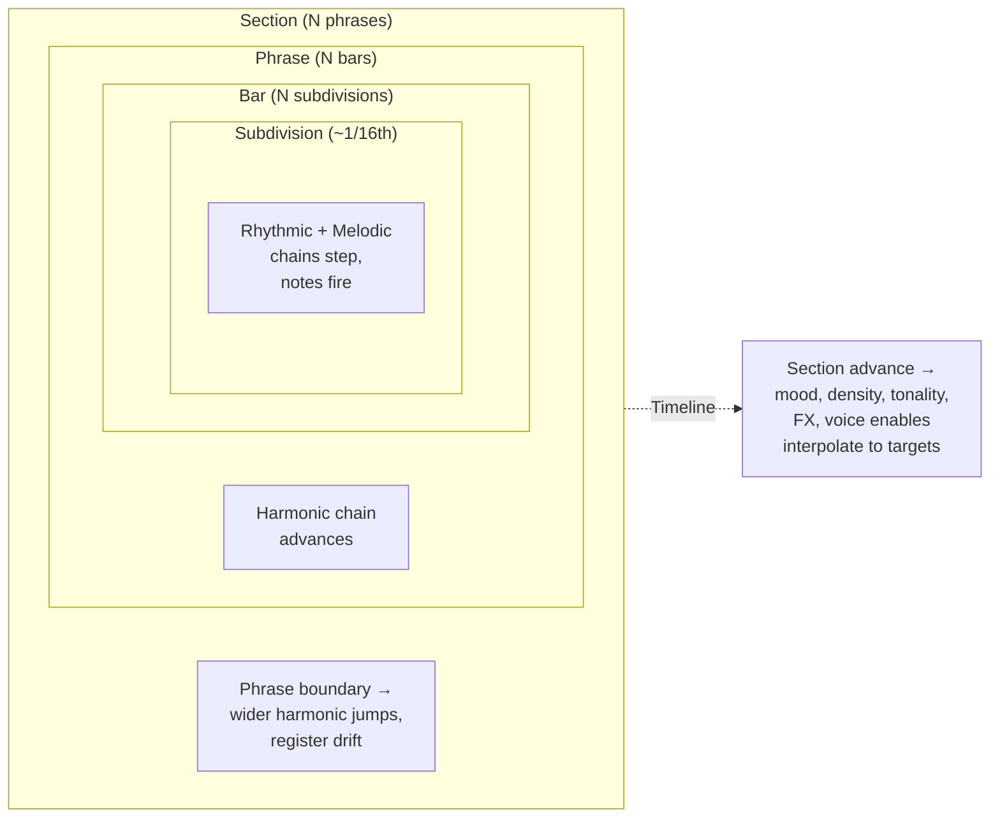

| Scale | Unit | What happens | Driven by |
|---|---|---|---|
| **Subdivision** | ~1/16th note | Rhythmic + melodic chains step, notes fire | BeatClock |
| **Bar** | N subdivisions | Harmonic chain advances (within-phrase matrix) | BeatClock |
| **Phrase** | N bars | Phrase boundary → wider harmonic jumps, register drift, Timeline section progress | PhraseCounter |
| **Section** | N phrases | Mood, density, tonality, effects, voice enables interpolate toward new targets | Timeline |

The first three scales existed in Phase 8.3. The fourth (Section) is added by the Timeline.

---

## 4. The Three Markov Chains

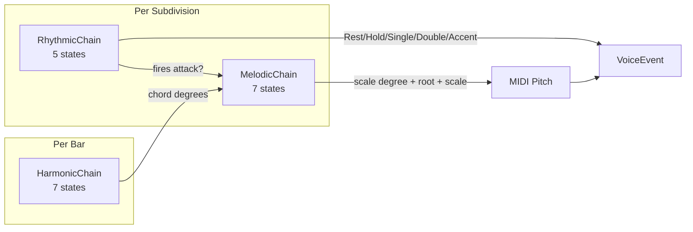

### 4.1 HarmonicChain (global, advances per bar or phrase boundary)

**States — harmonic functions (7):**

| Index | Function | Example in C major | Example in A minor |
|---|---|---|---|
| 0 | `I` / `i` | Cmaj7 | Am7 |
| 1 | `II` / `ii` | Dm7 | Bm7b5 |
| 2 | `III` / `bIII` | Em7 | Cmaj7 |
| 3 | `IV` / `iv` | Fmaj7 | Dm7 |
| 4 | `V` / `V7` | G7 | E7 |
| 5 | `VI` / `bVI` | Am7 | Fmaj7 |
| 6 | `VII` / `bVII` | Bm7b5 | Gmaj7 |

States encode *function*, not pitch. Resolution to actual chord tones happens at
NoteOn time using the current root and scale.

**Normal transition matrix (rows = from, columns = to):**
Used within a phrase. Biased toward authentic cadences and common progressions.

```
         I     ii    iii   IV    V     vi    vii
I       0.25  0.10  0.05  0.25  0.20  0.10  0.05
ii      0.05  0.15  0.05  0.15  0.40  0.15  0.05
iii     0.10  0.10  0.10  0.25  0.20  0.20  0.05
IV      0.25  0.10  0.05  0.20  0.25  0.10  0.05
V       0.45  0.05  0.05  0.10  0.15  0.15  0.05
vi      0.15  0.20  0.05  0.20  0.25  0.10  0.05
vii     0.35  0.10  0.05  0.15  0.20  0.10  0.05
```

Key properties:
- V resolves to I with 45% probability (dominant resolution)
- vii resolves to I with 35% probability (leading-tone resolution)
- IV→V and ii→V are the most common subdominant→dominant moves
- I has moderate self-loop (tonic stability)

**Phrase-boundary transition matrix:**
Used only at phrase boundaries (every N bars). Allows wider moves — relative major/minor
shifts, modal interchange, unexpected pivots.

```
         I     ii    iii   IV    V     vi    vii
I       0.10  0.10  0.10  0.15  0.15  0.25  0.15   ← can jump to vi (relative minor)
ii      0.10  0.05  0.10  0.15  0.25  0.25  0.10
iii     0.10  0.10  0.05  0.20  0.15  0.25  0.15
IV      0.15  0.10  0.10  0.05  0.20  0.25  0.15
V       0.25  0.10  0.10  0.15  0.05  0.25  0.10
vi      0.25  0.15  0.10  0.15  0.15  0.10  0.10   ← vi→I creates relative shift
vii     0.20  0.10  0.10  0.15  0.20  0.15  0.10
```

### 4.2 RhythmicChain (per voice, advances per subdivision)

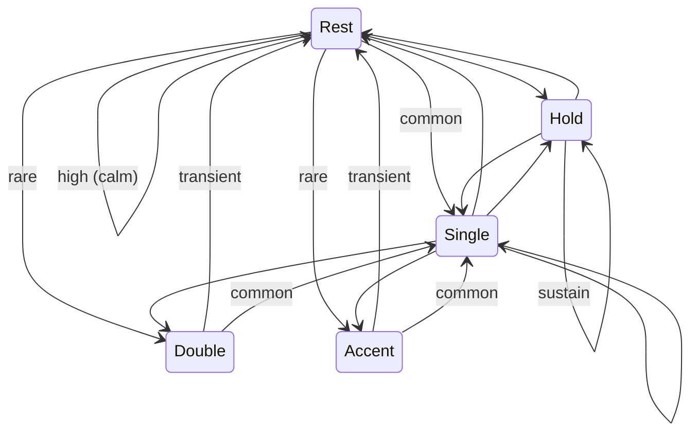

**States (5):**

| Index | State | Description | Typical duration |
|---|---|---|---|
| 0 | `Rest` | Silence | 1+ subdivisions |
| 1 | `Hold` | Sustain previous note | 1+ subdivisions |
| 2 | `Single` | One attack, normal velocity | 1 subdivision |
| 3 | `Double` | Two rapid attacks (2× 32nd) | 1 subdivision |
| 4 | `Accent` | One attack, high velocity | 1 subdivision |

**Calm matrix** (sparse, breathing, mostly resting):

```
          Rest  Hold  Single  Double  Accent
Rest      0.40  0.20  0.35    0.03    0.02
Hold      0.15  0.45  0.35    0.03    0.02
Single    0.25  0.20  0.40    0.10    0.05
Double    0.30  0.10  0.45    0.10    0.05
Accent    0.35  0.15  0.40    0.08    0.02
```

**Tense matrix** (dense, accented, restless):

```
          Rest  Hold  Single  Double  Accent
Rest      0.15  0.05  0.40    0.25    0.15
Hold      0.10  0.20  0.40    0.20    0.10
Single    0.10  0.10  0.35    0.30    0.15
Double    0.15  0.05  0.35    0.35    0.10
Accent    0.20  0.05  0.35    0.25    0.15
```

**Density control:** A density scalar `d ∈ [0,1]` modifies the effective matrix at
query time without changing the stored matrix:

```
effective_rest_prob = stored_rest_prob * (1 - d)   // suppress rest
// renormalize row to sum to 1.0
```

At `d=0` the matrix is used as-is. At `d=1` rest transitions are zeroed and the voice
plays almost continuously.

**Double** and **Accent** states always have high self-loop suppression — they are
naturally transient (a fill should not loop into another fill indefinitely).

### 4.3 MelodicChain (per voice, advances when rhythmic chain fires an attack)

**States — scale degrees (7):** `1 2 3 4 5 6 7`

All degrees are relative to the current scale. Actual MIDI pitch = `root + octave_offset +
scale.intervals[degree]`. The chain is tonality-agnostic by construction.

**Stepwise / Calm style** (small intervals, tonic pull, consonant):

```
       1     2     3     4     5     6     7
1     0.25  0.30  0.15  0.05  0.15  0.05  0.05
2     0.20  0.20  0.30  0.15  0.08  0.05  0.02
3     0.10  0.25  0.20  0.25  0.12  0.05  0.03
4     0.05  0.15  0.20  0.20  0.25  0.10  0.05
5     0.20  0.08  0.12  0.15  0.25  0.15  0.05
6     0.10  0.05  0.10  0.10  0.20  0.25  0.20
7     0.30  0.05  0.05  0.05  0.15  0.15  0.25
```

Key properties:
- Degree 7 resolves to 1 with 30% probability (leading tone)
- Degree 4 moves to 3 or 5 (avoids tritone stasis against 7)
- Tonic (1) has moderate self-loop — settled but moves on
- Adjacent degree transitions dominate (stepwise motion)

**Leaping / Heroic style** (large intervals, active):

```
       1     2     3     4     5     6     7
1     0.15  0.10  0.20  0.05  0.30  0.10  0.10
2     0.10  0.10  0.15  0.10  0.25  0.20  0.10
3     0.20  0.10  0.10  0.10  0.25  0.15  0.10
4     0.15  0.10  0.15  0.10  0.30  0.10  0.10
5     0.25  0.05  0.15  0.10  0.15  0.15  0.15
6     0.20  0.05  0.10  0.10  0.25  0.15  0.15
7     0.35  0.05  0.10  0.05  0.25  0.10  0.10
```

Key properties:
- Larger probability mass on non-adjacent degrees (4ths, 5ths)
- Degree 5 (dominant) is a common leap target from any state
- Degree 7 still resolves to 1 strongly (35%)

---

## 5. Voice Roles

Each voice has a fixed role that applies two constraints:
1. **Register** — octave range within which pitches are resolved
2. **Degree bias** — a per-degree weight vector multiplied into the melodic chain row

### Role definitions

**Bass**
- Register: octaves 1–2 (MIDI 24–47)
- Allowed degrees: `{1, 2, 5}` — root and fifth primarily, passing second
- Bias vector: `[3.0, 0.8, 0.0, 0.0, 2.5, 0.0, 0.0]`
  - Degree 4 = 0 (tritone risk against bass), degree 3/6/7 = 0 (weak in bass)
- Rhythmic style: slower subdivision clock (advances every 2 subdivisions)

**Pad**
- Register: octaves 3–4 (MIDI 48–71)
- Allowed degrees: chord tones of current harmonic state `{1, 3, 5}` ± 2 passing tones
- Bias vector: `[2.0, 0.5, 2.0, 0.3, 2.0, 0.5, 0.3]`
- Rhythmic style: prefers `Hold` and `Single`, rare `Accent`

**Melody**
- Register: octaves 4–5 (MIDI 60–83)
- Allowed degrees: all `{1, 2, 3, 4, 5, 6, 7}` — full melodic freedom
- Bias vector: `[1.0, 1.0, 1.0, 1.0, 1.0, 1.0, 1.0]` (unbiased)
- Rhythmic style: most rhythmically active, all states available

**Texture**
- Register: octaves 5–6 (MIDI 72–95)
- Allowed degrees: upper extensions `{2, 3, 6, 7}` — color tones, no root doubling
- Bias vector: `[0.2, 1.5, 1.2, 0.5, 0.5, 2.0, 1.8]`
- Rhythmic style: very sparse, mostly `Rest` and `Hold`

### Degree bias application

At each melodic step, the chain's transition row is element-wise multiplied by the role's
bias vector, then renormalized to sum to 1.0, before sampling. This means the role shapes
probabilities softly — it doesn't hard-exclude degrees (except where bias = 0), it just
makes some degrees much less likely.

---

## 6. Mood System

A mood is a named tuple of three matrices plus a gate length hint:

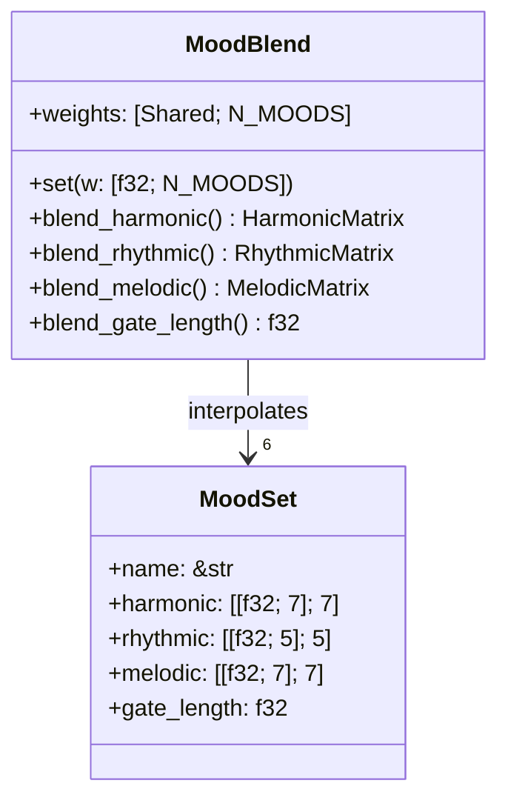

### Predefined moods (6) — Musical Inspirations

Each mood is designed around a specific harmonic language drawn from real composers and
traditions. The matrices are polarized so that each mood has 2–3 dominant transitions at
high probability (0.40–0.65) and competing transitions suppressed to near-zero. This
ensures that blending moods produces audible, characterful results rather than a bland average.

#### Calm — Satie / Debussy / Eno

**Inspiration:** Erik Satie's *Gymnopédies* (hypnotic I↔IV pendulum), Claude Debussy's
parallel diatonic motion, Brian Eno's *Music for Airports* (static tonic, rare movement).

**Harmonic character:** I↔IV plagal oscillation. Tonic sits for long stretches (high
self-loop). V is rare — and when it does appear, it resolves immediately back to I.
Tension is not allowed to build. The harmony barely moves; that *is* calm.

**Melodic character:** Satie-like stepwise motion — 1→2→3→2→1 pendulum. Very narrow
range, strong neighbor-tone movement. Upper degrees (6, 7) are rare visitors.

**Rhythmic character:** Extremely sparse. Rest and Hold dominate. When a note appears,
it's a gentle Single. Double and Accent are near-zero — there are no surprises.

#### Tense — Wagner / Herrmann / Penderecki

**Inspiration:** Wagner's *Tristan und Isolde* (the dominant that never resolves),
Bernard Herrmann's *Vertigo* score (vii and V circling without reaching I),
Penderecki and Bartók's chromatic suspense.

**Harmonic character:** V is a gravitational black hole — everything flows toward it,
and it stays there (self-loop 0.30) or deflects to vii. V→I resolution is actively
suppressed (only 0.15). I has a minimal self-loop — stability is impossible. The
"Wagner loop" emerges naturally: ii→V→vii→V→V→ii→V...

**Melodic character:** Tritone-prone. The 4↔7 tritone pair is strongly connected.
Degree 1 is almost never returned to — the leading tone doesn't resolve! Wide leaps
dominate over stepwise motion.

**Rhythmic character:** Bursts. Rest suddenly explodes into Double/Accent, then
collapses back to silence. No gentle Hold-based breathing — everything is sudden.

#### Dark — Radiohead / Pink Floyd / Andalusian Tradition

**Inspiration:** Radiohead's *Exit Music for a Film* (i→bVI→bVII→i loop), Pink Floyd's
*Breathe* (i→bVII), the Andalusian cadence tradition (i→bVII→bVI→V). The Aeolian
modal sound where vi and vii function as home bases rather than passing chords.

**Harmonic character:** vi and vii are home bases. The Aeolian cadence I→vii→vi→V→vi
is the natural orbit. V→vi deceptive cadence (highest probability from V) denies
resolution — darkness is maintained. I→vi immediately darkens any moment of stability.

**Melodic character:** Descending motion dominates. Minor 3rd (degree 3) is a
gravitational center. 7→6→5→6→7 oscillation in the low register. The leading tone
descends to b6 rather than resolving upward — the opposite of tonal expectation.

**Rhythmic character:** Sparse with sudden violence. Long silence, then a Accent stab,
then immediate collapse back to silence. The "jump-scare" texture — notes appear
violently and die immediately.

#### Euphoric — Pachelbel / Sigur Rós / EDM Builds

**Inspiration:** Pachelbel's *Canon in D* (I→V→vi→iii→IV→I cycle), Sigur Rós's
*Hoppípolla* (IV→I plagal lifts), EDM and trance build progressions (vi→IV→I→V),
the "four chord song" pop tradition (I→V→vi→IV).

**Harmonic character:** IV→I plagal lift is the emotional core. V→I resolves fast and
joyfully. The Pachelbel cycle (I→V→vi→IV→I) emerges from the probabilities. Every
chord has low self-loop — the harmony is always *moving forward*, always *building*.

**Melodic character:** Strongly ascending. Every degree wants to go *up*. The climax
chain 1→3→5→6→7→1(octave) has the highest probabilities throughout. 6→7 and 7→1
create the triumphant leading-tone resolution. Descending motion is suppressed.
Pentatonic feel (1, 2, 3, 5, 6 favored over 4, 7).

**Rhythmic character:** Steady energetic pulse. Single dominates as a heartbeat.
Rest almost never self-loops — the energy never drops. Double and Accent add drive.

#### Cosmic — Zimmer (Interstellar) / Vangelis / Tangerine Dream

**Inspiration:** Hans Zimmer's *Interstellar* organ (sustained I→IV→I for minutes),
Vangelis's *Blade Runner* (sustained tonic, timeless ambiguity), Tangerine Dream's
electronic ambient (modal, V absent, IV as second home).

**Harmonic character:** Harmonic time nearly stops. I has a massive self-loop — it
just *sits*. The only regular motion is I↔IV plagal oscillation. V almost never
appears — dominant function is absent from this universe. vi is occasional
Vangelis-style color.

**Melodic character:** Near-static drone. Degree 1 has a large self-loop. When
movement happens, it's 1↔5 (organ open 5th oscillation). Everything else is glacially
slow stepwise motion. The melody is barely distinguishable from a held chord.

**Rhythmic character:** Extremely sparse. Rest and Hold are almost everything. A note
attack is a rare cosmic occurrence — like a star appearing. Double and Accent
are near-zero.

#### Gravity — Philip Glass / Zimmer (Docking) / Nyman

**Inspiration:** Philip Glass's *Koyaanisqatsi* (relentless arpeggiated ostinato),
Zimmer's *Interstellar* docking scene (mechanical i→V→vi→IV cycle), Michael Nyman's
*The Piano* (repetitive short harmonic loops).

**Harmonic character:** A tight I→V→vi→IV→I loop that repeats obsessively. V→vi
deceptive cadence is the signature move — resolution is always *deflected*, creating
a relentless circular feeling. Unlike Cosmic (which sits), Gravity is always *moving*
but going in circles. Low self-loops everywhere.

**Melodic character:** Ostinato-like. 1→5→1→3→5 Glass-style arpeggiation. Very narrow
range but insistent — the same 3–4 degrees repeating in a tight pattern.

**Rhythmic character:** Mechanical clock-pulse. Single dominates at all transitions —
the machine never stops. Rest is rare. The rhythm has an industrial, minimalist
regularity.

### Mood design principle

Each mood "owns" a famous harmonic language. At 100%, you should *hear* the reference:
Calm sounds like Satie, Tense sounds like Wagner, Dark sounds like Radiohead, Euphoric
sounds like a pop anthem, Cosmic sounds like Interstellar's organ, Gravity sounds like
Philip Glass.

When blending — e.g. 50% Cosmic + 50% Gravity — the result should be recognizable as
a *conflict* between two languages (the Interstellar docking scene: sustained organ
stasis fighting against mechanical ostinato), not a generic average.

### Interpolation

At runtime, the active matrix for any chain is computed as a weighted blend:

```
active_rhythmic = sum(mood_blend[i] * mood[i].rhythmic for i in moods)
// where sum(mood_blend) = 1.0
```

This is done per-row, per-sample-of-chain-state (i.e. only when a transition is queried,
not every audio sample). Cost: N_states × N_moods multiplications at transition time.

**Example:** 70% Calm + 30% Tense gives a rhythmic matrix where rest probability is
`0.7 * calm_rest + 0.3 * tense_rest` — mostly breathing but occasionally bursting.

---

## 7. Phrase Boundary System

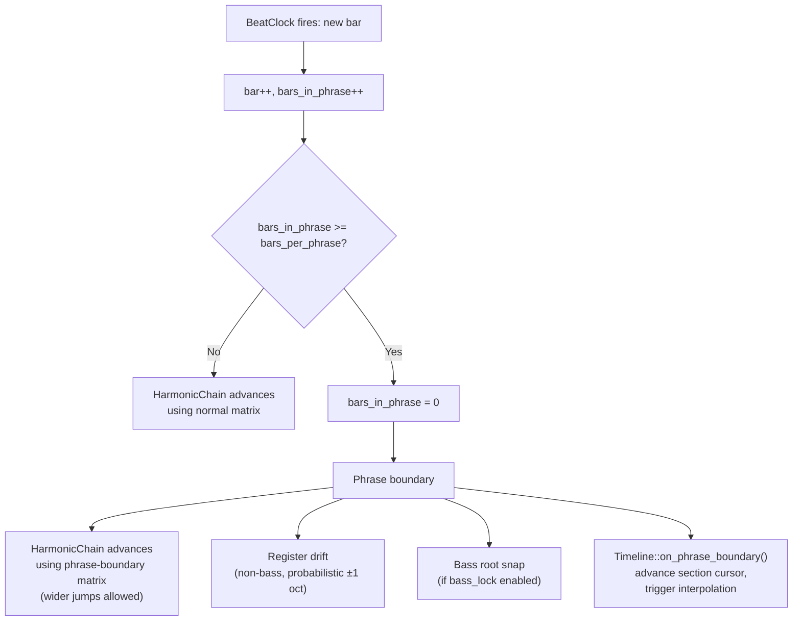

**Per bar:** `bar_counter++`. If `bars_in_phrase >= bars_per_phrase` → phrase boundary.
At a phrase boundary, the harmonic chain uses the **phrase-boundary transition matrix**
instead of the normal matrix. This allows larger harmonic jumps (relative modulation, etc.).

**Phrase boundary events** are also consumed by the **Timeline** (§10) to advance the
section cursor and trigger parameter interpolation.

---

## 8. Tonality Control (External Input)

All of the following are runtime parameters, not matrix properties:

| Parameter | Type | Who sets it |
|---|---|---|
| `root` | MIDI note 0–127 | Keyboard, game event, scene, **Timeline** |
| `scale` | enum (Major/Minor/Dorian/…) | Scene config, game event, **Timeline** |
| `octave_offset` | i32 per voice | Voice role default, game event |
| `mood_blend` | `[f32; N_MOODS]` (sums to 1) | Macro knob, game event, **Timeline** |
| `density` | f32 0–1 | Macro knob, game event, **Timeline** |
| `bars_per_phrase` | u32 (bars) | Scene config, game event, **Timeline** |

**Keyboard input:** playing a note on the keyboard shifts the root to that note (or adds it
to a chord set that the harmonic chain uses as an anchor). The matrices don't change —
the resolution mapping changes. This lets a performer modulate a generative piece in real
time by pressing a new root note.

**Game engine:** sends `SynthEvent::SetRoot(pitch)`, `SynthEvent::SetMoodBlend([…])`,
`SynthEvent::SetDensity(f32)`. These write to atomics; the audio thread reads them at
each chain transition.

**Timeline:** the highest-priority automated source. When a Timeline is active, it drives
mood, density, root, scale, voice enables, and effects sends on a per-section basis.
Manual UI knob overrides are still possible (the UI writes to the same atomics) but
will be overwritten by the Timeline at the next interpolation tick. See §10.

---

## 9. Matrix Training from Existing Music

### Training process

A training pass takes a sequence of observed events (from a MIDI file or live performance)
and counts state transitions:

```
for each consecutive pair (state_a, state_b) in observed sequence:
    count_matrix[state_a][state_b] += 1.0

// Normalize each row:
for row in count_matrix:
    total = sum(row)
    if total > 0: row /= total
```

For the **harmonic chain**: the input is a sequence of chord symbols (analyzed from MIDI or
provided as annotations). Each chord is mapped to a harmonic function (I/ii/iii/IV/V/vi/vii)
relative to the key. The transition count matrix is built from consecutive chord pairs.

For the **rhythmic chain**: the input is a sequence of note events on a rhythmic grid. Each
cell is classified as Rest/Hold/Single/Double/Accent. Consecutive cells build the count matrix.

For the **melodic chain**: the input is a sequence of scale degrees (absolute pitch → scale
degree given known key). Consecutive degree pairs build the count matrix.

### Smoothing

Raw count matrices from short songs have many zero entries, which create hard blocks in
generation (certain transitions can never occur). Apply Laplace smoothing:

```
smoothed[i][j] = (count[i][j] + alpha) / (row_total + alpha * N_states)
// alpha = 0.1 to 0.5 depending on desired smoothing strength
```

### Blending learned matrices with built-in moods

A trained matrix can be used as a new named mood and blended with existing moods. A
game could ship with `Calm`, `Tense`, `Dark` built-in and let designers train a
`HeroTheme` matrix from the game's own soundtrack. The mood blend knob then mixes
`50% Calm + 50% HeroTheme`.

### Format

Trained matrices are serialized as JSON (same format as scene files):

```json
{
  "name": "HeroTheme",
  "source": "midi/hero_theme.mid",
  "harmonic": [[0.25, 0.10, ...], ...],
  "rhythmic": [[0.40, 0.20, ...], ...],
  "melodic":  [[0.25, 0.30, ...], ...]
}
```

---

## 10. Timeline — Song-Level Temporal Structure

### Problem statement

Without the Timeline, every engine parameter is a **static value** set once when the
scene loads. The mood blend, density, root, scale, voice enables, and effects sends
never change unless a human turns a knob. This means:

- A 10-minute session of "Interstellar" sounds the same at minute 1 and minute 9.
- There is no build, no climax, no resolution.
- There is no sense of "a piece" — just an infinite, timbrally consistent stream.

The `harmonic_seq` field (Phase 8.3) was a first step — it cycles root/scale across
phrase slots — but it only touches tonality. Everything else stays frozen.

### Design: Section-based song arcs

A **Timeline** is an ordered list of **Sections**. Each Section defines:

- **Target state** — where the engine parameters should be at the end of this section
- **Duration** — how many phrases this section lasts
- **Transition** — how many phrases to spend interpolating from the previous section's state

The Timeline advances automatically as `PhraseCounter` fires phrase boundaries.
It does not run on the audio thread — it lives on the control thread and writes to
the same `MarkovEngineShared` atomics that UI knobs and game events write to.

### Data model

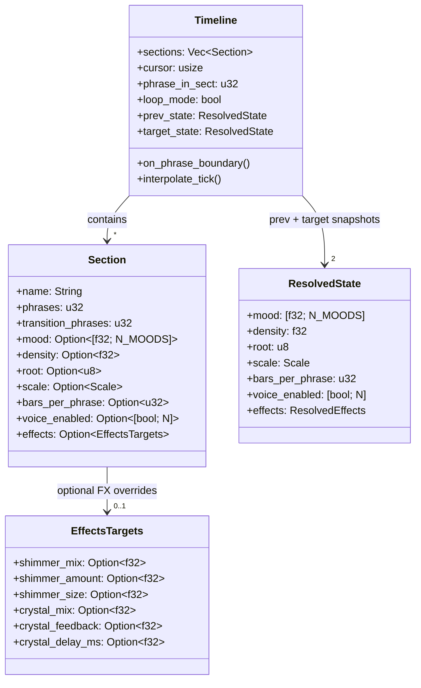

**Optional fields** are the key to keeping sections lightweight. An "Intro" section
might only set mood + density + voice_enabled. A "Modulate" section might only change
root + scale. Unspecified fields carry forward from the previous section (or from the
scene's base `markov` config for the first section).

`ResolvedState` is the fully resolved set of all parameters (no `Option`s —
every field filled in by cascading from defaults → previous section → current section).

### Interpolation

When a section begins, the Timeline snapshots `prev_state` (what the engine was
doing) and resolves `target_state` (what this section wants). During the
`transition_phrases` window, all continuous parameters are linearly interpolated:

```
t = phrase_in_sect / transition_phrases   // 0.0 → 1.0
current_density = lerp(prev_state.density, target_state.density, t)
current_mood[i] = lerp(prev_state.mood[i], target_state.mood[i], t)
// etc.
```

**Discrete parameters** (root, scale, voice_enabled) snap at t = 0.5 (midpoint of
the transition) to avoid jarring switches at section boundaries while still being
deterministic.

After the transition window completes (t ≥ 1.0), the engine holds at `target_state`
until the section's `phrases` count is exhausted.

### Section advancing logic

```mermaid
flowchart TD
    PB["PhraseCounter fires:<br/>phrase_boundary"]
    PB --> INC["phrase_in_sect += 1"]
    INC --> CHECK{phrase_in_sect >= section.phrases?}
    CHECK -->|No| INTERP{phrase_in_sect <= transition_phrases?}
    INTERP -->|Yes| LERP["Interpolate: t = phrase_in_sect / transition_phrases<br/>lerp(prev_state → target_state)"]
    INTERP -->|No| HOLD["Hold at target_state"]
    LERP --> WRITE["Write interpolated values<br/>to MarkovEngineShared atomics"]
    HOLD --> WRITE
    CHECK -->|Yes| NEXT{cursor + 1 < sections.len()?}
    NEXT -->|Yes| ADV["prev_state = snapshot()<br/>cursor += 1<br/>phrase_in_sect = 0<br/>target_state = resolve(sections[cursor])"]
    NEXT -->|No| LOOP{loop_mode?}
    LOOP -->|Yes| RESTART["prev_state = snapshot()<br/>cursor = 0<br/>phrase_in_sect = 0<br/>target_state = resolve(sections[0])"]
    LOOP -->|No| STAY["Hold on final section<br/>indefinitely"]
    ADV --> WRITE
    RESTART --> WRITE
```

### Relationship to harmonic_seq

The Timeline **replaces** `harmonic_seq`. The harmonic sequence was a 1-dimensional
timeline that only modulated root and scale. The Timeline generalizes this to all
parameters. For backwards compatibility, scenes with `harmonic_seq` but no `timeline`
continue to work as before. Scenes with a `timeline` ignore `harmonic_seq`.

### What the Timeline does NOT do

- **Does not run on the audio thread.** It writes to atomics on the control thread.
- **Does not modify Markov chain internals.** The chains remain memoryless — they
  just read different parameters.
- **Does not override live input.** If a performer plays a root note, it takes effect
  immediately. The Timeline will overwrite it at the next interpolation tick, but
  there's no conflict — the performer is always heard in the moment.
- **Does not require a Timeline.** Scenes without a `timeline` field work exactly
  as they do today (static parameters, optional `harmonic_seq`).

### Scene JSON format

```json
{
  "name": "Interstellar",
  "bpm": 58,
  "tracks": [ ... ],
  "global": { ... },
  "markov": {
    "clock_div": 8,
    "bars_per_phrase": 8,
    "density": 0.3,
    "mood": [0.0, 0.0, 0.1, 0.0, 0.55, 0.35],
    "voice_roles": [0, 1, 1, 3],
    "voice_enabled": [true, true, true, true],
    "chord_attraction": 0.82,
    "bass_lock": true,
    "dissonance_resolve": true,
    "dissonance_threshold": 1,
    "register_drift": 0.1,

    "timeline": [
      {
        "name": "Stillness",
        "phrases": 4,
        "transition_phrases": 0,
        "mood": [0.0, 0.0, 0.0, 0.0, 0.85, 0.15],
        "density": 0.10,
        "voice_enabled": [true, true, false, false]
      },
      {
        "name": "Awakening",
        "phrases": 6,
        "transition_phrases": 3,
        "mood": [0.0, 0.0, 0.15, 0.0, 0.50, 0.35],
        "density": 0.30,
        "voice_enabled": [true, true, true, false]
      },
      {
        "name": "Wormhole",
        "phrases": 4,
        "transition_phrases": 2,
        "mood": [0.0, 0.25, 0.20, 0.0, 0.20, 0.35],
        "density": 0.55,
        "root": 50,
        "scale": 6,
        "bars_per_phrase": 4,
        "voice_enabled": [true, true, true, true],
        "effects": { "shimmer_mix": 0.80, "crystal_mix": 0.40 }
      },
      {
        "name": "Resolution",
        "phrases": 8,
        "transition_phrases": 4,
        "mood": [0.20, 0.0, 0.0, 0.0, 0.60, 0.20],
        "density": 0.15,
        "root": 50,
        "scale": 1,
        "bars_per_phrase": 8,
        "voice_enabled": [true, true, false, true],
        "effects": { "shimmer_mix": 0.55, "crystal_mix": 0.15 }
      }
    ],
    "timeline_loop": true
  }
}
```

This example creates a 22-phrase arc (~17 minutes at 58 BPM, 8 bars/phrase):

```mermaid
gantt
    title Interstellar — Timeline Arc (22 phrases, loops)
    dateFormat X
    axisFormat %s

    section Sections
    Stillness (4 phrases)          :s0, 0, 4
    Awakening (6 phrases)          :s1, 4, 10
    Wormhole (4 phrases)           :s2, 10, 14
    Resolution (8 phrases)         :s3, 14, 22

    section Transitions
    (no transition)                :crit, t0, 0, 0
    Crossfade (3 phrases)          :active, t1, 4, 7
    Crossfade (2 phrases)          :active, t2, 10, 12
    Crossfade (4 phrases)          :active, t3, 14, 18

    section Voices
    Bass + Pad                     :v0, 0, 4
    Bass + Pad + Melody            :v1, 4, 10
    All 4 voices                   :v2, 10, 14
    Bass + Pad + Texture           :v3, 14, 22

    section Density
    0.10 (sparse)                  :d0, 0, 4
    0.10 → 0.30                    :d1, 4, 10
    0.30 → 0.55 (peak)            :d2, 10, 14
    0.55 → 0.15 (dissolve)        :d3, 14, 22
```

1. **Stillness** — sparse cosmic drones, bass + pad only, very low density
2. **Awakening** — melody voice enters over 3 phrases, density rises, gravity increases
3. **Wormhole** — peak tension, harmonic minor, all 4 voices, fast harmonic rhythm,
   heavy effects sends
4. **Resolution** — slow dissolve back to cosmic calm, melody drops out, texture remains

Then it loops back to Stillness.

---

## 11. The Launchpad UI

### Grid layout

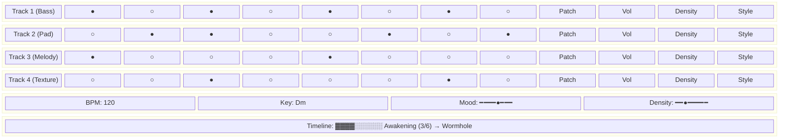

### Cell states

| Display | Meaning |
|---|---|
| Dark | Rest |
| Dim white | Hold (sustaining) |
| Bright color | Single attack (color = voice role) |
| Bright + large | Accent |
| Flashing | Double (two rapid attacks) |

Cells are **not clickable to pre-program** — they are a read-only live display of chain output.
Future: optionally allow override (click to force a step, overriding the chain for that one cycle).

### Per-voice controls (right of grid)

- Patch selector (dropdown)
- Volume knob
- Density knob (overrides global for this voice)
- Style knob (Stepwise ↔ Leaping melodic style blend)
- Role indicator (Bass / Pad / Melody / Texture — clickable to change)

### Global controls (below grid)

- BPM slider
- Key (root note buttons: C C# D … B)
- Scale (Major / Minor / Dorian / …)
- Mood XY pad or blend knobs (one per named mood)
- Master density
- Shimmer / Crystal sends

### Timeline display (below global controls)

- Horizontal bar showing all sections as proportionally-sized blocks
- Current section highlighted, progress indicator within it
- Upcoming section name shown
- When no Timeline is present: hidden (no UI change from current behavior)

---

## 12. Full System Class Diagram

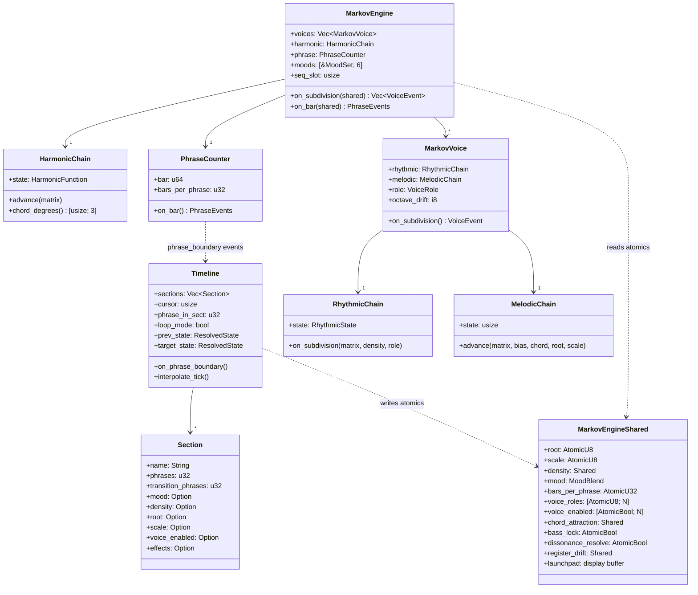

---

## 13. Implementation Plan

### Phase 8.3 — Core Markov engine (`ambient-engine`) ✅

| Task | Description | Status |
|---|---|---|
| 8.3.1 `HarmonicChain` | 7-state chain + normal/phrase-boundary matrices + current chord output | ✅ |
| 8.3.2 `RhythmicChain` | 5-state chain + density control + Calm/Tense base matrices | ✅ |
| 8.3.3 `MelodicChain` | 7-state degree chain + role bias + pitch resolution | ✅ |
| 8.3.4 `VoiceRole` enum | Bass/Pad/Melody/Texture + register + bias vector | ✅ |
| 8.3.5 `PhraseCounter` | Bar counter + phrase boundary event | ✅ |
| 8.3.6 `MoodSet` | Named mood = 3 matrices + gate_length; 6 built-in moods; blend function | ✅ |
| 8.3.7 `MarkovVoice` | Combines rhythmic + melodic chain for one voice | ✅ |
| 8.3.8 `MarkovEngine` | N voices + global harmonic chain + phrase counter + dissonance resolution | ✅ |

### Phase 8.4 — Matrix training (`ambient-engine` or standalone tool)

| Task | Description |
|---|---|
| 8.4.1 MIDI parser | Read `.mid` format 0/1, extract note events |
| 8.4.2 Chord analyzer | Infer harmonic function from simultaneous notes + key |
| 8.4.3 Rhythmic classifier | Map note events on grid → rhythmic states |
| 8.4.4 `TransitionCounter` | Build count matrices from event sequences |
| 8.4.5 Laplace smoothing | Prevent zero-probability transitions |
| 8.4.6 JSON export | Serialize trained mood to file |

### Phase 8.5 — Bevy integration (`forma-bevy`)

| Task | Description |
|---|---|
| 8.5.1 `SynthEvent::SetRoot` | Update root note atomically |
| 8.5.2 `SynthEvent::SetMoodBlend` | Update mood blend vector |
| 8.5.3 `SynthEvent::SetDensity` | Update per-voice or global density |
| 8.5.4 `SynthEvent::SetPhraseLength` | Update phrase boundary config |
| 8.5.5 `MarkovState` Resource | Exposes current harmonic state, phrase position to Bevy systems |

### Phase 8.6 — Launchpad UI (`forma-ambient`)

| Task | Description |
|---|---|
| 8.6.1 Grid widget | N×M cell grid, real-time update from chain output |
| 8.6.2 Per-voice controls | Role, patch, volume, density, style |
| 8.6.3 Global controls | Key, scale, mood blend, BPM |
| 8.6.4 Mood editor | Load/save mood JSON, blend sliders |
| 8.6.5 Training UI | Load MIDI, run training, preview matrix, export mood |

### Phase 8.7 — Timeline (`ambient-engine` + `forma-ambient`)

| Task | Description |
|---|---|
| 8.7.1 `Section` struct | Serde-friendly section definition with optional target fields |
| 8.7.2 `ResolvedState` | Fully-resolved parameter snapshot (no Options), cascade logic |
| 8.7.3 `Timeline` struct | Section list, cursor, interpolation state, advance logic |
| 8.7.4 `Timeline::on_phrase_boundary` | Advance cursor, snapshot states, begin interpolation |
| 8.7.5 `Timeline::interpolate_tick` | Write interpolated values to `MarkovEngineShared` atomics |
| 8.7.6 `EffectsTargets` | Optional per-section effects overrides (shimmer, crystal) |
| 8.7.7 Scene JSON serde | Deserialize `timeline` array + `timeline_loop`, backwards compat |
| 8.7.8 `MarkovEngine::on_bar` update | Feed phrase events into Timeline before harmonic advance |
| 8.7.9 Timeline UI widget | Section bar, progress indicator, current/next section labels |
| 8.7.10 Scene authoring | Add timelines to existing scenes (Interstellar, Breathing Space, etc.) |

---

## 14. Design Decisions Log

| Decision | Rationale |
|---|---|
| Tonality-agnostic matrices | Same matrices work in any key; modulation is input, not matrix property |
| Strategy 1+2 for coherence | Global harmonic chain + voice roles; simplest approach that guarantees no clashes |
| Strategy 3 (constraint solver) deferred | Adds complexity without clear audible benefit at this stage |
| Phrase boundary as event, not auto-modulate | Host (game/performer) decides whether to act on phrase boundary; engine doesn't auto-modulate |
| Laplace smoothing for training | Prevents hard probability blocks from short training sets |
| `Double` self-loop suppression | Fills must be transient; a loop of doubles sounds mechanical |
| Degree 4 = 0 in Bass role | Tritone against degree 7 is the most common harmonic clash; safest to exclude from bass |
| Mood blend by matrix interpolation | Linear interpolation between matrix pairs is cheap and perceptually smooth |
| Launchpad as read-only live display | Real-time feedback without pre-programming; future: optional step override |
| Timeline replaces harmonic_seq | harmonic_seq was a 1D timeline for root/scale only; Timeline generalizes to all params |
| Timeline on control thread, not audio | No new audio-thread complexity; writes to existing atomics |
| Section fields are optional | Keeps JSON lightweight; unspecified fields cascade from previous section or scene defaults |
| Discrete params snap at t=0.5 | Avoids jarring switch at section start while remaining deterministic |
| Timeline is optional per scene | Full backwards compatibility; scenes without timeline work exactly as before |
| Interpolation is linear per phrase | Simple, predictable, easy to author; exponential/eased curves can be added later if needed |

---

## 15. Future Considerations

Features deferred from the current design that could further enhance scene character:

### Motif memory / repetition
A mechanism to store short melodic fragments (4–8 notes) and probabilistically replay them.
This would give each session a personal theme that listeners recognise, bridging the gap
between "statistically plausible" and "memorable." Could be implemented as a small ring buffer
per voice that records recent melodic output and occasionally replays segments with variation.

### Velocity / dynamics shaping
Currently the `Accent` rhythmic state is binary (on/off). A dynamics layer — either a
per-voice velocity envelope or a second Markov chain for velocity levels — would add
expressive crescendos, ghost notes, and phrase-level dynamics. The Timeline could drive
a `dynamics_curve` per section.

### Harmonic substitution
The harmonic chain is strictly diatonic (7 functions within one scale). Adding secondary
dominants (V/V, V/ii), tritone substitutions, and modal interchange (borrowing from the
parallel major/minor) would enrich the harmonic vocabulary, especially for jazz and
cinematic scenes. Could be implemented as additional HarmonicFunction variants or as
a post-processing pass on the chord output.

### Polyrhythm / independent time per voice
All voices currently share the same BeatClock. Independent subdivisions or time signatures
per voice (e.g., bass in 3/4 against melody in 4/4) would create the kind of phasing
effects heard in Steve Reich's music. Requires per-voice BeatClock instances.

### Event triggers ("moments")
Rare, scene-defined events that fire at specific timeline positions or probabilistically:
a sudden silence, a register shift, a density spike, a textural drop. These would give
scenes a sense of *happening* beyond the smooth interpolation of the Timeline.
