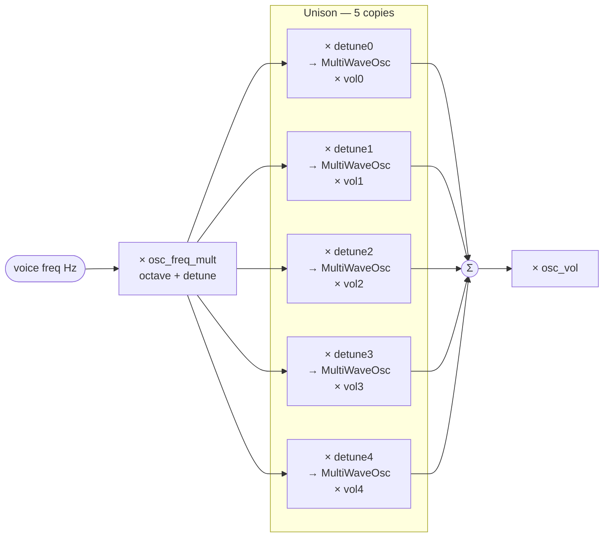

# Oscillators

The synth has 3 independent oscillators per voice. Each is a direct digital synthesis (DDS) oscillator implemented as a custom fundsp `AudioNode` (`MultiWaveOsc` in `src/osc.rs`).

---

## Controls (per oscillator)

| Control | Range | Default | Notes |
|---|---|---|---|
| On/Off | toggle | OSC 1+2 on, OSC 3 off | Header button, green = on |
| Waveform | Sin / Saw / Sqr / Tri | Sin | See waveforms below |
| Octave | −2 … +2 | 0 | Relative to played note |
| Detune | −100 … +100 ¢ | 0 | Fine pitch offset in cents |
| Volume | 0.0 … 1.0 | OSC1: 0.5, OSC2: 0.5, OSC3: 0.3 | In the mixer panel |

---

## Waveforms

### Sine
A pure single-frequency tone. No harmonics, no aliasing. The smoothest, least bright waveform. Good for sub-bass, soft pads, or FM modulation.

### Saw (Sawtooth)
A linear ramp from −1 to +1, then an instant reset. Rich in harmonics — all partials present (1/n amplitude). The classic "buzz" of brass and strings. Most common waveform for subtractive synthesis. Uses **PolyBLEP** band-limiting to eliminate aliasing at the reset discontinuity.

### Sqr (Square)
Equal time at +1 and −1. Contains only odd harmonics, giving a hollow, woody, clarinet-like sound at 50% duty cycle. Uses **PolyBLEP** band-limiting at both edges.

Supports **Pulse Width** control (see below).

### Tri (Triangle)
A linear ramp up then down. Only odd harmonics, falling off fast (1/n²). Softer than square, rounder than saw. Alias-free by nature — no PolyBLEP needed.

---

## Pulse Width (Square only)

| Control | Range | Default | Notes |
|---|---|---|---|
| PW on/off | toggle | off | Only visible when Sqr selected |
| Width | 0.01 … 0.99 | 0.5 | Duty cycle of the square wave |

At 0.5 (50%) you get a standard square wave. Narrowing the width (e.g. 0.1) produces a thin, nasal, reed-like tone. Disabling resets to 0.5.

**PolyBLEP** is applied at both the rising edge (phase = 0) and the falling edge (phase = width), so the band-limiting adapts correctly at any duty cycle.

---

## Unison / Spread

Runs multiple detuned copies of the oscillator simultaneously, summed and normalised. Creates a thick, chorused, "wide" sound. Up to 5 copies per OSC slot.

| Control | Range | Default | Notes |
|---|---|---|---|
| Uni on/off | toggle | off | Green = active |
| Voices (v) | 2 … 5 | 2 | Number of simultaneous copies |
| Spread (¢) | 0 … 50 ¢ | 20 | Total pitch spread across all copies |

Copies are spread symmetrically. With 3 voices at 20¢: −10¢, 0¢, +10¢. The centre copy (when count is odd) is always at 0 detune so the fundamental pitch stays anchored. All 5 graph nodes are always present in the DSP — inactive copies have volume 0.0, so there is no graph rebuild when toggling.

---

## Signal flow (per OSC slot)

Inactive unison copies have `vol = 0.0` — they are always present in the graph but contribute nothing.

---

## MultiWaveOsc internals

### PolyBLEP band-limiting

Saw and Square contain discontinuities (instantaneous jumps) that alias at high pitches. PolyBLEP applies a quadratic polynomial correction within ±1 sample of each discontinuity, smoothing the step without a lookup table. Triangle and Sine are alias-free by nature.

### Graph architecture

Waveform switching uses a single static `MultiWaveOsc` node — no graph rebuild. The `AtomicU8` waveform selector is written by the UI thread and read by the audio thread every sample.

Unison uses 5 `MultiWaveOsc` instances per OSC slot, always present in the graph. Spread is controlled by `osc_unison_detune[osc][copy]: Shared` (freq multiplier) and `osc_unison_vol[osc][copy]: Shared` (weight). The UI writes these atomically — no graph rebuild, no glitch.
