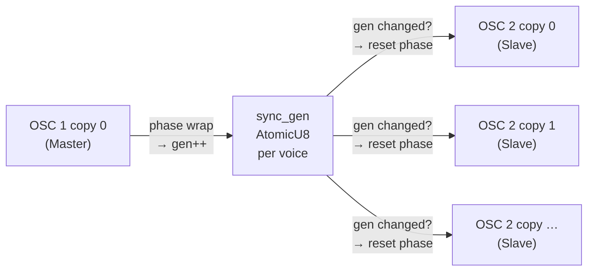
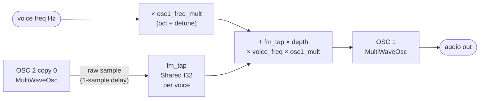
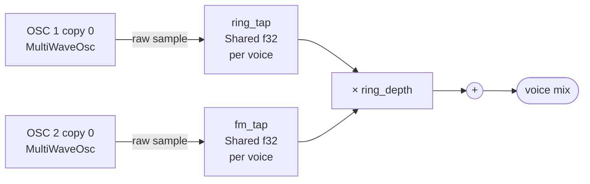
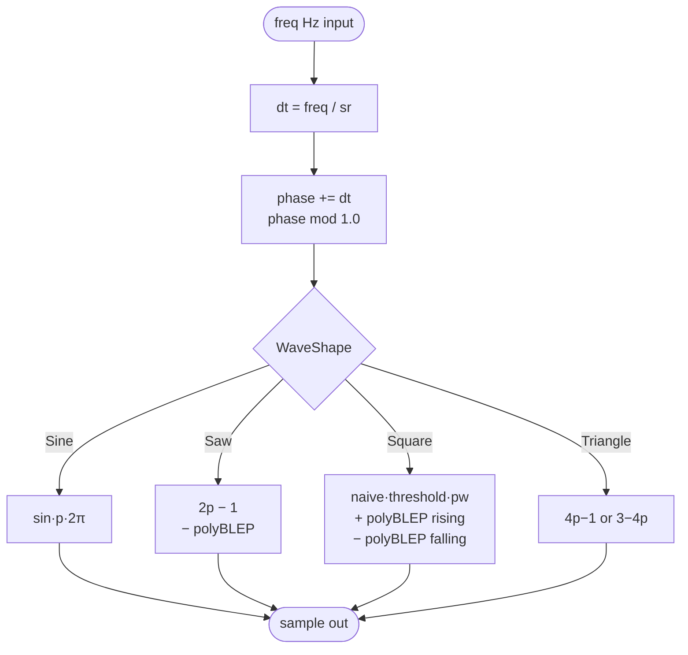

# Oscillators

The synth has 3 independent oscillators per voice. Each is a direct digital synthesis (DDS) oscillator implemented as a custom fundsp `AudioNode` (`MultiWaveOsc` in `src/osc.rs`).

---

## Controls (per oscillator)

| Control | Range | Default | Notes |
|---|---|---|---|
| On/Off | toggle | OSC 1+2 on, OSC 3 off | Header button, green = on |
| Waveform | Sin / Saw / Sqr / Tri | Sin | See waveforms below |
| Octave | −2 … +2 | 0 | Relative to played note |
| Detune | −100 … +100 ¢ | 0 | Fine pitch offset in cents |
| Volume | 0.0 … 1.0 | OSC1: 0.5, OSC2: 0.5, OSC3: 0.3 | In the mixer panel |
| PW on/off | toggle (Sqr only) | off | Pulse width control |
| Uni on/off | toggle | off | Unison / spread |
| Sync→2 | toggle (OSC 1 only) | off | Hard sync OSC 1 → OSC 2 |

---

## Waveforms

### Sine
A pure single-frequency tone. No harmonics, no aliasing. The smoothest, least bright waveform. Good for sub-bass, soft pads, or FM modulation.

### Saw (Sawtooth)
A linear ramp from −1 to +1, then an instant reset. Rich in harmonics — all partials present (1/n amplitude). The classic "buzz" of brass and strings. Most common waveform for subtractive synthesis. Uses **PolyBLEP** band-limiting to eliminate aliasing at the reset discontinuity.

### Sqr (Square)
Equal time at +1 and −1. Contains only odd harmonics, giving a hollow, woody, clarinet-like sound at 50% duty cycle. Uses **PolyBLEP** band-limiting at both edges.

Supports **Pulse Width** control (see below).

### Tri (Triangle)
A linear ramp up then down. Only odd harmonics, falling off fast (1/n²). Softer than square, rounder than saw. Alias-free by nature — no PolyBLEP needed.

---

## Pulse Width (Square only)

| Control | Range | Default | Notes |
|---|---|---|---|
| PW on/off | toggle | off | Only visible when Sqr selected |
| Width | 0.01 … 0.99 | 0.5 | Duty cycle of the square wave |

At 0.5 (50%) you get a standard square wave. Narrowing the width (e.g. 0.1) produces a thin, nasal, reed-like tone. Disabling resets to 0.5.

**PolyBLEP** is applied at both the rising edge (phase = 0) and the falling edge (phase = width), so the band-limiting adapts correctly at any duty cycle.

---

## Unison / Spread

Runs multiple detuned copies of the oscillator simultaneously, summed and normalised. Creates a thick, chorused, "wide" sound. Up to 5 copies per OSC slot.

| Control | Range | Default | Notes |
|---|---|---|---|
| Uni on/off | toggle | off | Green = active |
| Voices (v) | 2 … 5 | 2 | Number of simultaneous copies |
| Spread (¢) | 0 … 50 ¢ | 20 | Total pitch spread across all copies |

Copies are spread symmetrically. With 3 voices at 20¢: −10¢, 0¢, +10¢. The centre copy (when count is odd) is always at 0 detune so the fundamental pitch stays anchored. All 5 graph nodes are always present in the DSP — inactive copies have volume 0.0, so there is no graph rebuild when toggling.

---

## Hard Sync (OSC 1 → OSC 2)

Every time OSC 1 completes a full cycle, it forces OSC 2 to restart its phase from zero — regardless of where OSC 2 is in its own cycle. The result is a complex, harmonically rich timbre whose character changes dramatically as OSC 2's pitch is swept relative to OSC 1. Classic sound on Moog leads and the intro of "Jump" (Van Halen).

| Control | Range | Default | Notes |
|---|---|---|---|
| Sync→2 | toggle | off | On OSC 1 panel only, amber = active |

**How to use:** Enable OSC 2, set it to a higher pitch than OSC 1 (e.g. octave +1 or large detune), then engage `Sync→2`. Sweeping OSC 2's pitch while sync is on produces the characteristic hard sync sweep sound.

**Works with unison:** All 5 unison copies of OSC 2 are slaves — they all reset in the same sample when OSC 1's master copy wraps.

### Hard sync signal flow



The generation counter approach avoids the need to clear a flag — each slave independently compares its `last_gen` to the shared counter every sample. When `Sync→2` is off, master and slaves skip all sync logic with no CPU overhead.

---

## FM — Frequency Modulation (OSC 2 → OSC 1)

Audio-rate FM: OSC 2's output waveform is fed into OSC 1's frequency input instead of (or alongside) the audio mixer. OSC 2 is now wiggling OSC 1's pitch thousands of times per second. At low depths this adds subtle warmth and harmonic complexity. At high depths you get metallic, bell-like, inharmonic timbres similar to a DX7.

This is distinct from the LFO pitch destination — that is also FM, but at sub-audio rate (< 20 Hz). Below ~20 Hz the ear hears pitch wobble (vibrato). Above ~20 Hz the ear stops tracking individual cycles and hears new timbres instead.

| Control | Range | Default | Notes |
|---|---|---|---|
| FM | toggle | off | On OSC 1 panel only, blue = active |
| Depth | 0.0 … 10.0 | 1.0 | FM index — higher = more sideband energy |

**How depth works:** The frequency deviation applied to OSC 1 is:

```
deviation (Hz) = osc2_sample × depth × voice_freq × osc1_freq_mult
```

Scaling by `voice_freq × osc1_freq_mult` keeps the modulation index constant across the keyboard — the same depth setting sounds consistent whether you play C2 or C5.

**Modulator ratio and timbre:**

The ratio of OSC 2's frequency to OSC 1's frequency (the *modulator ratio*) determines where the sidebands land:

| OSC 2 relative pitch | Ratio | Timbre |
|---|---|---|
| Same octave, no detune | 1:1 | Adds odd harmonics, thickens timbre |
| Octave +1 | 2:1 | Bright, adds even harmonics |
| Octave +1 + 7 semitones (+702 ¢) | 3:1 | Brassy, trumpet-like |
| Octave +1 + large detune | irrational | Metallic, bell, inharmonic |

**Depth guide:**

| Depth | Character |
|---|---|
| 0.1 – 0.5 | Subtle warmth, slight edge |
| 1 – 2 | Noticeable harmonic complexity |
| 3 – 5 | DX7-style electric piano / bell |
| 6 – 10 | Aggressive, metallic, chaotic sidebands |

**OSC 2 volume in the mixer:** You can mute OSC 2 in the mixer (vol = 0) while FM is active. The tap runs independently of the audio path — OSC 2 still modulates OSC 1 even when its own output is silent. This is useful when you want pure FM timbre without OSC 2 adding to the mix directly.

### FM signal flow



The 1-sample delay (≈ 22 µs at 44.1 kHz) is inaudible. Only OSC 2 copy 0 drives the tap; unison copies do not contribute to avoid frequency-scaled summation artifacts.

---

## Ring Modulation (OSC 1 × OSC 2)

Multiplies OSC 1 and OSC 2 together and adds the result to the mix. Unlike normal mixing (which adds frequencies), multiplication produces the **sum and difference** of the two input frequencies — the originals disappear entirely and new tones appear in their place.

If OSC 1 = 440 Hz and OSC 2 = 550 Hz:
- Sum: 440 + 550 = **990 Hz**
- Difference: 550 − 440 = **110 Hz**

Neither 440 Hz nor 550 Hz is in the output. The result is metallic, bell-like, and often dissonant — especially when OSC 2 is tuned to a non-integer ratio relative to OSC 1.

| Control | Range | Default | Notes |
|---|---|---|---|
| Ring | toggle | off | On OSC 1 panel only, pink = active |
| Depth | 0.0 … 2.0 | 1.0 | Scales the ring signal level added to the mix |

**Pure ring mod:** Mute OSC 1 and OSC 2 in the mixer (vol = 0). The tap runs independently of the audio path — the ring signal is still computed and added to the mix. You hear only the sum/difference frequencies.

**Mixed ring mod:** Leave OSC 1 and OSC 2 audible. The ring product blends with the original tones for a complex, layered timbre.

**Interval guide:**

| OSC 2 relative pitch | Ratio | Output character |
|---|---|---|
| Unison | 1:1 | DC + 2× fundamental (mostly silent, use for tremolo-like effects with detune) |
| Octave +1 | 2:1 | Sum = 3× fundamental, difference = fundamental — adds a hollow quality |
| Fifth (+7 semitones) | ~1.5:1 | Slightly inharmonic — mild metallic edge |
| Large detune (e.g. +350 ¢) | irrational | Strongly inharmonic — bell, gong, Dalek |

**Classic uses:** Dalek voice effect, metallic percussion, alien textures, gong/bell tones.

### Ring mod signal flow



Both taps are 1-sample delayed (≈ 22 µs at 44.1 kHz — inaudible). Only copy 0 of each oscillator contributes to the ring product; unison copies are not included to avoid amplitude scaling artifacts.

---

## Signal flow (per OSC slot)


Inactive unison copies have `vol = 0.0` — they are always present in the graph but contribute nothing.

---

## MultiWaveOsc internals



### PolyBLEP band-limiting

Saw and Square contain discontinuities (instantaneous jumps) that alias at high pitches. PolyBLEP applies a quadratic polynomial correction within ±1 sample of each discontinuity, smoothing the step without a lookup table. Triangle and Sine are alias-free by nature.

### Graph architecture

Waveform switching uses a single static `MultiWaveOsc` node — no graph rebuild. The `AtomicU8` waveform selector is written by the UI thread and read by the audio thread every sample.

Unison uses 5 `MultiWaveOsc` instances per OSC slot, always present in the graph. Spread is controlled by `osc_unison_detune[osc][copy]: Shared` (freq multiplier) and `osc_unison_vol[osc][copy]: Shared` (weight). The UI writes these atomically — no graph rebuild, no glitch.
