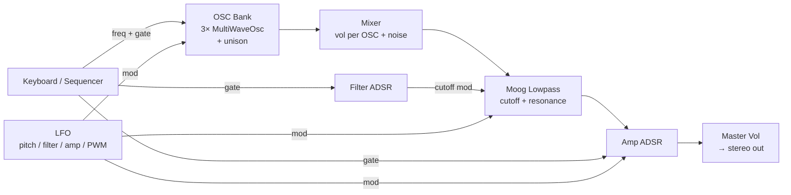

# Roadmap

Status of all planned features, in implementation order.

---

## Oscillators

| Feature | Status | Notes |
|---|---|---|
| 3 oscillators per voice | ✅ Done | |
| Waveforms: Sin / Saw / Sqr / Tri | ✅ Done | PolyBLEP on Saw + Sqr |
| Octave + detune per OSC | ✅ Done | |
| OSC on/off toggle | ✅ Done | |
| Pulse width (Square) | ✅ Done | With PolyBLEP at variable duty cycle |
| Unison / spread | ✅ Done | Up to 5 voices, 0–50¢ spread |
| PWM (LFO → pulse width) | 🔲 Planned | MultiWaveOsc gains 2nd input; LFO routed in |
| Hard sync (OSC1 resets OSC2) | ✅ Done | Generation counter per voice; all OSC2 unison copies are slaves |
| FM (OSC2 → OSC1 frequency) | ✅ Done | fm_tap Shared per voice; pitch-tracking linear FM |
| Ring modulation (OSC1 × OSC2) | 🔲 Planned | One multiply node instead of sum |
| Triangle PolyBLEP | 🔲 Low priority | Aliasing only audible above C6 |

---

## Mixer

| Feature | Status | Notes |
|---|---|---|
| Per-OSC volume | ✅ Done | |
| Noise volume | ✅ Done | State exists; noise node not yet in graph |
| Noise type (white / pink) | 🔲 Planned | |

---

## Filter

| Feature | Status | Notes |
|---|---|---|
| Moog-style lowpass | 🔲 Next | `moog_ladder` node in fundsp |
| Cutoff + resonance | 🔲 Next | |
| Filter envelope (ADSR) | 🔲 Next | |
| Env amount | 🔲 Next | |
| LFO → filter cutoff | 🔲 Next | Already routed via `effective_cutoff` Shared |

---

## LFO

| Feature | Status | Notes |
|---|---|---|
| Rate + depth | ✅ Done (UI + state) | Not yet wired to DSP graph |
| Shape: Sin / Tri / Saw | ✅ Done (UI + state) | |
| Destination: Pitch / Filter / Amp | ✅ Done (UI + state) | |
| PWM destination | 🔲 Planned | After PWM oscillator feature |

---

## Amp

| Feature | Status | Notes |
|---|---|---|
| ADSR envelope | ✅ Done | `adsr_live` fundsp node |
| Master volume | ✅ Done | |

---

## Glide

| Feature | Status | Notes |
|---|---|---|
| Portamento time | ✅ Done (UI + state) | `follow(0.002)` hardcoded; param not yet live |
| Live glide time control | 🔲 Planned | Control-side smoothing approach |

---

## UI / UX

| Feature | Status | Notes |
|---|---|---|
| Unified single-panel layout | ✅ Done | |
| Oscilloscope | ✅ Done | |
| Latency indicator (estimated + measured) | ✅ Done | |
| Keyboard (click + a–l keys) | ✅ Done | |
| Sequencer (8 steps, BPM, random) | ✅ Done | |

---

## Architecture decisions

- **No graph rebuild on parameter change** — all runtime parameters use fundsp `Shared` (atomic f32) or `Arc<AtomicU8>`. Graph is built once at startup.
- **Custom `MultiWaveOsc` node** — fundsp's built-in oscillators are statically typed; a custom node with internal `match` on waveform is the only way to switch waveforms at runtime without rebuilding the graph. `square()` in fundsp is a squaring function, not a square wave.
- **Unison via static 5-copy graph** — always 5 nodes per OSC slot; inactive copies have vol=0.0. Avoids any graph mutation.
- **PolyBLEP over wavetable** — chosen for simplicity and correctness at any sample rate. Quality is close to wavetable in the audible range.

---

## Signal chain (target)

Greyed sections (filter, LFO DSP wiring, glide) are implemented in UI/state but not yet connected in the DSP graph.
